# ARIN7001 Data Structure & Algorithm - summarized by hyperloop

# 1 Time Complexity
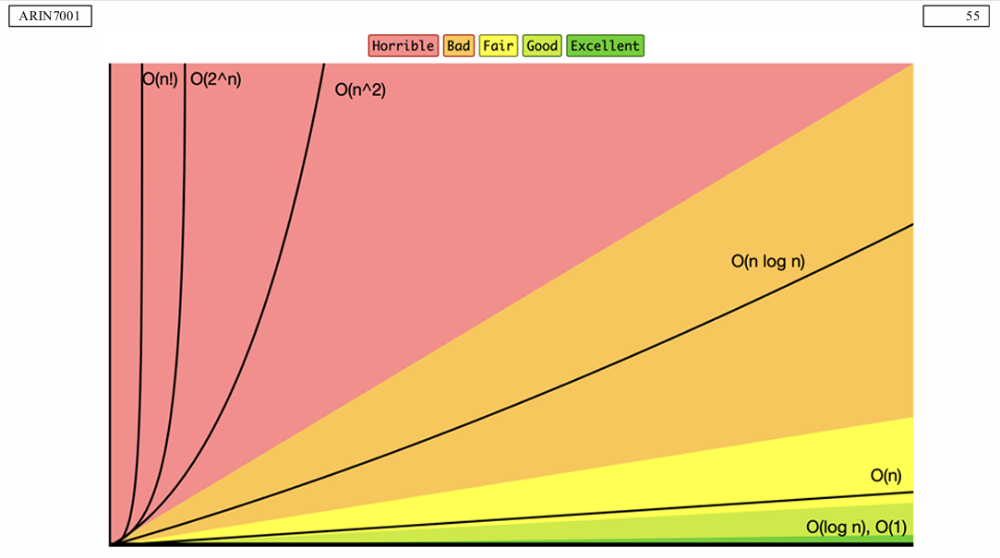
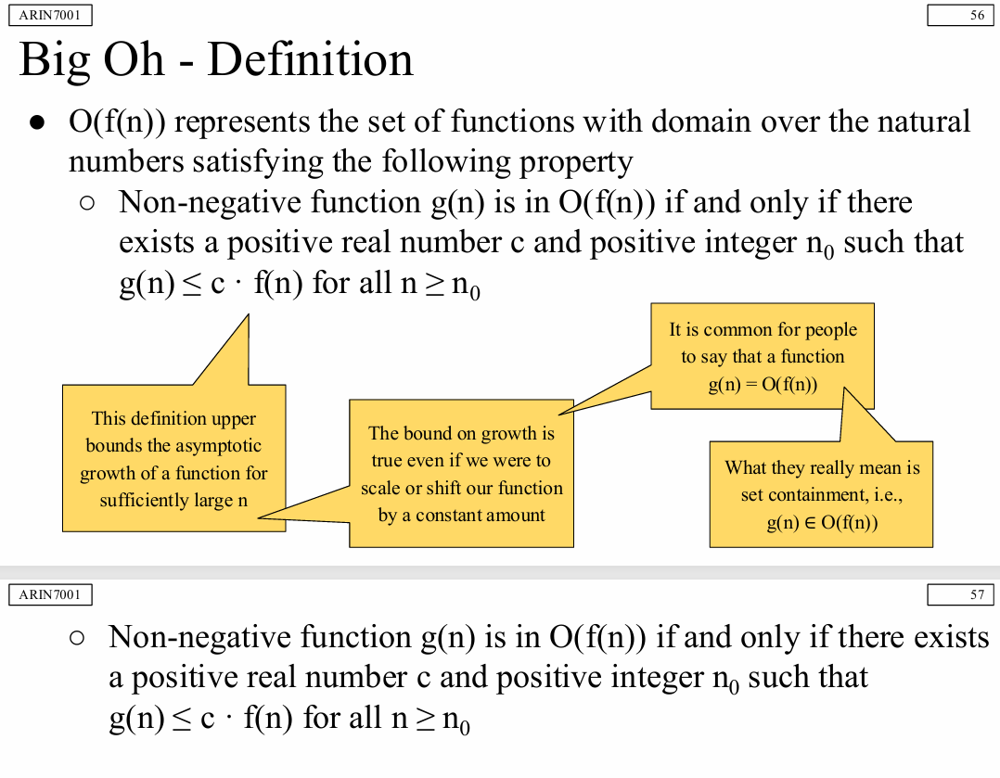
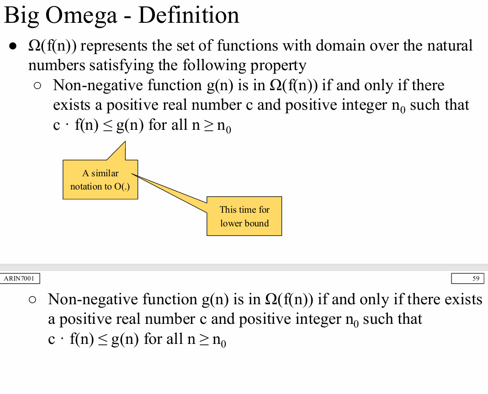
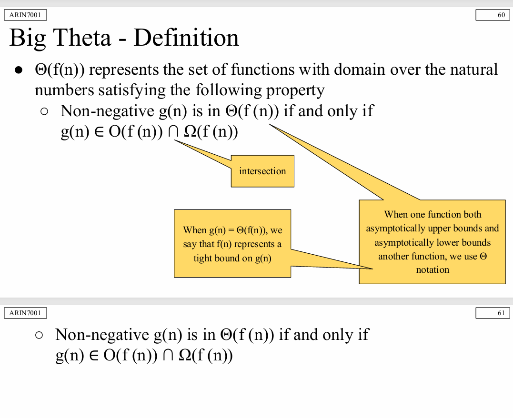
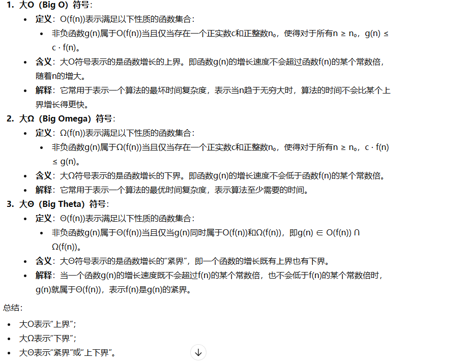

---

# 2 Linear List

## Interface (API/ADT) vs Data Structure（接口 vs 数据结构）

### 一句话区分（必背）
- **Interface / ADT**：规定“你能做什么”（what）
- **Data Structure**：规定“你怎么做”（how）

举例（讲义给的方向）：
- Interface：set、sequence（定义支持哪些操作）
- Data Structure：array、pointer-based DS（用什么结构存、怎么实现操作）

---

## Sequence Interface：静态序列 vs 动态序列

### Static Sequence（静态序列接口）
维护序列 (x0, x1, …, xn−1)，零索引
典型操作：
- build(X), len()
- iter_seq()
- get_at(i), set_at(i, x)

### Dynamic Sequence（动态序列接口）
在静态序列基础上增加：
- insert_at(i, x), delete_at(i)
- insert_first(x), delete_first()
- insert_last(x), delete_last()

#### 为什么要把 first/last 单独列出来？
因为很多数据结构能对“首/尾”做专门优化：
- dynamic array 对 **last** 可摊还 O(1)
- linked list 对 **first** 可 O(1)
虽然逻辑上它们是 insert_at/delete_at 的特例，但复杂度可能完全不同。

---

## 三种实现：Static Array / Linked List / Dynamic Array

> 复习目标：看到某个操作，能立刻说出在不同结构下的复杂度与原因。

### Static Array Sequence（静态数组实现序列）
思想：A[i] = xi
优点：
- get_at / set_at：Θ(1)

缺点（动态操作很差）：
- insert/delete 需要：分配新数组 + 复制 + 移动 → **Θ(n)**

原因：数组是连续存储，插入/删除会破坏连续性，需要整体搬移。

### Linked List Sequence（链表实现序列）
结构：
- 每个 item 在一个 node 里：node.item、node.next
- 维护 head 指针

优点：
- insert_first / delete_first：**Θ(1)**（改几个指针就行）

缺点：
- get_at(i) / set_at(i)：**O(n)**（必须从 head 走到第 i 个）
- insert_at(i) / delete_at(i)：O(i)（先定位，再改指针）
- insert_last / delete_last：若没有 tail 指针，通常 O(n)

### Dynamic Array Sequence（动态数组 / Python list）
核心思想：**预留额外空间（capacity）**，避免每次插入都 realloc

关键结论：
- insert_last / delete_last：**Θ(1) 摊还（amortized）**
- insert_first / delete_first / insert_at / delete_at：仍然常是 **O(n)**（需要移动元素）

---

## 摊还分析（Amortization）必背要点
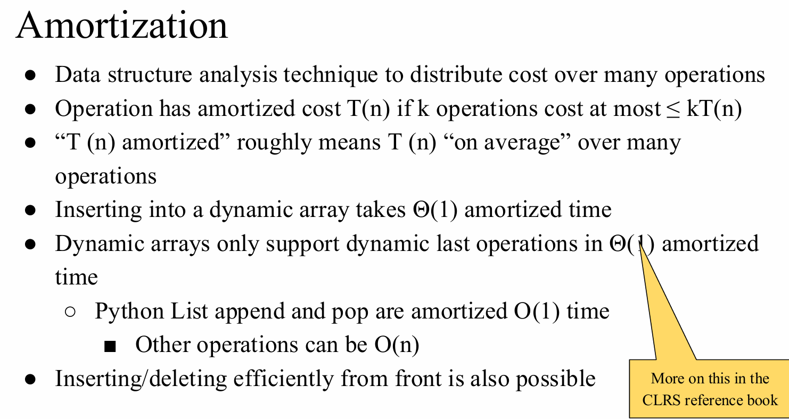
### 定义（口头解释版）
如果一串操作中偶尔会出现很贵的一次（例如扩容复制 O(n)），
但把它分摊到很多次便宜操作上后，平均每次仍然是常数，
就说该操作是 **摊还 O(1)**。

### 动态数组 append 为什么摊还 O(1)？
典型扩容策略：容量不够时扩成 2×size
- 扩容那次要复制 O(n)
- 但扩容不会每次发生，只在容量翻倍点发生
- 所以连续做很多次 append，总成本是 O(k)，平均每次 O(1)

### Python list 相关结论（会考“口头题/判断题”）
- append / pop（尾部）：摊还 O(1)
- 插入/删除中间或头部：通常 O(n)

---

## 一张“对比速记表”（建议背下来）

| 数据结构 | get_at / set_at | insert_first / delete_first | insert_last / delete_last | insert_at / delete_at |
|---|---:|---:|---:|---:|
| Static Array | Θ(1) | O(n) | O(n) | O(n) |
| Linked List（仅 head） | O(n) | Θ(1) | O(n) | O(n)（更精确：O(i)） |
| Dynamic Array（Python list） | Θ(1) | O(n) | Θ(1) amortized | O(n) |

> 记忆法：  
> - 数组强在“随机访问”  
> - 链表强在“头部改指针”  
> - 动态数组强在“尾部摊还常数”

---

# 3 Sort
## 3.1 Selection Sort
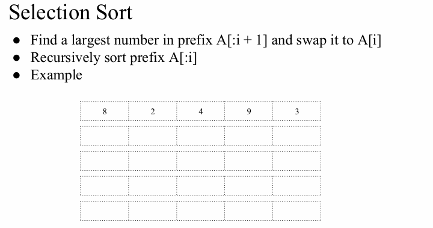
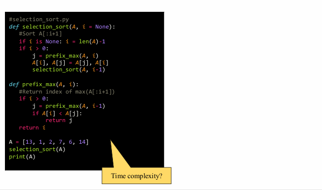

---

## 3.2 Divide and Conquer - Peak Finder

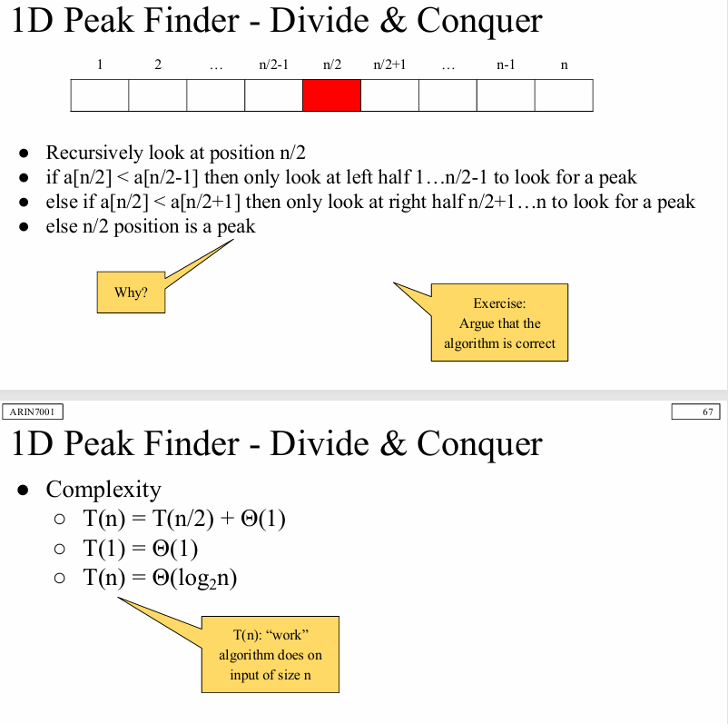
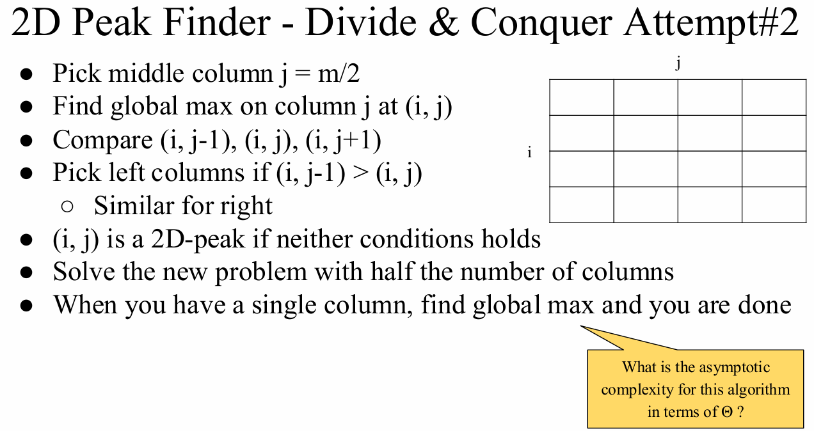
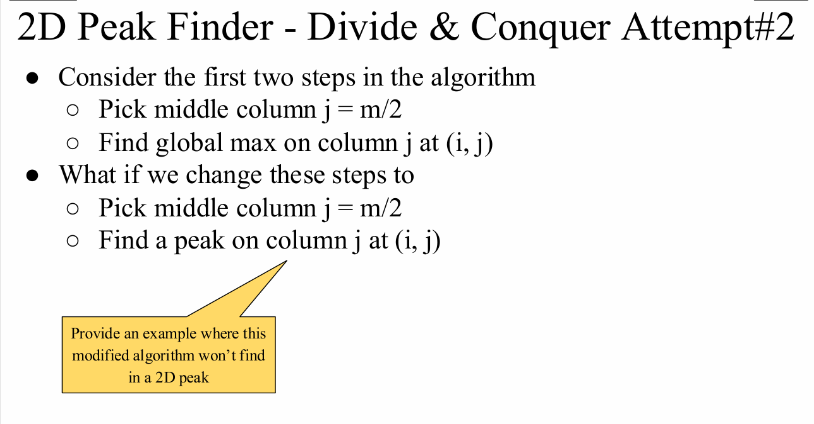

---

## 3.2 Divide and Conquer - Merge Sort
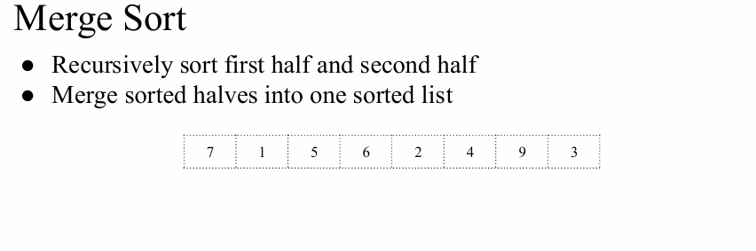
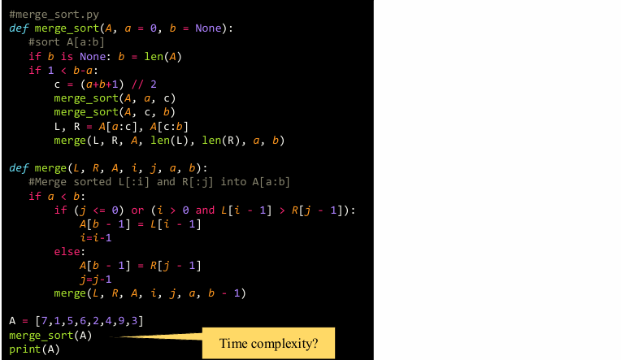

---

# 4 二叉堆（Heap）
## 4.1 二叉堆的性质
- **完全二叉树**：二叉堆是一颗完全二叉树，即除了最底层外，每一层的结点都是满的，最底层的结点从左到右依次排列。
- **堆序性质**：
  - **最大堆**：每个结点的值都大于或等于其子结点的值（根结点是最大的）。
  - **最小堆**：每个结点的值都小于或等于其子结点的值（根结点是最小的）。

### 数组表示方法
- 二叉堆可以用数组来表示。假设堆的根结点在数组的第一个位置（索引 0），对于数组中的任意元素 `arr[i]`，其左子结点的索引为 `2*i + 1`，右子结点的索引为 `2*i + 2`，父结点的索引为 `(i-1)//2`。

### 父子结点的索引规律
- **父结点**：`parent(i) = (i-1) // 2`
- **左子结点**：`left_child(i) = 2*i + 1`
- **右子结点**：`right_child(i) = 2*i + 2`

### 堆的高度计算
- 对于一个包含 `n` 个结点的堆，堆的高度为 `log₂(n)`。即树的高度等于结点总数的对数，向下取整。

### 最大堆的性质
- **根结点是最大值**：在最大堆中，根结点的值是堆中所有结点中的最大值。
- **父结点大于子结点**：每个结点的值大于或等于其左、右子结点的值。
- **堆序性质**：对于每个非叶子结点 `i`，其值总是大于或等于其子结点的值。

---

## 4.2 二叉堆（最大堆）的基本操作

> 记号：堆大小为 `n`，结点索引从 0 开始  
> `parent(i)=(i-1)//2`，`left(i)=2i+1`，`right(i)=2i+2`  
> 堆高度 `h = ⌊log2 n⌋`

### 0. 堆的常见基本操作（Max-Heap）

### A) 取最大值 `HEAP-MAXIMUM`
- **步骤**：直接返回 `A[0]`
- **时间复杂度**：`O(1)`

### B) 插入 `MAX-HEAP-INSERT(x)`（上滤 / sift-up）
- **步骤**
  1. 把 `x` 追加到数组末尾（堆尾）
  2. 令 `i = last_index`
  3. while `i>0` 且 `A[parent(i)] < A[i]`：交换 `A[i]` 与 `A[parent(i)]`，令 `i = parent(i)`
- **时间复杂度**：`O(log n)`（最多上滤一条根路径）

### C) 删除最大值 `HEAP-EXTRACT-MAX`（下滤 / sift-down）
- **步骤**
  1. 保存 `max = A[0]`
  2. 用最后一个元素覆盖根：`A[0] = A[n-1]`，堆大小 `n--`
  3. 对根执行 `MAX-HEAPIFY(0)`
  4. 返回 `max`
- **时间复杂度**：`O(log n)`

### D) 增大某个键值 `HEAP-INCREASE-KEY(i, newKey)`
- **前提**：`newKey >= A[i]`
- **步骤**：令 `A[i]=newKey`，然后像插入一样不断与父结点交换（上滤）
- **时间复杂度**：`O(log n)`

---

### 1. MAX-HEAPIFY（维护最大堆性质，向下调整）

### 作用
当某个结点 `i` 可能比子结点小（常见于“根被替换”“局部破坏”），`MAX-HEAPIFY(i)` 通过**下滤**恢复以 `i` 为根的子树的最大堆性质。  
**关键前提**：`i` 的左右子树（如果存在）本身已经是最大堆。

### 操作步骤（递归/迭代都行）
1. `l = left(i)`, `r = right(i)`
2. 在 `i,l,r` 中找值最大的结点 `largest`
3. 如果 `largest != i`：
   - 交换 `A[i]` 与 `A[largest]`
   - 令 `i = largest`，继续对新的 `i` 做 `MAX-HEAPIFY`

### 时间复杂度
- 只会沿高度向下走最多 `h` 层  
- **`O(log n)`**

---

### 2. BUILD-MAX-HEAP（把无序数组建成最大堆）

### 核心思想
从**最后一个非叶子结点**开始，自底向上对每个结点做 `MAX-HEAPIFY`。  
因为叶子本身就是堆（无需处理），越靠下的结点下滤成本越低。

### 操作步骤
1. 堆大小 `heap_size = n`
2. 对 `i = ⌊n/2⌋ - 1, ⌊n/2⌋ - 2, ..., 0`：
   - 调用 `MAX-HEAPIFY(i)`

### 时间复杂度（重点！）
- 不是 `O(n log n)`，而是 **`O(n)`**  
- 直觉：大量结点在底层，`heapify` 走不了几层；只有少量上层结点才可能走很深。

---

### 3. HEAPSORT（堆排序）

### 思想
先建最大堆（最大值在根），反复把根（最大值）交换到数组末尾，并缩小堆，再对根 `heapify`。

### 操作步骤
1. `BUILD-MAX-HEAP(A)`
2. for `i = n-1` down to `1`：
   - 交换 `A[0]` 与 `A[i]`（把当前最大值放到最终位置）
   - `heap_size--`（末尾已排好，不再属于堆）
   - `MAX-HEAPIFY(0)`（恢复最大堆）

### 时间复杂度
- 建堆：`O(n)`
- 循环执行 `n-1` 次，每次 `heapify`：`O(log n)`
- 总计：**`O(n log n)`**

### 额外性质
- **原地排序**：额外空间 `O(1)`（不算递归栈）
- **非稳定**：相等元素相对次序可能改变

---

# 5 二叉树
## 5.1 二叉树（指针实现）核心性质总结
### 1) Node（结点）通常包含什么
- **key / value（数据域）**：存储结点的值（如 int、对象等）
- **left 指针**：指向左子结点（可能为 `None/null`）
- **right 指针**：指向右子结点（可能为 `None/null`）
- （可选）**parent 指针**：指向父结点，便于向上回溯
- （可选）**额外信息**：如子树大小 size、高度 height、颜色 color（红黑树）等

---

### 2) Root（根结点）与 Leaf（叶结点）
- **Root（根结点）**
  - 整棵树的入口结点
  - **没有父结点**（parent 为 `None`，或概念上不存在父结点）
  - 树为空时：root 为 `None`
- **Leaf（叶结点）**
  - **没有子结点**的结点
  - 对二叉树：`left == None` 且 `right == None`

---

### 3) Ancestor（祖先结点）与相关概念
- **父结点（parent）**：直接指向当前结点的上一级结点
- **祖先结点（ancestor）**：
  - 从当前结点沿 parent 指针不断向上走，路径上所有结点（通常不包含自己）都是它的祖先
  - 根结点是所有结点的祖先（除了它自己）
- **后代结点（descendant）**：
  - 某结点子树中的所有结点（通常不包含自己）都是它的后代
- **兄弟结点（sibling）**：
  - 同一父结点的另一个孩子（若存在）

---

### 4) 深度（Depth）与高度（Height）
> 注意：不同教材对“高度/深度是否从 0 还是从 1 计数”可能不同，下列给出最常用的定义（从 0 开始）。

#### A) 结点深度 depth(v)
- 定义：从 **根结点到结点 v 的边数**
- 根结点深度：`depth(root) = 0`
- 若从 root 到 v 的路径长度（边数）为 k，则 `depth(v) = k`

#### B) 结点高度 height(v)
- 定义：从 **结点 v 到其最远叶子结点的边数**
- 叶子结点高度：`height(leaf) = 0`
- 递推：`height(v) = 1 + max(height(v.left), height(v.right))`
  - 约定空指针子树高度为 `-1`，则叶子高度自然得到 0

#### C) 树的高度 Height(Tree)
- 定义：`height(root)`（根结点高度）
- 如果树只有一个结点：树高度为 0
- 如果树为空（root=None）：通常定义高度为 `-1`（也有教材记为 0，需要看课程约定）

#### D) 树的深度（有时也叫最大深度）
- 常用含义：树中最大结点深度，即所有结点 depth 的最大值
- 在“从 0 计数”的定义下：**树的最大深度 = 树的高度**（都是最长根到叶路径的边数）
- 若教材用“层数/结点数”计：可能会相差 1（边数 vs 结点数）

---

## 5.2 二叉树的遍历
### 1) 先序遍历 Preorder（NLR：根-左-右）
- **逻辑**：先访问“当前结点”，再进入左子树，最后进入右子树
- **记忆法**：**根在最前**
- **直观理解**：像“先把当前结点处理掉/记录下来”，然后再处理它的孩子
- **常见用途**：
  - 复制/序列化树结构（先看到根，能先确定整体框架）
  - 输出表达式的前缀形式（prefix）

---

### 2) 中序遍历 Inorder（LNR：左-根-右）
- **逻辑**：先进入左子树，访问完左边后再访问根，最后进入右子树
- **记忆法**：**根在中间**
- **直观理解**：像“先把左边都处理完，再回到当前结点，最后处理右边”
- **常见用途**：
  - 对**二叉搜索树 BST**：中序遍历会得到**从小到大**的有序序列（因为左 < 根 < 右）

---

### 3) 后序遍历 Postorder（LRN：左-右-根）
- **逻辑**：先进入左子树，再进入右子树，最后才访问根
- **记忆法**：**根在最后**
- **直观理解**：像“先把子问题都做完，再回头处理当前结点”
- **常见用途**：
  - 释放/删除整棵树（先删子结点再删父结点）
  - 计算表达式树的值（先算左右，再算当前运算符）
  - 自底向上的 DP/汇总信息（高度、节点数等）

---

### 一句话对比（最短记忆）
- **先序**：先根 → “先处理当前，再看孩子”
- **中序**：根在中 → “左处理完才轮到我，再去右边”
- **后序**：后根 → “孩子都处理完，最后处理我”

### 小提醒：结构不变，访问位置变
三种遍历的“走树路径”很像，真正的差异只在于：**根节点是在进入子树前访问、两棵子树之间访问，还是两棵子树之后访问。**

---

## 5.3 中序遍历的“树上导航”

中序规则：**Left → Node → Right**  
对任意结点 X：它的中序位置介于“左子树所有结点”与“右子树所有结点”之间。

### 1) subtree_first(<X>)：X 子树的“第一个”（中序最先访问）
- **含义**：在以 X 为根的子树里，中序遍历最先被访问的结点。
- **导航逻辑**：  
  **从 X 出发，一直往左走到底**（能走左就走左），直到左孩子为空。
- **直观理解**：中序会先把“最左边”全处理完，所以子树里的第一访问点就是最左端结点。
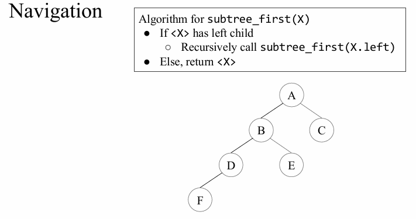

---

### 2) subtree_last(<X>)：X 子树的“最后一个”（中序最后访问）
- **含义**：在以 X 为根的子树里，中序遍历最后被访问的结点。
- **导航逻辑**：  
  **从 X 出发，一直往右走到底**（能走右就走右），直到右孩子为空。
- **直观理解**：中序会最后处理“最右边”的链，所以子树里的最终访问点就是最右端结点。

---

### 3) Successor(X)：X 的中序后继（下一个被访问）
> 定义：在中序序列里紧跟在 X 后面的结点（如果存在）。

#### 情况 A：X 有右子树
- **后继是谁**：右子树的第一个结点  
- **导航逻辑**：  
  `Successor(X) = subtree_first(<right(X)>)`  
  即：**先到右孩子，再一路向左到底**。
- **为什么**：中序访问完 X 之后，下一步必进入 X 的右子树，而右子树中最先访问的是其最左端。

#### 情况 B：X 没有右子树
- **后继是谁**：第一个把 X 放在“左边”的祖先  
- **导航逻辑**：  
  从 X 向上爬父节点：  
  - 只要当前结点是父节点的**右孩子**，就继续向上（因为父节点及其左侧都已经访问过了）。  
  - 一旦遇到“当前结点是父节点的**左孩子**”，那么这个父节点就是后继。  
- **若一路爬到根都没找到**：说明 X 是整棵树的最后一个结点（没有后继）。

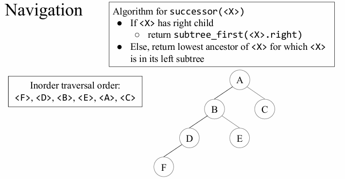

---

### 4) Predecessor(X)：X 的中序前驱（上一个被访问）
> 定义：在中序序列里紧挨在 X 前面的结点（如果存在）。

#### 情况 A：X 有左子树
- **前驱是谁**：左子树的最后一个结点  
- **导航逻辑**：  
  `Predecessor(X) = subtree_last(<left(X)>)`  
  即：**先到左孩子，再一路向右到底**。
- **为什么**：中序在访问 X 之前，会先访问完左子树，而左子树最后访问的是其最右端。

#### 情况 B：X 没有左子树
- **前驱是谁**：第一个把 X 放在“右边”的祖先  
- **导航逻辑**：  
  从 X 向上爬父节点：  
  - 只要当前结点是父节点的**左孩子**，就继续向上（因为父节点及其右侧还没轮到）。  
  - 一旦遇到“当前结点是父节点的**右孩子**”，那么这个父节点就是前驱。  
- **若一路爬到根都没找到**：说明 X 是整棵树的第一个结点（没有前驱）。

---

### 5) 一眼记忆版（最常用口诀）
- `subtree_first(X)`：**一直向左**
- `subtree_last(X)`：**一直向右**
- `Successor(X)`：
  - 有右：**右一次 + 左到头**
  - 无右：**向上找“我是左孩子”的第一个祖先**
- `Predecessor(X)`：
  - 有左：**左一次 + 右到头**
  - 无左：**向上找“我是右孩子”的第一个祖先**

---

## 5.4 树的“插入/删除”总结（按中序遍历导航的思路）

> 这里的语境通常指 **“带 parent 指针的二叉搜索树 BST”** 的结构性操作。  
> `insert_after(<X>, <Y>)` 常见含义：把结点/键 `<Y>` 插入到树里，使得 **中序遍历里 Y 紧跟在 X 之后**（即 Y 成为 X 的 Successor）。  
> `delete`：从 BST 中删除某个结点 Z，并保持 BST 性质不变。

### 1) insert_after(X, Y)：让 Y 成为 X 的中序后继

### 关键结论（只靠指针改动，不需要全树重排）
要让“Y 紧跟在 X 后面”，本质是把 Y 放到 **X 右侧最靠左的位置**。

### 情况 A：X 没有右子树
- **做法**：直接把 **Y 设为 X 的右孩子**
- **结果**：中序访问完 X，立刻到右子树；右子树第一个就是 Y，所以 Y 就是后继。

### 情况 B：X 有右子树
- **做法**：
  1) 找到 `S = subtree_first(right(X))`（X 右子树最左端结点）
  2) 把 **Y 插到 S 的左边**：即让 Y 成为 S 的左孩子（并维护 parent 指针）
- **直观理解**：在 X 的右子树里，S 原本是“最先访问”的；把 Y 放在 S 的左边，就能让 Y 变成右子树里最先访问的，从而成为 X 的后继。

### 插入时的额外注意
- 如果 `<Y>` 是“新结点”，它的 left/right 应为 null（或按需求接上某些子树，但必须保证 BST 有序性）。
- 如果 `<Y>` 代表一个“键值”，那就是普通 BST 插入；“after X” 实际上是对插入位置的约束。

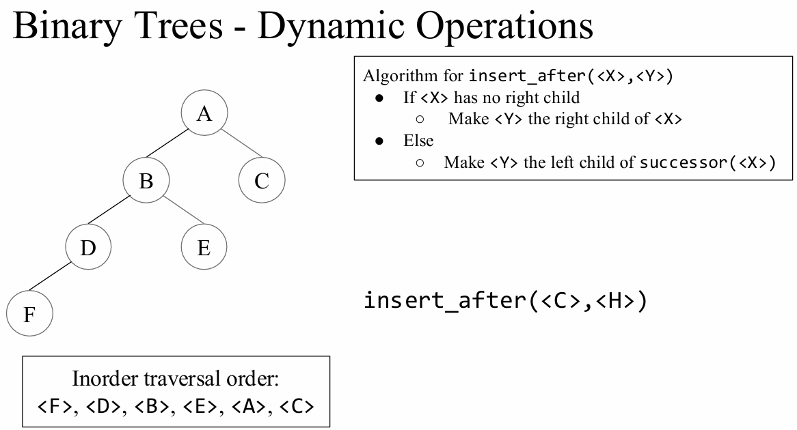

---

### 2) delete(Z)：删除结点 Z（保持 BST 性质）

> 删除的核心：**把 Z 从结构里移走，同时保持“中序序列仍然有序”。**  
> 经典做法分三种结构情况。

### 情况 1：Z 是叶子结点（无孩子）
- **做法**：直接从父结点断开它（父.left 或父.right 置空）
- **结果**：不影响其他结构，有序性自然保持。

### 情况 2：Z 只有一个孩子（只有左或只有右）
- **做法**：用 Z 的唯一孩子 **“顶替”** Z：
  - 让 Z 的父结点指向 Z 的孩子
  - 让孩子.parent 指向 Z 的父结点
- **结果**：Z 的子树整体上移一层；BST 的相对顺序不变。

### 情况 3：Z 有两个孩子（同时有左和右）
- **做法（最常见）**：找 Z 的中序后继 `S = Successor(Z)`（或用前驱也行）
  - **用 S 替换 Z 的位置**（值替换或结点替换均可）
  - 然后删除原来的 S
- **为什么选后继 S**：
  - S 是“比 Z 大的最小元素”，所以 S 放到 Z 的位置后：
    - 仍然大于左子树所有结点
    - 仍然小于右子树剩余所有结点
  - 并且 S **不可能有左孩子**（因为它是右子树最左端），所以“删除 S”会退化成 **情况 1 或 2**，很好处理。

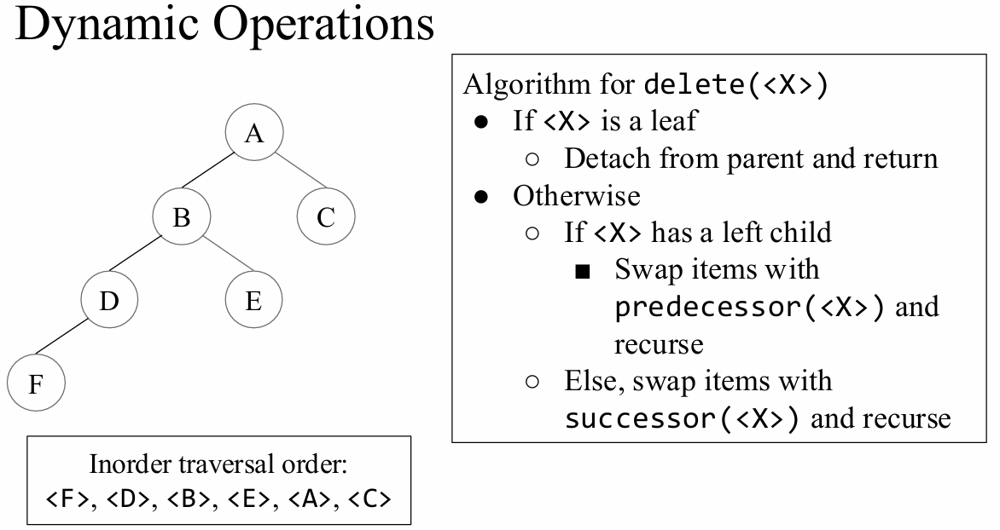s

---

### 3) 一句话记忆
- `insert_after(X, Y)`：  
  **要让 Y 紧跟 X：优先放到 X 的右边；如果右边已有树，就放到那棵右子树的最左端前面。**
- `delete(Z)`：  
  **0 个孩子直接删；1 个孩子让孩子顶上；2 个孩子用后继/前驱顶上，再删后继/前驱。**

---

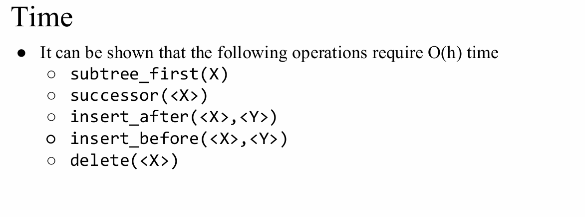

---

## 5.5 BST（二叉搜索树）的性质与常见操作

### 一、BST 的基本性质（Search Tree Property）
对任意结点 X：
- **左子树所有键 < key(X)**
- **右子树所有键 > key(X)**  
（若允许重复键，需要额外约定：比如“相等的放右边/放左边”，否则性质不唯一）

推论：
- **中序遍历 (LNR)** 会得到 **按键从小到大** 的有序序列
- 最小值 = `subtree_first(root)`（一路向左到底）
- 最大值 = `subtree_last(root)`（一路向右到底）

### 二、典型操作与核心思路
#### 1) Search / Find（查找）
- 从根开始比较：小就去左，大就去右
- 时间复杂度：`O(h)`，h 为树高

#### 2) Insert（插入）
- 沿着“查找路径”走到应插入的空位置（叶子位置）
- 插入为新叶子，保持 BST 性质
- 复杂度：`O(h)`

#### 3) Delete（删除）
按结点孩子数分类：
- **0 个孩子**：直接断开
- **1 个孩子**：用唯一孩子顶替该结点
- **2 个孩子**：用 **中序后继**（右子树最左）或 **中序前驱**（左子树最右）替换，再删除那个后继/前驱（会变成 0/1 孩子的简单情况）
- 复杂度：`O(h)`

#### 4) Successor / Predecessor（后继/前驱）
- **后继**：
  - 有右子树：`subtree_first(right(X))`
  - 无右子树：向上找第一个“X 位于其左侧”的祖先
- **前驱**：
  - 有左子树：`subtree_last(left(X))`
  - 无左子树：向上找第一个“X 位于其右侧”的祖先
- 复杂度：`O(h)`

### 三、复杂度与退化
- 若树平衡：`h = O(log n)`，查找/插入/删除都是 `O(log n)`
- 最坏情况（插入序列有序等）：BST 退化成链表，`h = O(n)`，操作变为 `O(n)`
- 平衡 BST（如 AVL、红黑树）通过旋转等机制把高度维持在 `O(log n)`（但普通 BST 不保证）

---

## 5.6 AVL 树（自平衡 BST）的性质与操作

### 一、AVL 的核心性质
AVL 是一种 **自平衡二叉搜索树（BST）**，同时满足：
1) **BST 有序性**：左子树键 < 根键 < 右子树键
2) **平衡性（Balance Condition）**：对任意结点 v，
   - 平衡因子 `BF(v) = height(left(v)) - height(right(v))`
   - 必须满足 `BF(v) ∈ { -1, 0, +1 }`
3) 结点通常维护 **高度 height**（或平衡因子）用于快速判断是否失衡

推论：
- 树高始终为 `O(log n)`，因此查找/插入/删除都有 `O(log n)` 的最坏时间保证。

### 二、基本操作
#### 1) Search（查找）
- 与 BST 完全相同：比较后向左/右走
- 复杂度：`O(log n)`

#### 2) Insert（插入）
流程：
1) 按 BST 规则插入新键（先当作普通 BST 插入）
2) 从插入点沿 parent 路径向上：
   - 更新高度
   - 检查 BF 是否超出 [-1,1]
3) 一旦出现失衡（|BF|=2），通过**旋转**恢复平衡

需要的旋转类型（由失衡形态决定）：
- **LL**：右旋（Right Rotation）
- **RR**：左旋（Left Rotation）
- **LR**：先左旋后右旋
- **RL**：先右旋后左旋

复杂度：`O(log n)`（插入只需在首次失衡处做一次旋转（单/双）即可恢复）

### 三、Delete（删除）
流程：
1) 按 BST 删除（0/1/2 孩子情况；2 孩子常用后继/前驱替换）
2) 从删除位置的上方沿 parent 路径向上：
   - 更新高度
   - 若失衡则旋转修复
3) 注意：**删除可能导致多处连续失衡**，因此回溯过程中可能需要多次旋转

复杂度：`O(log n)`（最坏需要沿路径做多个旋转）

### 四、旋转的作用（直观一句话）
旋转是在不破坏 BST 中序有序性的前提下，**局部重连指针**把“偏高的一侧”拉回去，从而把结点的平衡因子恢复到 [-1,1]。

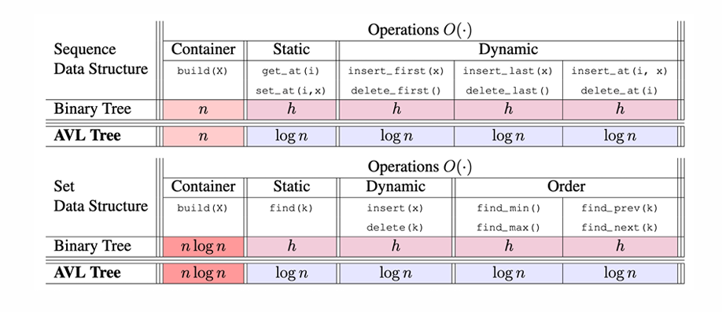