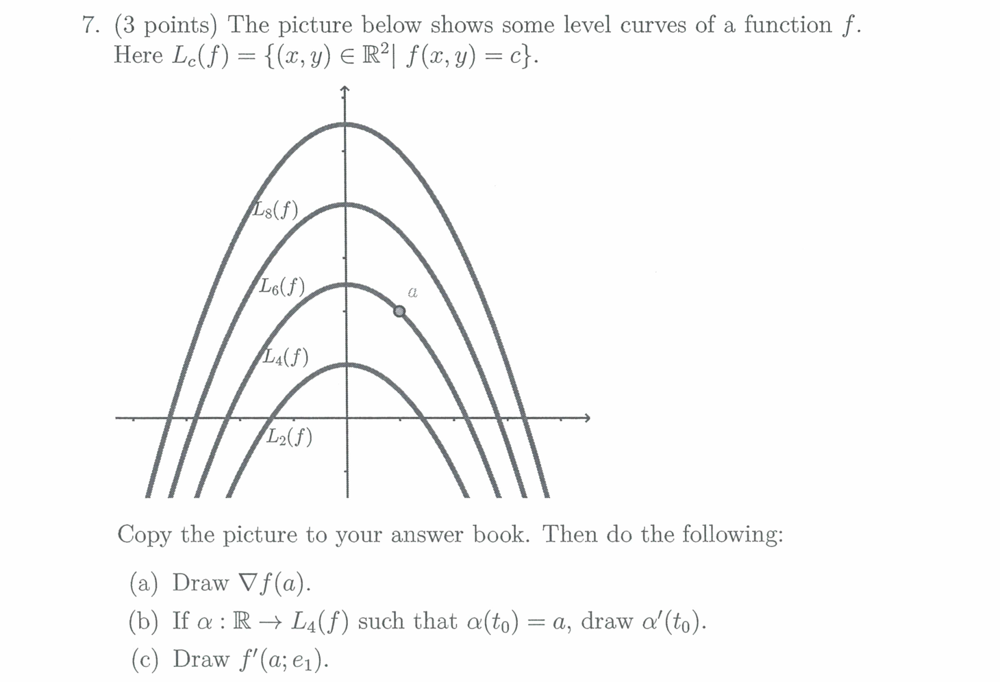

## ARIN7001 Revision - summerized by hyperloop

### Section 1 Calculus
### 2022 Final

---

### 2023 Final

---

---

---

---

### 2024 Final

### Section 2 Statistic
### 2022 Final

### 2023 Final

---

---

---

### 2024 Final

---

---

