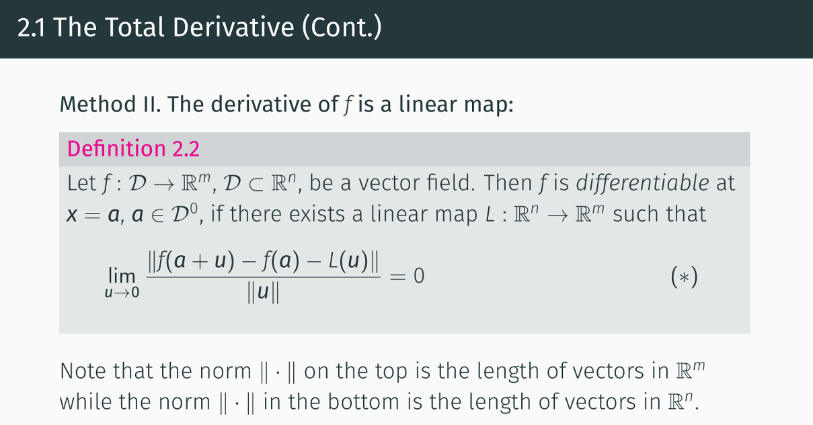
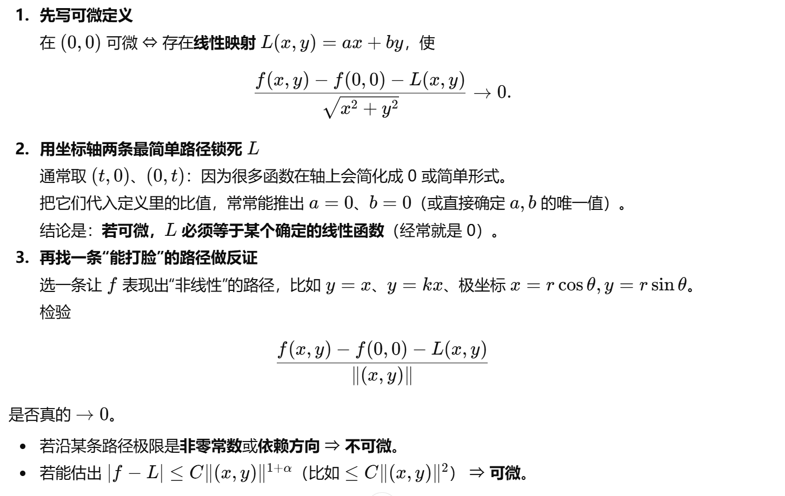
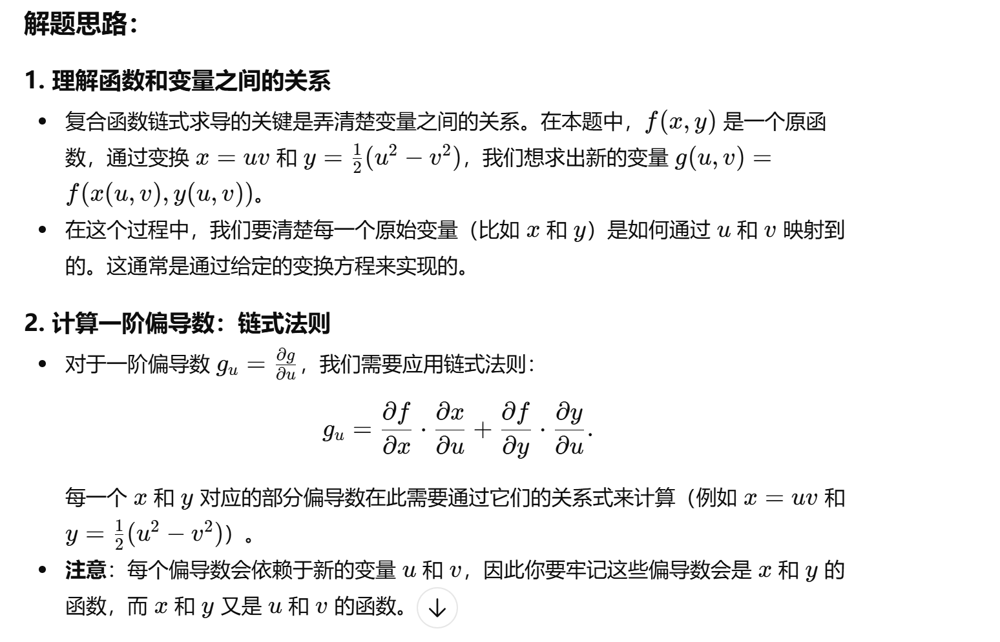
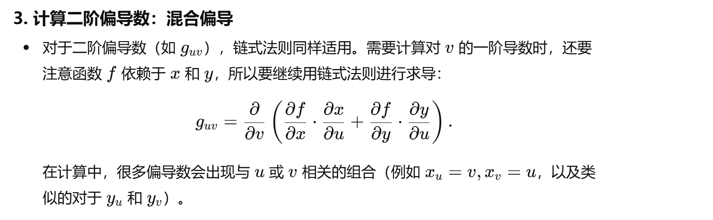
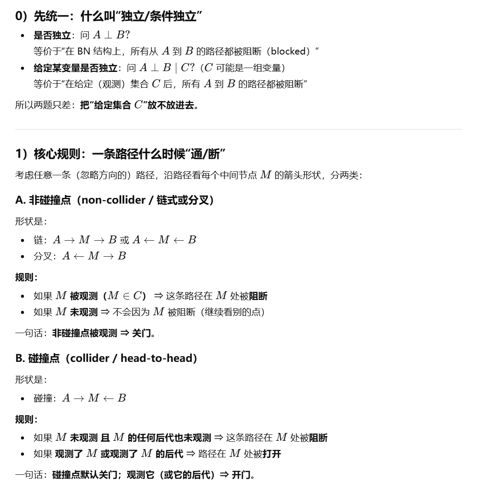
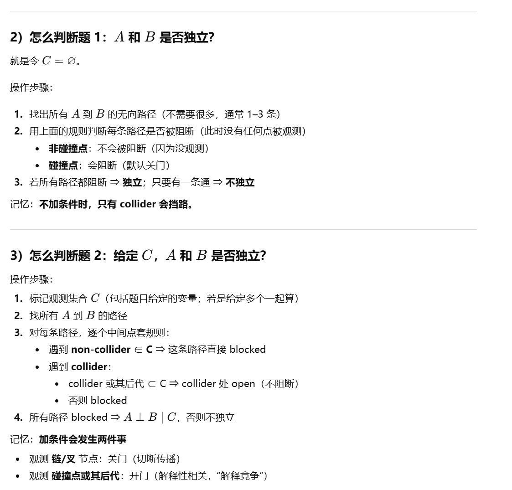

## ARIN7001 Key Notes - summarized by hyperloop

## 1 Adv Math & Calculus Section
高等数学部分每年大约有6-7道题，主要考察积分方面知识，还会有一些关于可微性质、复合函数求导、约束优化、导数梯度等知识，这一部分知识点最杂乱，有些题还是会固定出现；

### 1.1 Math 题型1 可微性质
每年都会有一道题，证明某多元函数**在零点处可微**，这道题建议使用老师课件中讲过的方法进行证明；

**根据往年经验，这些题额外创建的线性映射L一般都恒等于0，这非常重要**

**结合24-Math-Q1观看**

---

### 1.2 Math 题型2 纯积分

#### 纯积分题：常规方法做不动时，如何选“换招”（方法选择指南）

> 目标：**不展开具体技巧**，只教你看到题目后如何快速判断该用  
> ①交换积分顺序 ②分布/概率积分 ③换元（含极坐标、线性变换等）

#### 1.2.0 先做 3 秒扫描（决定大方向）
- **看积分维度**：是一重还是二重/三重？是否有参数 \(a\)、是否反常（\(\infty\)、奇点）？
- **看结构信号**：有无绝对值、min/max、分段边界、\(x^2+y^2\)、\(xy\)、\(\sqrt{\cdot}\)、\(\ln\)、\(e^{-x}\)、\(e^{-x^2}\)、\(x^{p-1}(1-x)^{q-1}\) 等。
- **看“难点”来自哪**：是 **被积函数难** 还是 **积分区域/上下限难**？

#### 1.2.1 交换积分顺序（当“区域/上下限”是痛点）
**触发条件（出现 1 条就高度怀疑要换序）：**
- 二重积分的积分限嵌套很怪：\(\int \int_{g(x)}^{h(x)}\cdots\) 内层很难算
- 区域边界是曲线（抛物线/圆弧/双曲线）或需要分段描述
- 出现 \(\min,\max,|x-y|\) 这类典型“分区”结构
- 你发现：**换序后内层能变成“立刻可积”的形式**（例如对某个变量变成指数/幂函数/多项式）

#### 1.2.2 分布/概率积分
**触发条件：**
- 区间是 \(0\to\infty\) 或 \(-\infty\to\infty\)，并出现
  - \(e^{-x}\)、\(x^{a-1}e^{-x}\)（像指数/伽马）
  - \(e^{-x^2}\)、\(e^{-(x^2+y^2)}\)（像正态）
  - \(x^{p-1}(1-x)^{q-1}\)（像 Beta）
- 题目看起来在算“某个区域上的密度积分”或“期望/概率”
- 积分整体不像初等函数能表达，但像 **Gamma/Beta/高斯积分** 可落地

**三步走（考试可直接套）**
1. **配形**：把表达式整理成“密度核 × 常数”的样子（必要时补一个常数再除回去）。
2. **换身份**：把积分写成
   - 概率：\(\int f = \mathbb P(\cdot)\)
   - 期望：\(\int g(x) f(x)\,dx = \mathbb E[g(X)]\)
   - 或直接对应到 Gamma/Beta/高斯模板。
3. **回代常数**：最后把你“补/除”的常数、比例系数、尺度参数都还原。

#### 1.2.3 换元（当“表达式/对称性”提示变量应被重新编码）
**触发条件：**
- 被积函数/区域出现结构性组合：
  - \(x^2+y^2\)、\(\sqrt{x^2+y^2}\) → 强烈提示极坐标/径向变量
  - \(xy\)、\(y/x\)、\((ax+by)\) → 常提示构造 \(u,v\)（乘积/比值/线性组合）
- 区域具有明显几何对称（圆、扇形、椭圆、平行四边形等）
- 你能把“复杂边界”通过换元变成“矩形/圆盘/简单区间”

**一句话判断：**
> **题目在“变量组合”上很有规律（平方和、乘积、线性组合）或区域有几何对称 → 换元。**

#### 换元法总结（重点：二维/三维极坐标与常见雅可比）

##### 换元的核心（一定要写出 Jacobian）
把变量从 \((x,y)\) 或 \((x,y,z)\) 换成更“贴合区域/被积函数”的新变量，并用
\[
dx\,dy = \left|\frac{\partial(x,y)}{\partial(u,v)}\right| du\,dv,\qquad
dx\,dy\,dz = \left|\frac{\partial(x,y,z)}{\partial(u,v,w)}\right| du\,dv\,dw
\]
其中绝对值就是 **Jacobian（雅可比）**。

##### 二维：极坐标（Polar）
##### 适用信号
- 被积函数含 \(x^2+y^2\)、\(\sqrt{x^2+y^2}\)、或区域是圆/扇形/环形
- 旋转对称明显

##### 变量替换与面积元
\[
x=r\cos\theta,\quad y=r\sin\theta,\quad r\ge 0
\]
\[
dx\,dy = r\,dr\,d\theta
\]

##### 边界处理口诀
- 圆/环：直接变成 \(r\) 的区间
- 扇形：\(\theta\) 先定范围，再写 \(r\) 的范围
- 一般曲线：把边界方程改写成 \(r=f(\theta)\) 或 \(\theta=g(r)\)

##### 三维：柱坐标（Cylindrical）
##### 适用信号
- 对 \(z\) 方向“直上直下”结构明显（柱体、圆柱、绕 \(z\) 轴旋转的立体）
- 出现 \(x^2+y^2\) 但同时还有 \(z\)

##### 变量替换与体积元
\[
x=r\cos\theta,\quad y=r\sin\theta,\quad z=z
\]
\[
dx\,dy\,dz = r\,dr\,d\theta\,dz
\]
（顺序可写成 \(r\,dr\,d\theta\,dz\) 或 \(r\,dr\,dz\,d\theta\)，看边界哪个更好写）

##### 边界处理口诀
- 先确定 \((r,\theta)\) 的“底面区域”，再给出 \(z\) 的上下界：\(z\in[z_{\min}(r,\theta), z_{\max}(r,\theta)]\)

##### 三维：球坐标（Spherical，最常用版）
> 你说的 “\(r\,dr\,d\alpha\,d\beta\)” 多数对应球坐标的两个角（记号因教材不同）。

##### 适用信号
- 出现 \(x^2+y^2+z^2\) 或球/球冠/球壳
- 立体对称性强（关于原点或某轴）

##### 常见定义（物理/工科常用）
\[
x=\rho\sin\varphi\cos\theta,\quad
y=\rho\sin\varphi\sin\theta,\quad
z=\rho\cos\varphi
\]
范围通常：
\[
\rho\ge0,\quad \theta\in[0,2\pi),\quad \varphi\in[0,\pi]
\]
体积元：
\[
dx\,dy\,dz = \rho^2\sin\varphi\,d\rho\,d\varphi\,d\theta
\]

> 若你用 \(\alpha,\beta\) 表示两角：一般就是把 \(\theta\leftrightarrow \alpha\)，\(\varphi\leftrightarrow \beta\) 记号改名即可，关键是 **\(\rho^2\sin(\text{极角})\)** 这一项别漏。

##### 换元选型速记（考场判断）
- 看到 **\(x^2+y^2\)** → 优先极坐标/柱坐标
- 看到 **\(x^2+y^2+z^2\)** → 优先球坐标
- 区域像“绕轴旋转” → 柱坐标
- 区域像“球/球壳/球冠” → 球坐标

##### 高频易错点（丢分重灾区）
- **忘记 Jacobian**：二维漏 \(r\)，三维球坐标漏 \(\rho^2\sin\varphi\)
- **角度范围写错**：\(\theta\) 通常 \(0\to2\pi\)，极角 \(\varphi\) 通常 \(0\to\pi\)
- **边界没翻译干净**：一定把原边界用新变量改写成 \(r/\rho,\theta,\varphi\) 的不等式

#### 1.2.4 决策树（考试上直接用）
1) **难点主要来自积分域/上下限？**  
   - 是 → 先想 **换序**
2) **被积函数像经典核（指数/高斯/幂×指数/Beta形）？**  
   - 是 → 优先 **分布积分**
3) **出现 \(x^2+y^2\) 或明显对称/几何形状？**  
   - 是 → 优先 **换元（极坐标/适配几何）**
4) **都不明显**：  
   - 先尝试“画域 + 看哪种切片更简单”（回到换序）
   - 或尝试把表达式配成某个已知核（回到分布积分）
   - 或寻找能把边界变直的变量组合（回到换元）

---
### 1.3 Math 题型3 极值点

#### 找候选点（critical points）
对可微函数 \(f(x_1,\dots,x_n)\)：
\[
\nabla f = 0 \quad \Longleftrightarrow \quad 
\frac{\partial f}{\partial x_1}=0,\dots,\frac{\partial f}{\partial x_n}=0
\]
解这个方程组得到所有驻点（候选极值点）。

#### 计算 Hessian（海森矩阵）
在每个驻点 \(x^*\) 处计算二阶偏导，组成海森矩阵：
\[
H(x^*)=
\begin{pmatrix}
\frac{\partial^2 f}{\partial x_1^2} & \cdots & \frac{\partial^2 f}{\partial x_1\partial x_n}\\
\vdots & \ddots & \vdots\\
\frac{\partial^2 f}{\partial x_n\partial x_1} & \cdots & \frac{\partial^2 f}{\partial x_n^2}
\end{pmatrix}_{x=x^*}
\]

#### 用正定性判定（核心结论）
- 若 \(H(x^*)\) **正定**（对任意非零向量 \(v\)，有 \(v^\top H v>0\)）  
  👉 \(f\) 在 \(x^*\) 处有**严格局部极小值**。

- 若 \(H(x^*)\) **负定**（对任意非零向量 \(v\)，有 \(v^\top H v<0\)）  
  👉 \(f\) 在 \(x^*\) 处有**严格局部极大值**。

- 若 \(H(x^*)\) **不定**（有的 \(v\) 使 \(v^\top H v>0\)，有的 \(v\) 使 \(v^\top H v<0\)）  
  👉 \(x^*\) 是**鞍点**，不是极值点。

- 若 \(H(x^*)\) **半正定 / 半负定**（总是 \(\ge 0\) 或 \(\le 0\)，但存在非零 \(v\) 使 \(v^\top H v=0\)）  
  👉 **无法仅凭二阶判断**，需要进一步用高阶项或别的方法分析。

#### 二元函数 \(f(x,y)\) 的常用判据（特例记忆版）
对
\[
H=
\begin{pmatrix}
f_{xx} & f_{xy}\\
f_{yx} & f_{yy}
\end{pmatrix}
\]
记
\[
D = f_{xx}f_{yy} - f_{xy}^2
\]

在驻点处：

- 若 \(D>0\) 且 \(f_{xx}>0\)：局部极小值  
- 若 \(D>0\) 且 \(f_{xx}<0\)：局部极大值  
- 若 \(D<0\)：鞍点  
- 若 \(D=0\)：二阶判别法失效，需要另行分析

---

### 1.4 Math 题型4 链式求导
**结合23-Math-Q6观看**

---

## 2 Stat & Prbability Section
**概率论与数理统计部分，每年考察的题型，非常一致，永远是：**
- 一道联合分布
- 一到线性回归最小二乘法推导
- 一道贝叶斯网络

### 2.1 Stat 题型1 联合分布
概率联合分布这道题通常来说都没有什么难度，只需要记清变量**独立分布**的定义就行；

---

### 2.2 Stat 题型2
**最小二乘法这道题一共有两个考点：**
- 第1个考点是损失函数最小二乘闭式解推导
- 第2个考点是最小解是否唯一

#### Stat 2.2.1 最小二乘闭式解推导
对于第1个考点，损失函数闭式解的推导又分为几种情况，包括：
- 基本型
- Bias trick
- 含正则化项
- 含bias（应该不考）

这部分没什么好说的，直接背下来闭式解的公式就可以;

#### Stat 2.2.1.1 基本型

#### Stat 2.2.1.2 Bias trick

#### Stat 2.2.1.3 含正则化项

#### Stat 2.2.1.4 含Bias（应该不考）

#### Stat 2.2.2 最小解唯一性

---

### 2.3 Stat 题型3 贝叶斯网络
三个常见考点
- 变量独立判断
- 条件概率计算
- 最大似然估计

#### 变量独立判断技巧

---

## 3 Data Structure & Algorithm Section

### Updating...