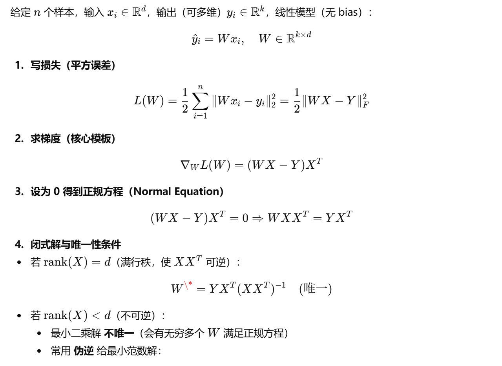
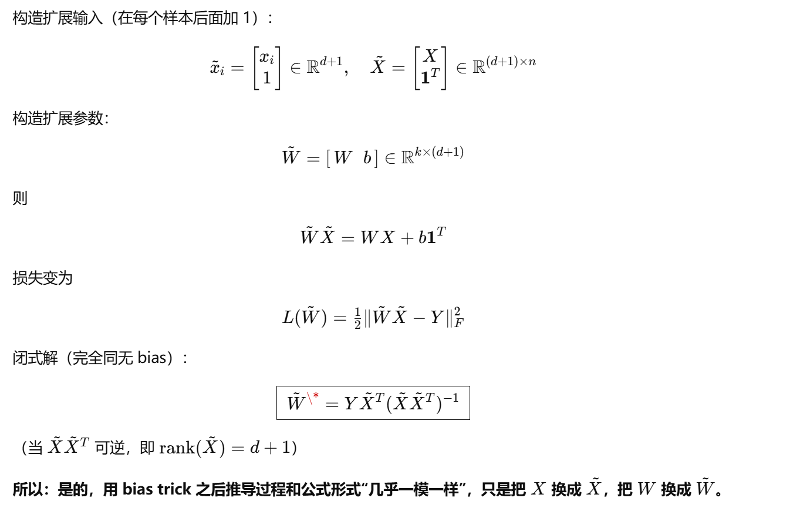
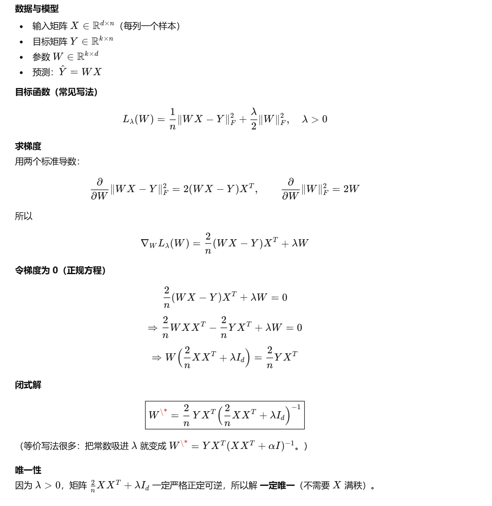
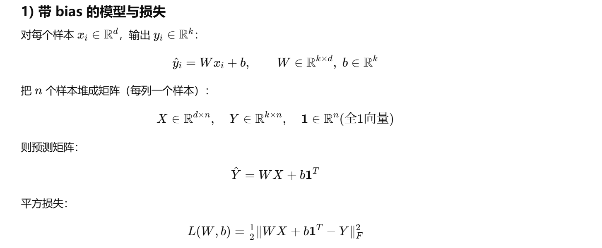
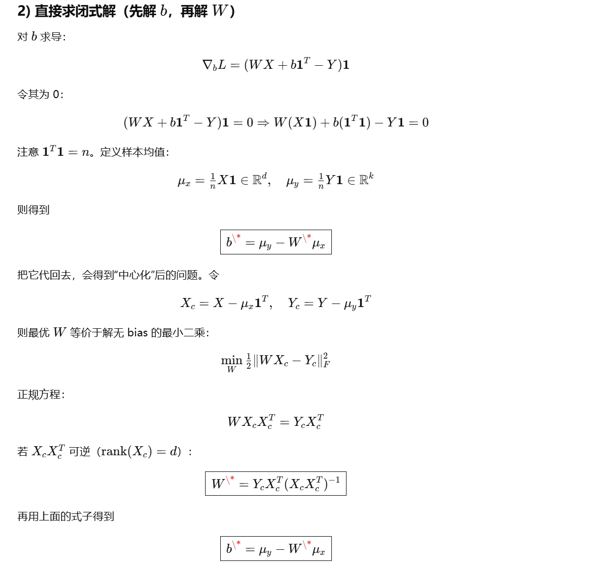
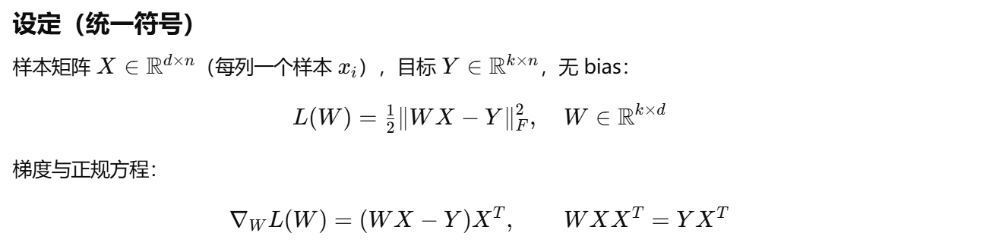
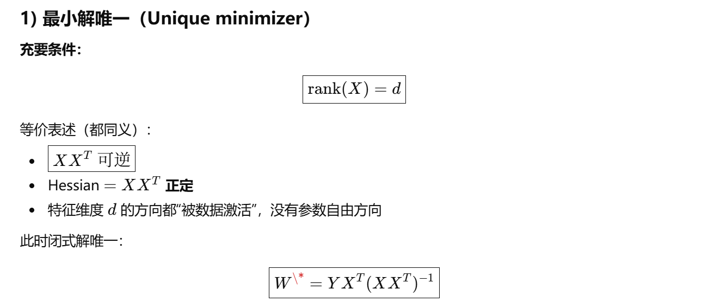
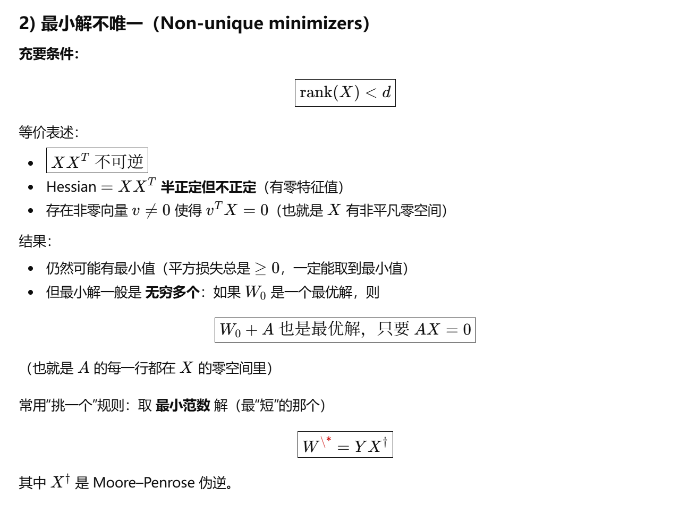

## ARIN7001 Key Notes - summerized by hyperloop

## Stat & Prbability Section
**概率论与数理统计部分，每年考察的题型，非常一致，永远是：**
- 一道联合分布
- 一到线性回归最小二乘法推导
- 一道贝叶斯网络

### Stat 题型1
概率联合分布这道题通常来说都没有什么难度，只需要记清变量**独立分布**的定义就行；

### Stat 题型2
**最小二乘法这道题一共有两个考点：**
- 第1个考点是损失函数最小二乘闭式解推导
- 第2个考点是最小解是否唯一

#### Stat 2.1 最小二乘闭式解推导
对于第1个考点，损失函数闭式解的推导又分为几种情况，包括：
- 基本型
- Bias trick
- 含正则化项
- 含bias（应该不考）

这部分没什么好说的，直接背下来闭式解的公式就可以;

#### Stat 2.1.1 基本型

#### Stat 2.1.2 Bias trick

#### Stat 2.1.3 含正则化项

#### Stat 2.1.4 含Bias（应该不考）

#### Stat 2.2 最小解唯一性

### Stat 题型3