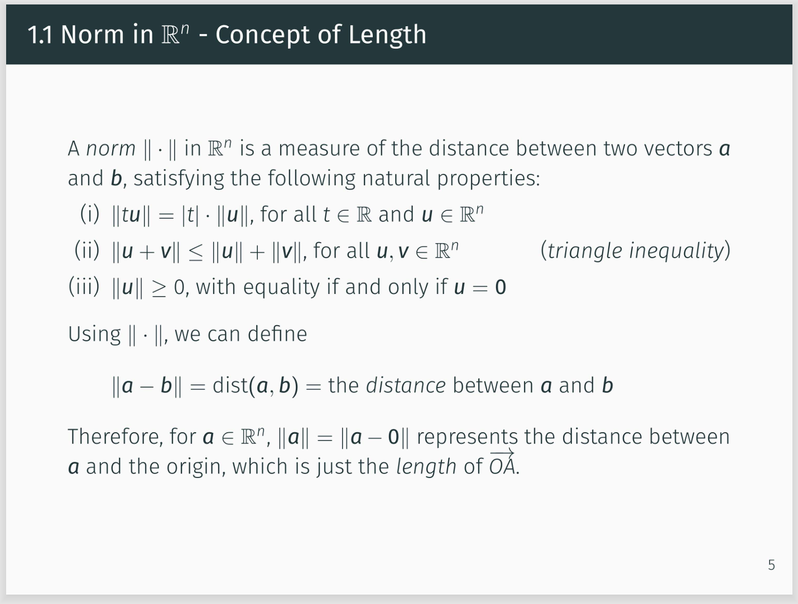
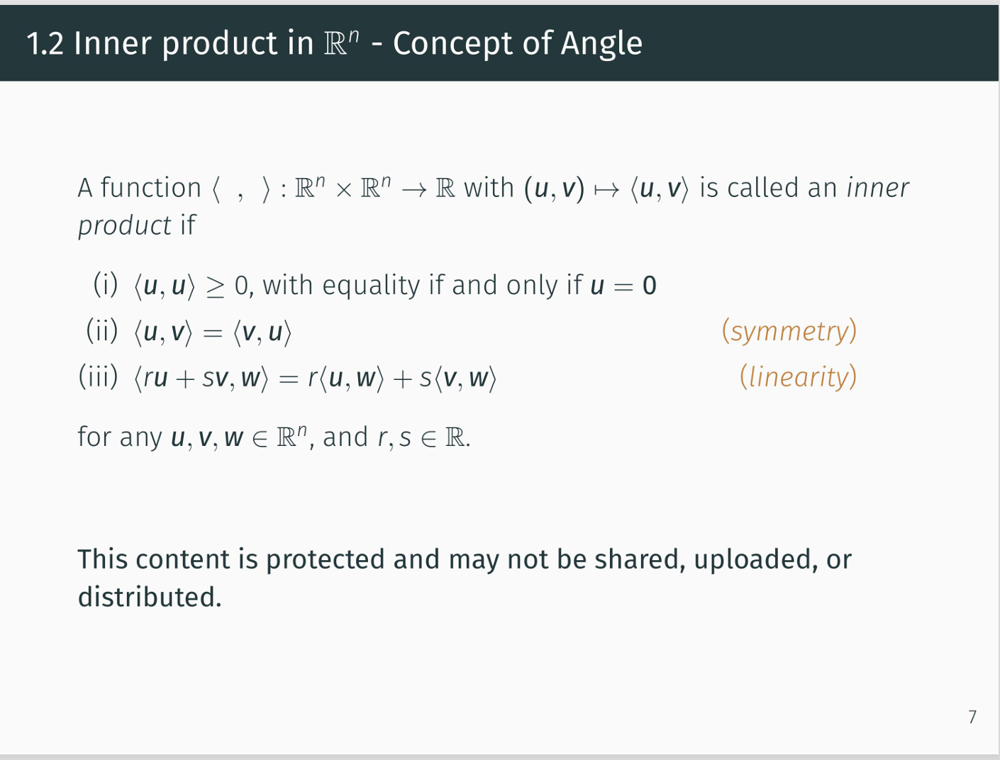
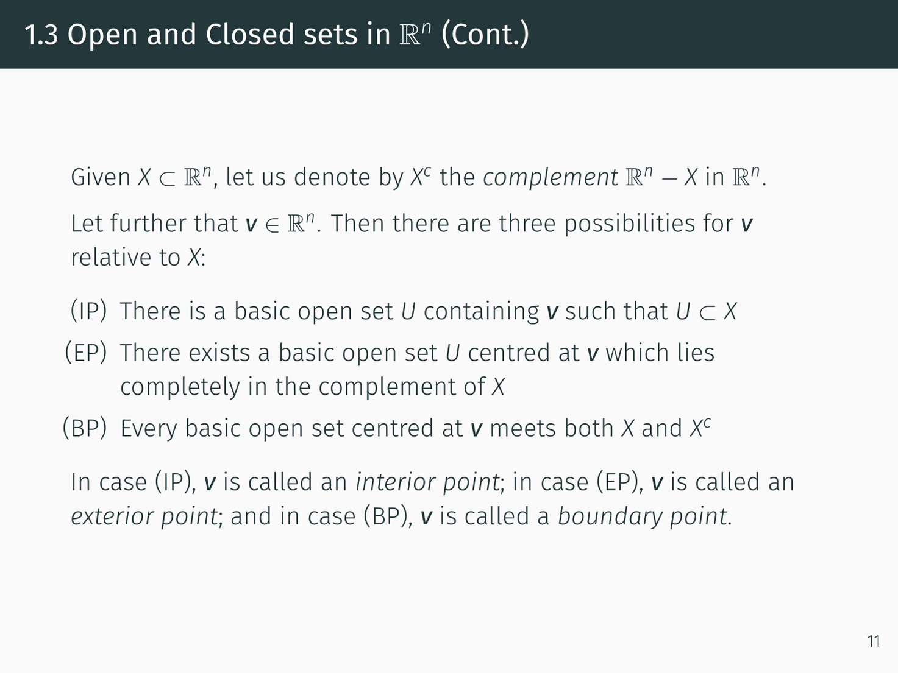
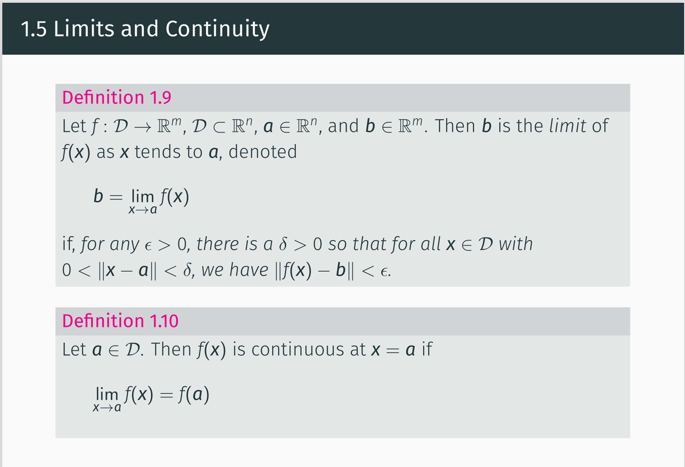
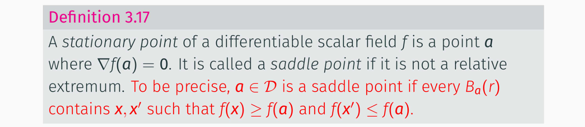
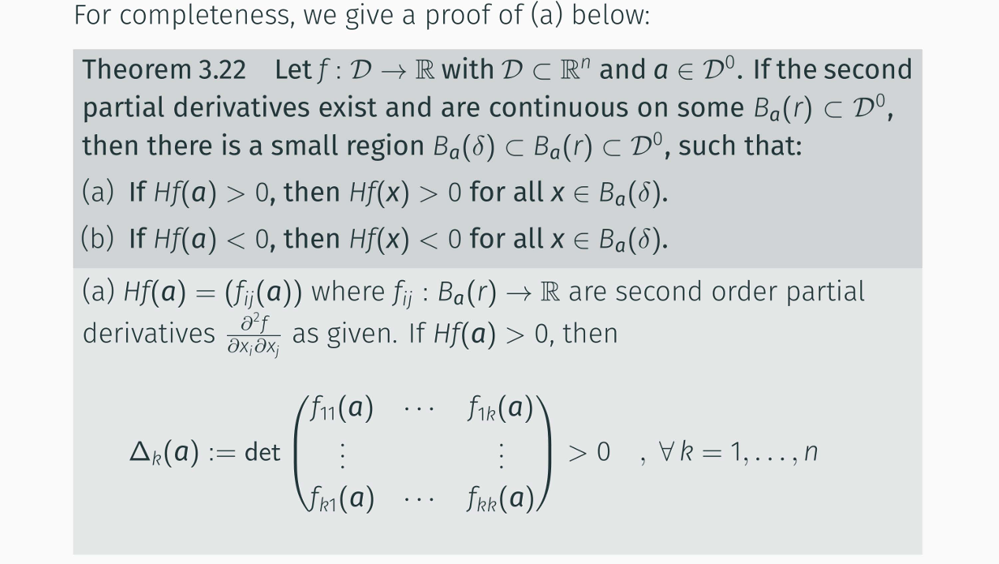
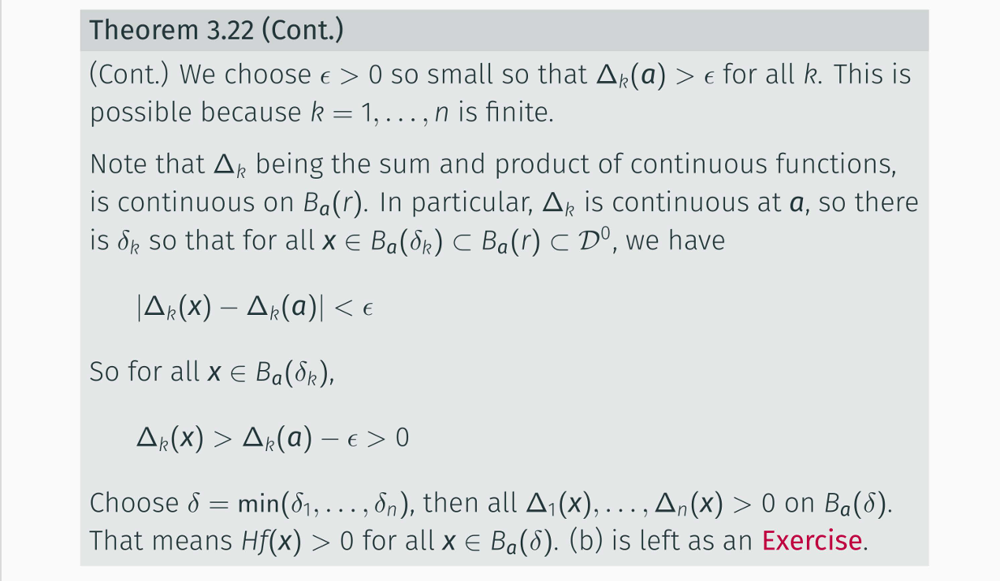
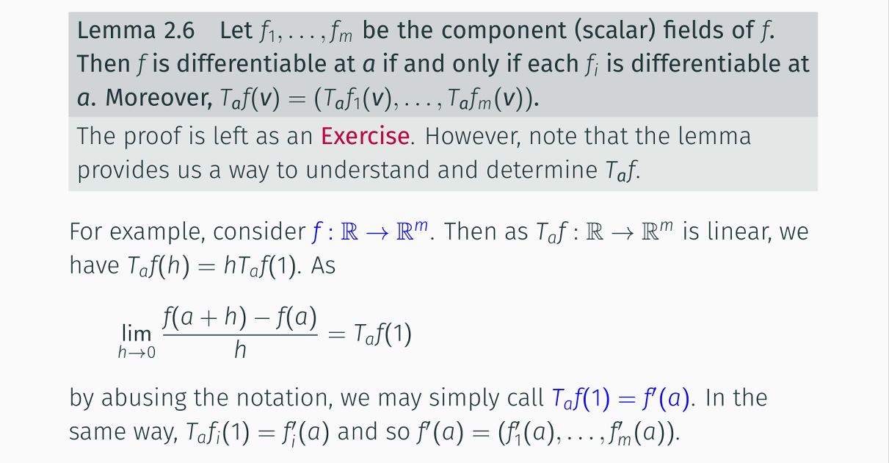

## ARIN7001 Revision - summerized by hyperloop

## Tutorial 1

### Question 1

Verify that $\|a\| := \sqrt{a_1^2 + \cdots + a_n^2}$ is a norm.

### Answer

Checking the axiom one by one

- **(i)** For $ t \in \mathbb{R}, a = (a_1, \ldots, a_n) \in \mathbb{R}^n $,

  $$
  \|ta\| = \sqrt{(ta_1)^2 + \cdots + (ta_n)^2} = |t| \sqrt{a_1^2 + \cdots + a_n^2} = |t| \|a\|.
  $$
- **(ii)** To prove this we need the **Cauchy–Schwarz inequality**:

  $$
  \left( \sum_{i=1}^n u_i v_i \right)^2 \leq \left( \sum_{i=1}^n u_i^2 \right) \left( \sum_{i=1}^n v_i^2 \right), \quad u_i, v_i \in \mathbb{R}.
  $$

  **Proof:** Consider

  $$
  f(x) = \sum_{i=1}^n (u_i x + v_i)^2 = \left( \sum_{i=1}^n u_i^2 \right) x^2 + 2 \left( \sum_{i=1}^n u_i v_i \right) x + \left( \sum_{i=1}^n v_i^2 \right).
  $$

  Since $ f(x) \geq 0 $ for all $ x \in \mathbb{R} $, its discriminant satisfies:

  $$
  \Delta = \left( 2 \sum_{i=1}^n u_i v_i \right)^2 - 4 \left( \sum_{i=1}^n u_i^2 \right) \left( \sum_{i=1}^n v_i^2 \right) \leq 0,
  $$

  which gives the inequality.

  Now, for $ u = (u_1, \ldots, u_n), v = (v_1, \ldots, v_n) \in \mathbb{R}^n $:

  $$
  \begin{aligned}
  \|u + v\|^2 &= \sum_{i=1}^n (u_i + v_i)^2 \\
  &= \sum u_i^2 + 2 \sum u_i v_i + \sum v_i^2 \\
  &\leq \sum u_i^2 + 2 \sqrt{ \left( \sum u_i^2 \right) \left( \sum v_i^2 \right) } + \sum v_i^2 \\
  &= \left( \sqrt{\sum u_i^2} + \sqrt{\sum v_i^2} \right)^2 \\
  &= \left( \|u\| + \|v\| \right)^2
  \end{aligned}
  $$

  Therefore $ \|u + v\| \leq \|u\| + \|v\| $.
- **(iii)** $ \|a\| $ is nonnegative because the square root function gives nonnegative results. If $ \|a\| = \sqrt{a_1^2 + \cdots + a_n^2} = 0 $, then $ a_1^2 + \cdots + a_n^2 = 0 $, which implies $ a_1 = \cdots = a_n = 0 $.

---

### Question 2

Verify that the following are norms:

- (a) $\|a\| = |a_1| + \cdots + |a_n|$     (Manhattan/$l_1$ norm)
- (b) $\|a\| = \max_i |a_i|$     (infinity norm)

### Answer

(a) Again let's check one by one

- **(i)** For $ t \in \mathbb{R}, a = (a_1, \ldots, a_n) \in \mathbb{R}^n $,

  $$
  \|ta\| = |ta_1| + \cdots + |ta_n| = |t| (|a_1| + \cdots + |a_n|) = |t| \|a\|.
  $$
- **(ii)** For $ u = (u_1, \ldots, u_n), v = (v_1, \ldots, v_n) \in \mathbb{R}^n $,

  $$
  \begin{aligned}
  \|u + v\| &= |u_1 + v_1| + \cdots + |u_n + v_n| \\
  &\leq |u_1| + |v_1| + \cdots + |u_n| + |v_n| \quad (\text{since } |a+b| \leq |a| + |b|) \\
  &= \|u\| + \|v\|
  \end{aligned}
  $$
- **(iii)** $ \|a\| $ is nonnegative as a sum of absolute values. If $ \|a\| = |a_1| + \cdots + |a_n| = 0 $, then $ a_1 = \cdots = a_n = 0 $.

(b)

- **(i)** For $ t \in \mathbb{R}, a = (a_1, \ldots, a_n) \in \mathbb{R}^n $,

  $$
  \|ta\| = \max_i |ta_i| = |t| (\max_i |a_i|) = |t| \|a\|.
  $$
- **(ii)** For $ u = (u_1, \ldots, u_n), v = (v_1, \ldots, v_n) \in \mathbb{R}^n $,

  $$
  \begin{aligned}
  \|u + v\| &= \max_i |u_i + v_i| \\
  &\leq \max_i (|u_i| + |v_i|) \quad (\text{since } |a+b| \leq |a| + |b|) \\
  &\leq (\max_i |u_i|) + (\max_i |v_i|) \\
  &= \|u\| + \|v\|
  \end{aligned}
  $$
- **(iii)** $ \|a\| $ is nonnegative. If $ \|a\| = \max_i |a_i| = 0 $, then all $ |a_i| = 0 $, so $ a_1 = \cdots = a_n = 0 $.

---

### Question 3

Verify that $\langle a, b \rangle = a_1b_1 + \cdots + a_nb_n$ is an inner product. This inner product is called the dot product $a \cdot b$.

### Answer

Again, axioms

For $ a = (a_1, \ldots, a_n), b = (b_1, \ldots, b_n), c = (c_1, \ldots, c_n) \in \mathbb{R}^n $ and $ r,s \in \mathbb{R} $:

- **(i)** $ (a,a) = a_1^2 + \cdots + a_n^2 \geq 0 $. If $ (a,a) = 0 $ then $ a_1 = \cdots = a_n = 0 $.
- **(ii)** $ (a,b) = a_1b_1 + \cdots + a_nb_n = b_1a_1 + \cdots + b_na_n = (b,a) $.
- **(iii)** $ (ra + sb, c) = (ra_1 + sb_1)c_1 + \cdots + (ra_n + sb_n)c_n = r(a_1c_1 + \cdots + a_nc_n) + s(b_1c_1 + \cdots + b_nc_n) = r(a,c) + s(b,c) $.

---

### Question 4

Let $\langle a, b \rangle$ be as defined in Exercise 3, and define $\|a\| = \sqrt{\langle a, a \rangle}$. Show that this $\|\cdot\|$ is a norm. Further, prove the Cauchy-Schwarz inequality $|\langle a, b \rangle| \leq \|a\|\cdot\|b\|$.

We are given the inner product
$\langle \mathbf{a}, \mathbf{b} \rangle = a_1 b_1 + \dots + a_n b_n$
and the norm
$\|\mathbf{a}\| = \sqrt{\langle \mathbf{a}, \mathbf{a} \rangle}$.
We must show $\|\cdot\|$ is a **norm** and prove the **Cauchy–Schwarz inequality**
$|\langle \mathbf{a}, \mathbf{b} \rangle| \leq \|\mathbf{a}\| \, \|\mathbf{b}\|$.

---

### 1. Norm properties

A function $\|\cdot\|$ is a norm if for all $\mathbf{a}, \mathbf{b} \in \mathbb{R}^n$ and $c \in \mathbb{R}$:

1. **Positive definiteness**: $\|\mathbf{a}\| \ge 0$, and $\|\mathbf{a}\| = 0 \iff \mathbf{a} = \mathbf{0}$.
2. **Absolute homogeneity**: $\|c \mathbf{a}\| = |c| \, \|\mathbf{a}\|$.
3. **Triangle inequality**: $\|\mathbf{a} + \mathbf{b}\| \le \|\mathbf{a}\| + \|\mathbf{b}\|$.

##### (1) Positive definiteness

$\|\mathbf{a}\| = \sqrt{a_1^2 + \dots + a_n^2} \ge 0$ clearly.
If $\mathbf{a} = \mathbf{0}$, then $\|\mathbf{a}\| = 0$.
If $\|\mathbf{a}\| = 0$, then $a_1^2 + \dots + a_n^2 = 0 \implies a_i = 0$ for all $i$.

##### (2) Absolute homogeneity

$$
\|c \mathbf{a}\| 
= \sqrt{ (c a_1)^2 + \dots + (c a_n)^2 }
= \sqrt{ c^2 (a_1^2 + \dots + a_n^2) }
= |c| \, \|\mathbf{a}\|.
$$

##### (3) Triangle inequality

(Will be shown using Cauchy–Schwarz.)

---

##### 2. Proof of the Cauchy–Schwarz inequality

Consider the function

$$
f(t) = \|\mathbf{a} + t\mathbf{b}\|^2
= \|\mathbf{a}\|^2 + 2t \langle \mathbf{a}, \mathbf{b} \rangle + t^2 \|\mathbf{b}\|^2.
$$

Since $f(t) \ge 0$ for all $t$, the quadratic has nonpositive discriminant:

$$
(2\langle \mathbf{a}, \mathbf{b} \rangle)^2 - 4\|\mathbf{a}\|^2\|\mathbf{b}\|^2 \le 0,
$$

so

$$
|\langle \mathbf{a}, \mathbf{b} \rangle|
\le
\|\mathbf{a}\| \, \|\mathbf{b}\|.
$$

---

##### 3. Triangle inequality

$$
\|\mathbf{a} + \mathbf{b}\|^2
= \|\mathbf{a}\|^2 + 2\langle \mathbf{a}, \mathbf{b}\rangle + \|\mathbf{b}\|^2
\le
(\|\mathbf{a}\| + \|\mathbf{b}\|)^2.
$$

Taking square roots gives

$$
\|\mathbf{a} + \mathbf{b}\|
\le
\|\mathbf{a}\| + \|\mathbf{b}\|.
$$

---

### Question 5

Prove that: A subset $A$ of $\mathbb{R}^n$ is closed if and only if it contains all of its boundary points.

### Answer

**"If" part:** Assume $ A $ contains all its boundary points. Then $ A^C $ doesn't contain any boundary points of $ A $. For every $ b \in A^C $, $ b $ is an exterior point of $ A $, so there exists an open set $ U $ centered at $ b $ that lies completely in $ A^C $. Thus $ A^C $ is open, so $ A $ is closed.

**"Only if" part:** Assume $ A $ is closed. Then $ A^C $ is open. Suppose there exists a boundary point $ b $ of $ A $ that is not in $ A $. Then $ b \in A^C $, and since $ A^C $ is open, there exists an open set $ U $ centered at $ b $ that lies completely in $ A^C $, contradicting the definition of boundary points. So all boundary points of $ A $ are in $ A $.

---
### Question 6

Show that

- (a) Basic open sets are open.
- (b) The empty set $\emptyset$ and $\mathbb{R}^n$ are both open and closed.
- (c) Let $\{W_\alpha\}$ be a (possibly uncountable) collection of open sets. Then their union $W = \bigcup_\alpha W_\alpha$ is also open.
- (d) Let $\{W_1, W_2, \ldots, W_n\}$ be a finite collection of open sets. Then their intersection $W = \bigcap_1^n W_\alpha$ is open. Give an example demonstrating that the finiteness condition is required to guarantee openness, i.e., the intersection of an infinite collection of open sets need not be open.
- (e) Any finite set of points is closed.

### Answer

### (a) Open balls and open boxes

**Open balls $ B_a(r) $:** For any $ b \in B_a(r) $, take $ r' = r - \|b - a\| $. Then $ B_b(r') \subset B_a(r) $ since for all $ c \in B_b(r') $:

$$
\|c - a\| \leq \|c - b\| + \|b - a\| < r' + \|b - a\| = r.
$$

**Open boxes $ R = [a_1,b_1] \times \cdots \times [a_n,b_n] $:** For any $ c = (c_1, \ldots, c_n) \in R $, take $ r = \min_i \{ \min(c_i - a_i, b_i - c_i) \} $. Then for any $ d = (d_1, \ldots, d_n) \in B_c(r) $:

$$
c_i - r < d_i < c_i + r \Rightarrow a_i < d_i < b_i,
$$

so $ d \in R $ and thus $ B_c(r) \subset R $.

### (b) Empty set and whole space

Since $ \varnothing^C = \mathbb{R}^n $, we prove both are open:

- $ \varnothing $ is open: Automatically true since it has no points, so every point in it is an interior point.
- $ \mathbb{R}^n $ is open: Automatically true since every basic open set centered at any point is inside $ \mathbb{R}^n $, so every point in it is an interior point.

### (c) Arbitrary union of open sets

For any $ a \in W $, $ a \in W_\alpha $ for some $ \alpha $. Since $ W_\alpha $ is open, there exists an open ball centered at $ a $ that is entirely in $ W_\alpha $, hence in $ W $. So $ a $ is an interior point of $ W $ and $ W $ is open.

### (d) Finite intersection of open sets

For any $ a \in W $, $ a \in W_i $ for every $ i = 1,\ldots,n $. Since each $ W_i $ is open, there exists $ B_a(r_i) \subset W_i $. Let $ r = \min_i r_i $. Then $ B_a(r) \subset B_a(r_i) \subset W_i $ for every $ i $, so $ B_a(r) \subset W $. Thus $ a $ is an interior point and $ W $ is open.

This fails for infinite intersections: example $ W_i = (-1/i, 1/i) \subset \mathbb{R} $, then $ \bigcap W_i = \{0\} $ which is not open.

### (e) Finite sets are closed

Let $ S = \{a_1, \ldots, a_n\} \subset \mathbb{R}^n $. For all $ b \in S^C $, let $ r = \min_i \|b - a_i\| $. Then $ B_b(r) \subset S^C $ since for any $ c \in B_b(r) $:

$$
\|c - a_i\| \geq \|b - a_i\| - \|b - c\| > \|b - a_i\| - r \geq 0,
$$

so $ c \neq a_i $ for every $ i $.

---

### Question 7

Let $f$ be a vector field and $f_1, \ldots, f_m$ be the corresponding component fields. Prove that $f$ is continuous at $a$ if and only if each $f_i$ is continuous at $a$.

### Answer

Here we denote $\|x\|$ as the standard Euclidean norm. We denote $\mathbf{e}_i$ to be a vector in $\mathbb{R}^n$ where the $i$-th entry of $\mathbf{e}_i$ is 1 and the rest are all zero. Notice that $\|\mathbf{e}_i\| = 1$ and we can write  

$$
f(x) = (f_1(x), \ldots, f_n(x)) = f_1(x)\mathbf{e}_1 + \cdots + f_n(x)\mathbf{e}_n.
$$

**"If" part:** For any $a \in \mathbb{R}^n$, for any $\varepsilon > 0$, there exists $\delta_1, \ldots, \delta_n > 0$ such that for any  

$$
\|x - a\| < \delta_i,
$$

$$
|f_i(x) - f_i(a)| < \frac{\varepsilon}{n}.
$$

Take $\delta = \min_i \delta_i$. Then for any $\|x - a\| < \delta$,

$$
\begin{aligned}
\|f(x) - f(a)\| &= \|f_1(x)\mathbf{e}_1 + \cdots + f_n(x)\mathbf{e}_n - f_1(a)\mathbf{e}_1 - \cdots - f_n(a)\mathbf{e}_n\| \\
&\leq \|f_1(x)\mathbf{e}_1 - f_1(a)\mathbf{e}_1\| + \cdots + \|f_n(x)\mathbf{e}_n - f_n(a)\mathbf{e}_n\| \\
&\leq (|f_1(x) - f_1(a)|)\|\mathbf{e}_1\| + \cdots + (|f_n(x) - f_n(a)|)\|\mathbf{e}_n\| \\
&< n\left(\frac{\varepsilon}{n}\right) = \varepsilon
\end{aligned}
$$

So $f$ is continuous at $a$.

**"Only if" part:** Notice that

$$
\begin{aligned}
\|f(x) - f(a)\| &= \|(f_1(x) - f_1(a), \ldots, f_n(x) - f_n(a))\| \\
&= \sqrt{(f_1(x) - f_1(a))^2 + \cdots + (f_n(x) - f_n(a))^2} \\
&\geq \sqrt{(f_i(x) - f_i(a))^2} \\
&= |f_i(x) - f_i(a)|
\end{aligned}
$$

for every $i$. Since $f(x)$ is continuous, for any $\varepsilon > 0$, there exists $\delta > 0$ such that for any  

$$
\|x - a\| < \delta, \quad \|f(x) - f(a)\| < \varepsilon.
$$

So under the same condition,

$$
|f_i(x) - f_i(a)| \leq \|f(x) - f(a)\| < \varepsilon
$$

which means $f_i(x)$ is also continuous for every $i$.

---
## Tutorial 2

### Q1
Find $T_{a}f$ (or also called L) with $a\in\mathcal{D}^{0}$ for: 
- (a) f is a constant vector field, i.e., $f:\mathcal{D}\rightarrow\mathbb{R}^{m}$ with all elements a map to a fixed element $w\in\mathbb{R}^{m}$.
- (b) f is a linear map.
- (c) $f(x)=\langle x,x\rangle=||x||^{2}$.
- (d) A matrix $X\in Matr(n\times n,\mathbb{R})$ may be considered as an element in $\mathbb{R}^{n^{2}}$. Define the map $f:\mathbb{R}^{n^{2}}\rightarrow\mathbb{R}^{n^{2}}$ with $f(X)=X\cdot X$ where $\cdot$ denotes matrix multiplication.

[Hint: use the uniqueness of $T_{a}f$]
### Answer
### (a) Constant field

Suppose $f$ is constant. Define the linear map $L(u)=0$. Then
$$
\lim_{u\to 0} \frac{\|f(a+u)-f(a)-L(u)\|}{\|u\|}
= \lim_{u\to 0} \frac{0}{\|u\|} = 0.
$$
Thus $f$ is differentiable at $a$ and, by uniqueness of the derivative,
$$
T_a f = L(u) = 0.
$$

### (b) Linear map

Suppose $f$ is linear. Let $L(u)=f(u)$, which is linear. Then
$$
\lim_{u\to 0} \frac{\|f(a+u)-f(a)-L(u)\|}{\|u\|}
= \lim_{u\to 0} \frac{\|f(u)+f(a)-f(a)-f(u)\|}{\|u\|}
= \lim_{u\to 0} \frac{0}{\|u\|} = 0.
$$
Hence $f$ is differentiable at $a$ and
$$
T_a f = L(u) = f.
$$

### (c) Inner product

Let $f(x)=\langle x,x\rangle$ on an inner product space, and fix $a$. Define
$$
L(u)=2\langle u,a\rangle,
$$
which is linear. Then
$$
\begin{aligned}
\lim_{u\to 0} \frac{\|f(a+u)-f(a)-L(u)\|}{\|u\|}
&= \lim_{u\to 0}
\frac{\|\langle a+u,a+u\rangle - \|a\|^2 - 2\langle u,a\rangle\|}{\|u\|} \\
&= \lim_{u\to 0}
\frac{\|\|u\|^2 + 2\langle u,a\rangle + \|a\|^2 - \|a\|^2 - 2\langle u,a\rangle\|}{\|u\|} \\
&= \lim_{u\to 0} \frac{\|\|u\|^2\|}{\|u\|}
= \lim_{u\to 0} \|u\| = 0.
\end{aligned}
$$
Thus $f$ is differentiable at $a$ and
$$
T_a f = L(u) = 2\langle u,a\rangle.
$$

### (d) Matrix multiplication

Let $A=(a_{ij})$ and $B=(b_{ij})$ be real $n\times n$ matrices. The $(i,j)$–entry of $A B$ is
$$
(AB)_{ij} = \sum_{k=1}^n a_{ik} b_{kj}.
$$
By the Cauchy–Schwarz inequality,
$$
\begin{aligned}
\|A B\|^2
&= \sum_{i=1}^n \sum_{j=1}^n \Bigl(\sum_{k=1}^n a_{ik} b_{kj}\Bigr)^2 \\
&\le \sum_{i=1}^n \sum_{j=1}^n
\Bigl(\sum_{k=1}^n a_{ik}^2\Bigr)
\Bigl(\sum_{k=1}^n b_{kj}^2\Bigr) \\
&= \sum_{i=1}^n \Bigl(\sum_{k=1}^n a_{ik}^2\Bigr)
\sum_{j=1}^n \Bigl(\sum_{k=1}^n b_{kj}^2\Bigr)
= \|A\|^2 \,\|B\|^2.
\end{aligned}
$$
Hence
$$
\|A B\| \le \|A\|\,\|B\|.
$$

Now let $f(u)=u\,u$ on the space of $n\times n$ matrices, and fix $a$. Define
$$
L(u)= a\,u + u\,a,
$$
which is linear (matrix multiplication is linear in each argument). Then
$$
\begin{aligned}
\lim_{u\to 0} \frac{\|f(a+u)-f(a)-L(u)\|}{\|u\|}
&= \lim_{u\to 0} \frac{\|(a+u)(a+u) - a a - a u - u a\|}{\|u\|} \\
&= \lim_{u\to 0} \frac{\|u u + u a + a u + a a - a a - a u - u a\|}{\|u\|} \\
&= \lim_{u\to 0} \frac{\|u u\|}{\|u\|}
\le \lim_{u\to 0} \frac{\|u\|^2}{\|u\|}
= \lim_{u\to 0} \|u\| = 0.
\end{aligned}
$$
Since the fraction is nonnegative, the squeeze theorem gives limit $0$. Thus
$$
T_a f = L(u) = a\,u + u\,a.
$$

---

### Q2
 Define \(f : \mathbb{R}^3 \to \mathbb{R}^2\) by
   $$
   f(x,y,z) = \bigl(e^{x\sin y},\, z\cos y\bigr).
   $$
   Find \(\dfrac{\partial f}{\partial x}(a)\) and \(\dfrac{\partial f}{\partial z}(a)\), where \(a = (x_0,y_0,z_0)\).
### Answer
Let
$$
f(x,y,z) = \bigl(e^{x\sin y},\, z\cos y\bigr).
$$
Then
$$
\frac{\partial f}{\partial x}
= \left(\frac{\partial}{\partial x} e^{x\sin y},
\,\frac{\partial}{\partial x}(z\cos y)\right)
= \bigl((\sin y)e^{x\sin y},\, 0\bigr),
$$
and
$$
\frac{\partial f}{\partial z}
= \left(\frac{\partial}{\partial z} e^{x\sin y},
\,\frac{\partial}{\partial z}(z\cos y)\right)
= \bigl(0,\,\cos y\bigr).
$$
Therefore, at $a=(x_0,y_0,z_0)$,
$$
\frac{\partial f}{\partial x}(a)
= \bigl((\sin y_0)e^{x_0\sin y_0},\, 0\bigr),
\qquad
\frac{\partial f}{\partial z}(a)
= \bigl(0,\,\cos y_0\bigr).
$$

---

### Q3.
Define
   $$
   f(x,y) = \int_{0}^{\sqrt{xy}} e^{-t^2}\,dt
   $$
   for \(x,y>0\). Find \(\dfrac{\partial f}{\partial x}\).

### Answer
Let
$$
f(x,y)=\int_{0}^{\sqrt{xy}} e^{-t^2}\,dt.
$$
By the chain rule and the fundamental theorem of calculus,
$$
\begin{aligned}
\frac{\partial f}{\partial x}
&= \frac{\partial}{\partial(\sqrt{xy})}
\left(\int_{0}^{\sqrt{xy}} e^{-t^2}\,dt\right)
\cdot \frac{\partial(\sqrt{xy})}{\partial x} \\
&= e^{-(\sqrt{xy})^2} \cdot \frac{\sqrt{y}}{2\sqrt{x}}
= \frac{\sqrt{y}}{2\sqrt{x}}\,e^{-xy}.
\end{aligned}
$$

### 变上下限积分求导公式 - Leibniz Integral Rule
对于函数 $F(x)$ 定义为:$$F(x) = \int_{a(x)}^{b(x)} f(x, t) dt$$其中：$a(x)$ 是积分下限，是关于 $x$ 的函数。$b(x)$ 是积分上限，是关于 $x$ 的函数。$f(x, t)$ 是被积函数，是关于 $x$ 和 $t$ 的二元函数。则 $F(x)$ 对 $x$ 的导数为:$$\frac{dF}{dx} = \frac{d}{dx} \left[ \int_{a(x)}^{b(x)} f(x, t) dt \right]$$$$= f(x, b(x)) \cdot b'(x) - f(x, a(x)) \cdot a'(x) + \int_{a(x)}^{b(x)} \frac{\partial f(x, t)}{\partial x} dt$$

如果被积函数 $f(t)$ 不依赖于 $x$ (即 $f(x, t) = f(t)$)，则 $\frac{\partial f(x, t)}{\partial x} = 0$，公式可以简化为:$$\frac{d}{dx} \left[ \int_{a(x)}^{b(x)} f(t) dt \right] = f(b(x)) \cdot b'(x) - f(a(x)) \cdot a'(x)$$

---
### Q4
Let \(g : \mathbb{R}^2 \to \mathbb{R}^2\) and \(f : \mathbb{R}^3 \to \mathbb{R}^2\) be two vector fields defined as follows:
   $$
   g(x,y) = \bigl(e^{x+2y},\, \sin(y+2x)\bigr),
   $$
   $$
   f(r,s,t) = \bigl(r + 2s^2 + 3t^3,\, 2s - r^2\bigr).
   $$

(a) Compute the Jacobian matrices $Dg(x,y)$ and $Df(r,s,t).$ 20
(b) Compute the composition $h(r,s,t)=g(f(r,s,t))$. 21
(c) Compute the Jacobian $Dh(1,-1,1)$.

### Answer
### (a)

$$Dg(x,y)=\begin{pmatrix}\frac{\partial e^{x+2y}}{\partial x}&\frac{\partial e^{x+2y}}{\partial y}\\ \frac{\partial \sin(y+2x)}{\partial x}&\frac{\partial \sin(y+2x)}{\partial y}\end{pmatrix}=\begin{pmatrix}e^{x+2y}&2e^{x+2y}\\ 2\cos(y+2x)&\cos(y+2x)\end{pmatrix}$$

### (b)

$$Df(r,s,t)=\begin{pmatrix}\frac{\partial r+2s^{2}+3t^{3}}{\partial r}&\frac{\partial r+2s^{2}+3t^{3}}{\partial s}&\frac{\partial r+2s^{2}+3t^{3}}{\partial t}\\ \frac{\partial 2s-r^{2}}{\partial r}&\frac{\partial 2s-r^{2}}{\partial s}&\frac{\partial 2s-r^{2}}{\partial t}\end{pmatrix}=\begin{pmatrix}1&4s&9t^{2}\\ -2r&2&0\end{pmatrix}$$$$Df(r,s,t)=\begin{pmatrix}\frac{\partial r+2s^{2}+3t^{3}}{\partial r}&\frac{\partial r+2s^{2}+3t^{3}}{\partial s}&\frac{\partial r+2s^{2}+3t^{3}}{\partial t}\\ \frac{\partial 2s-r^{2}}{\partial r}&\frac{\partial 2s-r^{2}}{\partial s}&\frac{\partial 2s-r^{2}}{\partial t}\end{pmatrix}=\begin{pmatrix}1&4s&9t^{2}\\ -2r&2&0\end{pmatrix}$$$$h(r,s,t)=g(f(r,s,t))=\left(e^{r+2s^{2}+3t^{3}+2(2s-r^{2})},\sin\left(2s-r^{2}+2(r+2s^{2}+3t^{3})\right)\right)$$

### (c)

Note that $f(1,-1,1)=(6,-3)$.$$Dh(1,-1,1)=Dg(6,-3)Df(1,-1,1)$$$$=\begin{pmatrix}e^{6+2(-3)}&2e^{6+2(-3)}\\ 2\cos(-3+2(6))&\cos(-3+2(6))\end{pmatrix}\begin{pmatrix}1&4(-1)&9(1)^{2}\\ -2(1)&2&0\end{pmatrix}$$=(12cos9​2cos9​)(1−2​−42​90​)$$=\begin{pmatrix}1&2\\ 2\cos 9&\cos 9\end{pmatrix}\begin{pmatrix}1&-4&9\\ -2&2&0\end{pmatrix}$$$$=\begin{pmatrix}1-4&-4+4&9+0\\ 2\cos 9-2(2)\cos 9&-4\cos 9+2\cos 9&9(2\cos 9)+0\end{pmatrix}$$

---

### Q5. 
Find the directional derivative of the scalar field
   $$
   f(x,y) = x^2 - 3xy
   $$
   along the parabola
   $$
   y = x^2 - x + 2
   $$
   at the point \((1,2)\).

   *Note:* The given condition means that \(f\) is defined on
   $$
   D = \{(x,y)\in\mathbb{R}^2 \mid y = x^2 - x + 2\},
   $$
   so to use Corollary 2.12, one needs first to parametrize the curve \(D\) and then find the direction vector \(u\) at \((1,2)\).

### Answer

Let
$$
f(x,y)=x^2-3xy,
$$
so that
$$
\nabla f(x,y)=\left(\frac{\partial f}{\partial x},\frac{\partial f}{\partial y}\right)
=(2x-3y,\,-3x).
$$
The parabola is parametrised by
$$
\alpha(t)=(t,\,t^2-t+2).
$$
At $t=1$, we have
$$
\alpha(1)=(1,2), \qquad
\alpha'(t)=(1,\,2t-1), \quad \alpha'(1)=(1,1).
$$
A unit tangent vector at $t=1$ is
$$
u=\frac{\alpha'(1)}{\|\alpha'(1)\|}
=\left(\frac{1}{\sqrt{2}},\,\frac{1}{\sqrt{2}}\right).
$$
The required directional derivative of $f$ at $(1,2)$ along the parabola is
$$
\begin{aligned}
D_u f(1,2)
&= \nabla f(1,2)\cdot u \\
&= \bigl(2\cdot 1 - 3\cdot 2,\,-3\cdot 1\bigr)
\cdot \left(\frac{1}{\sqrt{2}},\,\frac{1}{\sqrt{2}}\right) \\
&= (-4,-3)\cdot \left(\frac{1}{\sqrt{2}},\,\frac{1}{\sqrt{2}}\right)
= \frac{-7}{\sqrt{2}}.
\end{aligned}
$$

---
### Q6

The change of variables $x=r+s$, $y=rs^{2}$ transforms $f(x,y)$ into $g(r,s)$. Compute the value of $\partial^{2}g/(\partial s\partial r)$ at the point at which $(r,s)=(1,1)$, given that $$\frac{\partial f}{\partial y}=\frac{\partial^{2}f}{\partial x^{2}}=\frac{\partial^{2}f}{\partial y^{2}}=\frac{\partial^{2}f}{\partial x\partial y}=\frac{\partial^{2}f}{\partial y\partial x}=1$$at that point.Hint. For a function $f(x,y)$ with $x, y$ being functions of $r, s$, then $f=g(r,s)$ and $$\frac{\partial f}{\partial r}=\frac{\partial f}{\partial x}\frac{\partial x}{\partial r}+\frac{\partial f}{\partial y}\frac{\partial y}{\partial r}$$and$$\frac{\partial f}{\partial s}=\frac{\partial f}{\partial x}\frac{\partial x}{\partial s}+\frac{\partial f}{\partial y}\frac{\partial y}{\partial s}$$

### Answer

$$\frac{\partial^{2}g}{(\partial s\partial r)}=\frac{\partial}{\partial s}\left(\frac{\partial g}{\partial r}\right)$$$$=\frac{\partial}{\partial s}\left(\frac{\partial g}{\partial x}\frac{\partial x}{\partial r}+\frac{\partial g}{\partial y}\frac{\partial y}{\partial r}\right)$$$$=\left(\frac{\partial}{\partial s}\frac{\partial f}{\partial x}\right)\frac{\partial x}{\partial r}+\left(\frac{\partial}{\partial s}\frac{\partial x}{\partial r}\right)\frac{\partial f}{\partial x}+\left(\frac{\partial}{\partial s}\frac{\partial f}{\partial y}\right)\frac{\partial y}{\partial r}+\left(\frac{\partial}{\partial s}\frac{\partial y}{\partial r}\right)\frac{\partial f}{\partial y}$$$$=\left(\frac{\partial^{2}f}{\partial x^{2}}\frac{\partial x}{\partial s}+\frac{\partial^{2}f}{\partial y\partial x}\frac{\partial y}{\partial s}\right)\frac{\partial x}{\partial r}+\frac{\partial(1)}{\partial s}\frac{\partial f}{\partial x}+\left(\frac{\partial^{2}f}{\partial y^{2}}\frac{\partial y}{\partial s}+\frac{\partial^{2}f}{\partial y\partial x}\frac{\partial x}{\partial s}\right)\frac{\partial y}{\partial r}+\frac{\partial s^{2}}{\partial s}\frac{\partial f}{\partial y}$$$$=((1)(1)+(1)(2sr))(1)+(0)\frac{\partial f}{\partial x}+((1)(2sr)+(1)(1))(s^{2})+(2s)\frac{\partial f}{\partial y}$$$$=((1)(1)+(1)(2sr))(1)+(0)\frac{\partial f}{\partial x}+((1)(2sr)+(1)(1))(s^{2})+(2s)(1)$$$$=(1+2sr)(1)+0+(2sr+1)(s^{2})+2s$$$$=1+2sr+2s^{3}r+s^{2}+2s$$Substituting the values at $(r,s)=(1,1)$:$$=1+2(1)(1)+2(1)^{3}(1)+(1)^{2}+2(1)$$$$=1+2+2+1+2=8$$

---

## Turorial 3

### Q1.
Consider \( y = x^2 \) defined on \( \mathbb{R} \).

(a) Find the tangent line at \( a = (1, 1) \), then present it in the form \( a + t \mathbf{v} \) for some scalar \( t \) and direction \( \mathbf{v} \).

(b) Parametrize \( y = x^2 \), i.e., find a vector field \( \alpha: D \rightarrow \mathbb{R}^2 \) with \( D \subset \mathbb{R} \) presenting the curve.

(c) Find \( t_0 \) such that \( \alpha(t_0) = a \), then verify that \( \mathbf{v} = k \alpha'(t_0) \) for some constant \( k \).

### Answer
(a)$$\frac{dy}{dx}\Big|_{x=1}=2x\Big|_{x=1}=2.$$So the equation of the tangent line is $\frac{y-1}{x-1}=2\Rightarrow y=2x-1$.Therefore every point on this line can be expressed as:$$(x,2x-1)=(1,1)+(x-1,2x-2)=(1,1)+(x-1)(1,2)=a+tv$$where $v=(1,2)$ and $t=x-1$ is a scalar run through all real number.

(b)Let $\alpha(t):\mathbb{R}\rightarrow\mathbb{R}^{2}$ defined as $\alpha(t)=(t,t^{2})$. This describes the curve.

(c)By simple checking $\alpha(1)=(1,1)=a$. Then$$\alpha^{\prime}(1)=\left(\frac{dt}{dt},\frac{dt^{2}}{dt}\right)\Big|_{t=1}=(1,2t)\Big|_{t=1}=(1,2)$$which is just $v$ above.

---
### Q2
(a) Find a vector \( \mathbf{v} \) normal to the surface
\[
z = \sqrt{x^2 + y^2 }+ (x^2 + y^2)^{3/2}
\]
at a general nonzero point \( (x, y, z) \) of the surface.

(b) Find the cosine of the angle \( \theta \) between \( \mathbf{v} \) and the \( z \)-axis and determine the limit of \( \cos \theta \) as \( (x, y, z) \to (0, 0, 0) \).

### Answer
(a)
Let $f(x,y,z)=\sqrt{x^{2}+y^{2}}+(x^{2}+y^{2})^{3/2}-z$. Then the surface is just $f(x,y,z)=0$ and a normal to it at $(x,y,z)$ can be$$v=\nabla f(x,y,z)=\left(\frac{x}{\sqrt{x^{2}+y^{2}}}+3x\sqrt{x^{2}+y^{2}},\frac{y}{\sqrt{x^{2}+y^{2}}}+3y\sqrt{x^{2}+y^{2}},-1\right)$$

(b)
Let $e_{3}=(0,0,1)$ which is a unit vector on the $z$-axis. Then $v\cdot e_{3}=||v||||e_{3}||\cos\theta$, and thus$$\lim_{(x,y,z)\rightarrow(0,0,0)}\cos\theta=\lim_{(x,y,z)\rightarrow(0,0,0)}\frac{v\cdot e_{3}}{||v||||e_{3}||}$$$$=\lim_{(x,y,z)\rightarrow(0,0,0)}\frac{-1}{\sqrt{\left(\frac{x}{\sqrt{x^{2}+y^{2}}}+3x\sqrt{x^{2}+y^{2}}\right)^{2}+\left(\frac{y}{\sqrt{x^{2}+y^{2}}}+3y\sqrt{x^{2}+y^{2}}\right)^{2}+(-1)^{2}}}$$$$=\lim_{(x,y,z)\rightarrow(0,0,0)}\frac{-1}{\sqrt{2+6x^{2}+6y^{2}+9x^{2}(x^{2}+y^{2})+9y^{2}(x^{2}+y^{2})}}=\frac{-1}{\sqrt{2}}$$

---
### Q3
Find the function \( f(x_1, \dots, x_n) = x_1^2 + x_2^2 + \dots + x_n^2 - x_1^2 - \dots - x_k^2 \) for a fixed integer \( k \), and show that the origin is a saddle point.

### Answer
Let $a$ be the origin. Since$$\nabla f(a)=\left(\frac{\partial f}{\partial x_{1}},\cdot\cdot\cdot,\frac{\partial f}{\partial x_{n}}\right)\Big|_{a}=(2x_{1},...,2x_{k},-2x_{k+1},...,-2x_{n})\Big|_{a}=0$$it is a stationary point and $f(a)=0$.But notice that for any $r>0$, $f(\frac{r}{2},0,...,0)=\frac{r^{2}}{4}>0=f(a)$ and $f(0,...,0,\frac{r}{2})=\frac{-r^{2}}{4}<0=f(a)$.So no matter how we draw an open ball around the origin, there exists points $b, c$ in it such that $f(b)>f(a)>f(c)$.So it cannot be a local extremum and thus is a saddle point.

---

### Q4
Determine all the relative and absolute extreme values and the saddle points for the function
\[
f(x, y) = xy(1 - x^2 - y^2)
\]
on the square \( (x, y) \in [-1, 1] \times [-1, 1] \).

### Answer
First, we consider the interior points \((x, y) \in (-1, 1) \times (-1, 1)\):

\[
\frac{\partial f}{\partial x} = y - 3x^2 y - y^3 = y(1 - 3x^2 - y^2) = 0 \quad \text{(1)}
\]
\[
\frac{\partial f}{\partial y} = x - x^3 - 3xy^2 = x(1 - x^2 - 3y^2) = 0 \quad \text{(2)}
\]

From (1), we have \( y = 0 \) or \( 1 - 3x^2 - y^2 = 0 \).

If \( y = 0 \), substituting into (2) gives \( x(1 - x^2) = 0 \), which implies \( x = 0 \). (Note: we are considering \( (x, y) \in (-1, 1) \times (-1, 1) \), so \( x \neq \pm 1 \)).

If \( 1 - 3x^2 - y^2 = 0 \), we have \( x = \pm \sqrt{\frac{1 - y^2}{3}} \neq 0 \), since \( y \in (-1, 1) \). Substituting into (2) gives:
\[
x(1 - x^2 - 3y^2) = 0 \quad \Rightarrow \quad 1 - x^2 - 3y^2 = 0 \quad \Rightarrow \quad 1 - \frac{1 - y^2}{3} - 3y^2 = 0 \quad \Rightarrow \quad y^2 = \frac{1}{4} \quad \Rightarrow \quad y = \pm \frac{1}{2}.
\]
Substituting \( y = \pm \frac{1}{2} \) into \( x = \pm \sqrt{\frac{1 - y^2}{3}} \) gives \( x = \pm \frac{1}{2} \), so all stationary points of \( f \) in \( (-1, 1) \times (-1, 1) \) are \( \left(\pm \frac{1}{2}, \pm \frac{1}{2}\right) \) and \( (0, 0) \).

Now, looking at the Hessian matrix:
\[
Hf(x, y) = \begin{pmatrix}
\frac{\partial^2 f}{\partial x^2} & \frac{\partial^2 f}{\partial x \partial y} \\
\frac{\partial^2 f}{\partial y \partial x} & \frac{\partial^2 f}{\partial y^2}
\end{pmatrix}
= \begin{pmatrix}
-6xy & 1 - 3x^2 - 3y^2 \\
1 - 3x^2 - 3y^2 & -6xy
\end{pmatrix}
\]

One can check that \( Hf\left(\frac{1}{2}, \frac{1}{2}\right) \) and \( Hf\left(-\frac{1}{2}, -\frac{1}{2}\right) \) are negative definite, while \( Hf\left(\frac{1}{2}, -\frac{1}{2}\right) \) and \( Hf\left(-\frac{1}{2}, \frac{1}{2}\right) \) are positive definite, so \( \pm\left(\frac{1}{2}, \frac{1}{2}\right) \) are the relative maximum points (where \( f\left(\frac{1}{2}, \frac{1}{2}\right) = f\left(-\frac{1}{2}, -\frac{1}{2}\right) = \frac{1}{8} \)) and \( \pm\left(\frac{1}{2}, -\frac{1}{2}\right) \) are the relative minimum points (where \( f\left(\frac{1}{2}, -\frac{1}{2}\right) = f\left(-\frac{1}{2}, \frac{1}{2}\right) = -\frac{1}{8} \)).

Since \( \text{det} Hf(0, 0) = -1 \), \( (0, 0) \) is a saddle point.

Now look at the boundaries. When \( y = 1 \), \( f(x, y) = -x^3 \), which is a strictly decreasing function. Therefore, it reaches a maximum at \( x = -1 \) (where \( f(-1, 1) = 1 \)), reaches a minimum at \( x = 1 \) (where \( f(1, 1) = -1 \)), and the only stationary point \( x = 0 \) is a saddle point.

When \( y = -1 \), \( f(x, y) = x^3 \), which is a strictly increasing function. Therefore, it reaches a maximum at \( x = 1 \) (where \( f(1, -1) = 1 \)), reaches a minimum at \( x = -1 \) (where \( f(-1, -1) = -1 \)), and the only stationary point \( x = 0 \) is a saddle point.

When \( x = 1 \), \( f(x, y) = -y^3 \), which is a strictly decreasing function. Therefore, it reaches a maximum at \( y = -1 \) (where \( f(1, -1) = 1 \)), reaches a minimum at \( y = 1 \) (where \( f(1, 1) = -1 \)), and the only stationary point \( x = 0 \) is a saddle point.

When \( x = -1 \), \( f(x, y) = y^3 \), which is a strictly increasing function. Therefore, it reaches a maximum at \( y = 1 \) (where \( f(-1, 1) = 1 \)), reaches a minimum at \( y = -1 \) (where \( f(-1, -1) = -1 \)), and the only stationary point \( x = 0 \) is a saddle point.

Therefore, to conclude, for \( f \) defined in \( [-1, 1] \times [-1, 1] \), \( (0, 0) \), \( (\pm 1, 0) \), \( (0, \pm 1) \) are the saddle points, \( \pm\left(\frac{1}{2}, \frac{1}{2}\right) \), \( \pm(-1, 1) \) are the relative maximum points, and \( \pm\left(\frac{1}{2}, -\frac{1}{2}\right) \), \( \pm(1, 1) \) are the relative minimum points. By comparing the values, the absolute maximum are \( \pm(-1, 1) \) and the absolute minimum are \( \pm(1, 1) \).

---
### 判断实对称矩阵正定/负定的方法
1 定义

- **正定矩阵**：一个对称矩阵 \( A \) 称为正定矩阵，当且仅当对于任意非零向量 \( \mathbf{x} \)，都有 \( \mathbf{x}^T A \mathbf{x} > 0 \)。
- **负定矩阵**：一个对称矩阵 \( A \) 称为负定矩阵，当且仅当对于任意非零向量 \( \mathbf{x} \)，都有 \( \mathbf{x}^T A \mathbf{x} < 0 \)。

2.1 特征值法

- **正定矩阵**：所有特征值均为正。
- **负定矩阵**：所有特征值均为负。
- **半正定矩阵**：所有特征值非负。
- **半负定矩阵**：所有特征值非正。

2.2 主子式法

对于一个对称矩阵 \( A \)，检查矩阵的所有主子式（即矩阵的行列式）。若满足以下条件：
- **正定矩阵**：所有主子式均大于零。
- **负定矩阵**：对于奇数阶的主子式为负，偶数阶的主子式为正。
- **半正定矩阵**：所有主子式均大于等于零。
- **半负定矩阵**：所有主子式均小于等于零。

2.3 Cholesky分解法

对于一个矩阵 \( A \)，尝试进行 **Cholesky分解**：
- **正定矩阵**：能够进行Cholesky分解，且分解出的矩阵的对角线元素均为正。
- **负定矩阵**：不能进行Cholesky分解。

### 海森矩阵与极值点判断的关系
1 海森矩阵的定义

对于一个二次可导的多变量函数 \( f(x_1, x_2, \dots, x_n) \)，其海森矩阵 \( H \) 是由该函数的二阶偏导数组成的对称矩阵，表示为：

\[
H = \begin{bmatrix}
\frac{\partial^2 f}{\partial x_1^2} & \frac{\partial^2 f}{\partial x_1 \partial x_2} & \dots & \frac{\partial^2 f}{\partial x_1 \partial x_n} \\
\frac{\partial^2 f}{\partial x_2 \partial x_1} & \frac{\partial^2 f}{\partial x_2^2} & \dots & \frac{\partial^2 f}{\partial x_2 \partial x_n} \\
\vdots & \vdots & \ddots & \vdots \\
\frac{\partial^2 f}{\partial x_n \partial x_1} & \frac{\partial^2 f}{\partial x_n \partial x_2} & \dots & \frac{\partial^2 f}{\partial x_n^2}
\end{bmatrix}
\]

海森矩阵描述了目标函数在某点的二阶导数信息，它帮助我们分析函数在该点的曲率变化。

2 极值点的判断

通过海森矩阵，我们可以通过特征值和符号来判断目标函数在某点的极值类型。

- **正定矩阵**：海森矩阵是正定的，当且仅当所有特征值都为正。
    - **结论**：如果海森矩阵在某点是正定的，则该点为**局部最小值**。

- **负定矩阵**：海森矩阵是负定的，当且仅当所有特征值都为负。
    - **结论**：如果海森矩阵在某点是负定的，则该点为**局部最大值**。

- **不定矩阵**：海森矩阵是非定的，当且仅当它的特征值既有正的也有负的。
    - **结论**：如果海森矩阵在某点是不定的，则该点为**鞍点**。
   
- **半正定矩阵**：海森矩阵是半正定的，当且仅当所有特征值都是非负的，可能有零特征值。
    - **结论**：如果海森矩阵在某点是半正定的，则该点可能是**局部最小值**，但也可能是**鞍点**或**平坦区域**，需要进一步分析。

- **半负定矩阵**：海森矩阵是半负定的，当且仅当所有特征值都是非正的，可能有零特征值。
    - **结论**：如果海森矩阵在某点是半负定的，则该点可能是**局部最大值**，但也可能是**鞍点**或**平坦区域**，需要进一步分析。

3 判断极值点的步骤

1. **计算梯度**：首先，计算目标函数的梯度并找到临界点（即梯度为零的点）。
   
2. **计算海森矩阵**：在临界点处计算海森矩阵，获取其特征值。

3. **分析海森矩阵的特征值**：
    - 如果所有特征值为正，则该点为局部最小值。
    - 如果所有特征值为负，则该点为局部最大值。
    - 如果特征值既有正有负，则该点为鞍点。
    - 如果特征值中有零，则需要进一步分析，例如计算更高阶的导数或检查边界条件。

---
### Q5
Find the points on the curve of intersection of the two surfaces
\[
x^2 - xy + y^2 - z^2 = 1 \quad \text{and} \quad x^2 + y^2 = 1
\]
which are nearest to the origin.

### Answer
Minimizing the distance from a point $a=(x,y,z)$ to origin is equivalent to minimizing $f(x,y,z)=x^{2}+y^{2}+z^{2}$, so for convinience we will minimize $f$ instead.

The point we required is in the intersection of $g_{1}=x^{2}-xy+y^{2}-z^{2}=1$ and $g_{2}=x^{2}+y^{2}=1$.Then by the Lagrange mulitpliers, we have $\lambda_{1}$, $\lambda_{2}$ such that $\nabla f=\lambda_{1}\nabla g_{1}+\lambda_{2}\nabla g_{2}$, so$$(2x,2y,2z)=\lambda_{1}(2x-y,2y-x,-2z)+\lambda_{2}(2x,2y,0).$$Case 1: $z\ne0$Then we have $x, y\ne0$ since if $x=0$, then by $x^{2}+y^{2}=1$ we have $y=\pm1$, which after putting it in $x^{2}-xy+y^{2}-z^{2}=1$ we have $z=0$ which is a contradiction (and the same logic may apply on $y=0$). Then we have$$\begin{cases}2x = \lambda_{1} (2x - y) + \lambda_{2} (2x) = 2x(\lambda_{1} + \lambda_{2}) - \lambda_{1}y \quad (1) \\ 2y = \lambda_{1} (2y - x) + \lambda_{2} (2y) = 2y(\lambda_{1} + \lambda_{2}) - \lambda_{1}x \quad (2) \\ 2z=\lambda_{1}(-2z) \quad (3) \end{cases}$$So by (3) we have $\lambda_{1}=-1$ and thus$$\begin{cases}y=2(\lambda_{2}-2)x&....&(4)\\ x=2(\lambda_{2}-2)y&......&(5)\end{cases}$$Put (4) in (5) we have $x-4(\lambda_{2}-2)^{2}x=0\Rightarrow4(\lambda_{2}-2)^{2}=1\Rightarrow(\lambda_{2}-2)=\pm\frac{1}{2}\Rightarrow\lambda_{2}=\frac{3}{2}$ or $\lambda_{2}=\frac{5}{2}$.Assume $\lambda_{2}=\frac{5}{2}$ Then by (4) we have $y=2(\frac{5}{2}-2)x=x.$ Since $x^{2}+y^{2}=1$, $x=y=\pm\frac{1}{\sqrt{2}}$. But then $x^{2}-xy+y^{2}-z^{2}=1$ gives $\frac{1}{2}-z^{2}=1\Rightarrow z^{2}=-\frac{1}{2}$ which is impossible.

So $\lambda_{2}=\frac{3}{2}$ and thus $y=2(\frac{3}{2}-2)x=-x.$ Since $x^{2}+y^{2}=1$ $x=\pm\frac{1}{\sqrt{2}}.$ Then $x^{2}-xy+y^{2}-z^{2}=1$ gives $\frac{3}{2}-z^{2}=1\Rightarrow z^{2}=\frac{1}{2}\Rightarrow z=\pm\frac{1}{\sqrt{2}}$. In any of these $(x, y, z)$ we have $f(a)=\frac{1}{2}+\frac{1}{2}+\frac{1}{2}=\frac{3}{2}$.

Case2 $z=0$.Then combining it with $x^{2}-xy+y^{2}-z^{2}=1$ and $x^{2}+y^{2}=1$ we have $1-xy=1\Rightarrow xy=0$. If $x=0,$ then by $x^{2}+y^{2}=1$ we have $y=\pm1$. If $y=0$ then by $x^{2}+y^{2}=1$ we have $x=\pm1$.In any of these $(x, y, z)$ we have $f(a)=1$.Therefore, the points on the curve nearest to the origin are $(\pm1,0,0)$ and $(0,\pm1,0)$.

---
### Q6
Find extrema of
\[
f(x, y) = x^2 + y^2 + z^2
\]
subject to the conditions
\[
x^3 + y^3 + z^3 = 10 \quad \text{and} \quad x + y + z = 4.
\]

### Answer
By the same procedure as above, let $g_{1}=x^{3}+y^{3}+z^{3}-10=0$ (i,e, $L_{0}(g_{1}))$ and $g_{2}=x+y+z-4=0$ (i.e. $L_{0}(g_{2}))$. Then by the Lagrange mulitpliers, we have $\lambda_{1}, \lambda_{2}$ such that $\nabla f=\lambda_{1}\nabla g_{1}+\lambda_{2}\nabla g_{2}$SO$$(2x,2y,2z)=\lambda_{1}(3x^{2},3y^{2},3z^{2})+\lambda_{2}(1,1,1). \text{}$$So we have$$\begin{cases}2x=3\lambda_{1}x^{2}+\lambda_{2}&\Rightarrow\lambda_{2}=2x-3\lambda_{1}x^{2} \quad (1) \text{} \\ 2y=3\lambda_{1}y^{2}+\lambda_{2}&\Rightarrow\lambda_{2}=2y-3\lambda_{1}y^{2} \quad (2) \text{} \\ 2z=3\lambda_{1}z^{2}+\lambda_{2}&\Rightarrow\lambda_{2}=2z-3\lambda_{1}z^{2} \quad (3) \text{}\end{cases}$$

Assume all $x, y, z$ are distinct. Then combining we have $2x-3\lambda_{1}x^{2}=2y-3\lambda_{1}y^{2}\Rightarrow\lambda_{1}=$$$\frac{2x-2y}{3(x^{2}-y^{2})}\Rightarrow\lambda_{1}=\frac{2}{3(x+y)} . \text{}$$Similarly we have $\lambda_{1}=\frac{2}{3(y+z)}$ and $\lambda_{1}=\frac{2}{3(x+z)}$, which just implies $x+y=y+z=x+z$which just implies $x=y=z$ and it's a contradiction. So at least some of $x, y, z$ are not distinct.

Assume $x=y=z$. Then $x=y=z=\frac{4}{3}$ But then $x^{3}+y^{3}+z^{3}=\frac{64}{9}\ne10$ which is a contradiction, so at least one of them should be distinct.Without loss of generality, assume $x=y$ and $z\ne x.$ Then $2x^{3}+z^{3}=10$ and $2x+z=4$ implies$$2x^{3}+(4-2x)^{3}=10\Rightarrow x^{3}-8x^{2}+16x-9=0. \text{}$$Notice that 1 is a root of it, by long division wehave $$(x-1)(x^{2}-7x+9)=0\Rightarrow x=1 \text{ or } x=\frac{7\pm\sqrt{13}}{2} \text{}$$If$x=y=1$ then $z=2$ and $f(x,y,z)=6$. The same result applies on $y=z=1$ and $x=z=1$.If $x=y=\frac{7+\sqrt{13}}{2}$ then $z=-3-\sqrt{13}$ and $f(x,y,z)=53+\sqrt{13}$. Again the same result applies on $y=z=\frac{7+\sqrt{13}}{2}$ and $x=z=\frac{7+\sqrt{13}}{2}$.Finally if $x=y=\frac{7-\sqrt{13}}{2}$ then $z=-3+\sqrt{13}$ and $f(x,y,z)=53-\sqrt{13}$. Again the same result applies on $y=z=\frac{7-\sqrt{13}}{2}$ and $x=z=\frac{7-\sqrt{13}}{2}$.

---
### 7. Prove Theorem 3.22(b).

First we define $\Delta_{k}$ as in the proof of 3.22(a).As stated in the same proof, $\Delta_{k}$ is a function consists of sum and product of continuous functions, so it is also continuous.Now, for any $a\in D^{0}$ such that $Hf(a)<0,$ take $\epsilon=\frac{1}{2}min\{|\Delta_{k}(a)|\}$.(Note that $\Delta_{2k-1}(a)<0$ and $\Delta_{2k}(a)>0$ for $k=1,2,...,\lceil k/2\rceil$).Then $\exists\delta_{1},...,\delta_{n}$ such that whenever $||x-a||<\delta_{k},|\Delta_{k}(x)-\Delta_{k}(a)|<\epsilon$.Take $\delta=min\{\delta_{k}\}$. Then for all $||x-a||<\delta$:$$|\Delta_{2k-1}(x)-\Delta_{2k-1}(a)|<\epsilon \quad$$$$\Rightarrow\Delta_{2k-1}(x)<\Delta_{2k-1}(a)+\epsilon \quad$$$$\Rightarrow\Delta_{2k-1}(x)<\Delta_{2k-1}(a)-\frac{1}{2}\Delta_{2k-1}(a) \quad$$$$\Rightarrow\Delta_{2k-1}(x)<\frac{1}{2}\Delta_{2k-1}(a)<0 \quad$$and$$|\Delta_{2k}(x)-\Delta_{2k}(a)|<\epsilon \quad$$$$\Rightarrow\Delta_{2k}(x)>\Delta_{2k}(a)-\epsilon \quad$$$$\Rightarrow\Delta_{2k}(x)>\Delta_{2k}(a)-\frac{1}{2}\Delta_{2k}(a) \quad$$$$\Rightarrow\Delta_{2k}(x)>\frac{1}{2}\Delta_{2k}(a)>0 \quad$$for all $k=1,2,...,\lceil k/2\rceil$.$\epsilon\le\frac{1}{2}|\Delta_{2k-1}(a)|=-\frac{1}{2}\Delta_{2k-1}(a)$ as $\Delta_{2k-1}(a)<0$.$\Delta_{2k-1}(a)<0$.$\epsilon\le\frac{1}{2}|\Delta_{2k}(a)|=\frac{1}{2}\Delta_{2k}(a)$ as $\Delta_{2k}(a)>0$.$\Delta_{2k}(a)>0$.Therefore, for any $a\in D^{0}$ such that $Hf(a)<0$ there exists $\delta>0$ such that for all $x\in B_{a}(\delta)$, $Hf(x)<0$.

---

## Tutorial 4
### Q1
Evaluate $\iint_{Q}\sqrt{|y-x^{2}|}dxdy$ on $Q=[-1,1]\times[0,2]$.

### Answer

1. To compute the first term:$$\int_{-1}^{1}\int_{0}^{x^{2}}\sqrt{x^{2}-y}dydx$$$$=-\int_{-1}^{1}\int_{0}^{x^{2}}\sqrt{x^{2}-y}d(x^{2}-y)dx$$$$=-\frac{2}{3}\int_{-1}^{1}[(x^{2}-y)^{3/2}]_{0}^{x^{2}}dx$$$$=\frac{2}{3}\int_{-1}^{1}(x^{2})^{3/2}dx$$$$=\frac{2}{3}\int_{-1}^{1}|x|^{3}dx$$$$=\frac{2}{3}\int_{-1}^{0}-x^{3}dx+\frac{2}{3}\int_{0}^{1}x^{3}dx$$$$=\frac{2}{3}[\frac{-x^{4}}{4}]_{-1}^{0}+\frac{2}{3}[\frac{x^{4}}{4}]_{0}^{1}$$$$=\frac{1}{6}+\frac{1}{6}=\frac{1}{3}.$$2. Computing the second term. 

For the second term$$\int_{-1}^{1}\int_{x^{2}}^{2}\sqrt{y-x^{2}}dydx$$$$=\int_{-1}^{1}\int_{x^{2}}^{2}\sqrt{y-x^{2}}d(y-x^{2})dx$$$$=\frac{2}{3}\int_{-1}^{1}[(y-x^{2})^{3/2}]_{x^{2}}^{2}dx$$$$=\frac{2}{3}\int_{-1}^{1}(2-x^{2})^{3/2}dx$$$$=\frac{2}{3}\int_{-1}^{1}2\sqrt{2-x^{2}}dx-\frac{2}{3}\int_{-1}^{1}x^{2}\sqrt{2-x^{2}}dx$$$$=\frac{4}{3}\int_{-\pi/4}^{\pi/4}(\sqrt{2}\cos\theta)(\sqrt{2}\cos\theta)d\theta-\frac{2}{3}\int_{-\pi/4}^{\pi/4}2\sin^{2}\theta(\sqrt{2}\cos\theta)(\sqrt{2}\cos\theta)d\theta(let~x=\sqrt{2}\sin\theta)$$$$=\frac{4}{3}\int_{-\pi/4}^{\pi/4}2\cos^{2}\theta~d\theta-\frac{2}{3}\int_{-\pi/4}^{\pi/4}4\sin^{2}\theta\cos^{2}\theta~d\theta$$$$=\frac{4}{3}\int_{-\pi/4}^{\pi/4}(\cos2\theta+1)d\theta-\frac{2}{3}\int_{-\pi/4}^{\pi/4}(\sin^{2}2\theta)d\theta$$$$=\frac{2}{3}\int_{-\pi/4}^{\pi/4}\cos2\theta~d2\theta+\frac{4}{3}\int_{-\pi/4}^{\pi/4}d\theta-\frac{1}{3}\int_{-\pi/4}^{\pi/4}(1-\cos4\theta)d\theta$$$$=\frac{2}{3}[\sin2\theta]_{-\pi/4}^{\pi/4}+\frac{4}{3}[\theta]_{-\pi/4}^{\pi/4}-\frac{1}{3}[\theta]_{-\pi/4}^{\pi/4}+\frac{1}{12}[\sin4\theta]_{-\pi/4}^{\pi/4}$$$$=\frac{2}{3}(1-(-1))+\frac{4}{3}(\pi/4-(-\pi/4))-\frac{1}{3}(\pi/4-(-\pi/4))+\frac{1}{12}(0-0)$$$$=\frac{4}{3}+\frac{\pi}{2}$$ 

Final ResultTherefore$$\int_{-1}^{1}\int_{0}^{2}\sqrt{|y-x^{2}|}dydx=\frac{1}{3}+\frac{4}{3}+\frac{\pi}{2}=\frac{5}{3}+\frac{\pi}{2}.$$

---
### Q2
A double integral of a positive function f, $\iint_{S}f(x,y)dxdy,$ reduces to the repeated integral$$\int_{0}^{3}[\int_{4y/3}^{\sqrt{25-y^{2}}}f(x,y)dx]dy$$Determine S and interchange the order of integration.

### Answer

1. Determine S From the integral, we can see that for every $y\in(0,3)$, $x$ is bounded from right by $\sqrt{25-y^{2}}$ and left by $4y/3$.The former is part of the circle line $x^{2}+y^{2}=5^{2}$ center at origin with radius 5 while intersecting the positive $x$-axis at $(5,0)$, and the latter is a straight line passing through origin with slope $3/4$ and these two lines intersect at $(4,3)$.Therefore the region S is a region bounded by the positive $x$-axis, $x=\sqrt{25-y^{2}}$ and $x=4y/3$ with vertex $(0,0)$, $(5,0)$ and $(4,3)$.It is also a sector of a circle, so by polar coordinates,$$S=\{(r,\theta):0\le r\le5,0\le\theta\le \tan^{-1}3/4\}.$$2. Interchange the order of integrationFrom $x$'s perspective, the region $S$ must be split into two subregions:When $x\in(0,4)$, $y$ is bounded above by $y=3x/4$ and below by the $x$-axis.When $x\in(4,5)$, $y$ is bounded above by $y=\sqrt{25-x^{2}}$ and below by the $x$-axis.So the required integral with the order of integration interchanged is:$$\int_{0}^{4}\left[\int_{0}^{3x/4}f(x,y)dy\right]dx+\int_{4}^{5}\left[\int_{0}^{\sqrt{25-x^{2}}}f(x,y)dy\right]dx.$$

---

### Q3
Change the ordering of the integration:$$\int_{0}^{1}\int_{0}^{1}\int_{0}^{x^{2}+y^{2}}f(x,y,z)dzdydx=\int_{*}^{*}\int_{*}^{*}\int_{*}^{*}f(x,y,z)dydzdx$$

### Answer
From the integral, the required region $\mathcal{R}$ satisfies:$$\begin{cases}0&\le x\le&1\\ 0&\le y\le&1\\ 0&\le z\le&x^{2}+y^{2}\end{cases}$$The maximum value of $z$ in the region is $1^2 + 1^2 = 2$. However, we must also consider the condition $z \le x^2 + y^2$.The solution provided simplifies the process by noting that $z$ is bounded by $z \le x^2 + y^2$.We want to change the order to $dydzdx$. This means we first integrate with respect to $y$, then $z$, and finally $x$. The $x$ boundary remains $0 \le x \le 1$.For a fixed $x$ and $z$:The maximum value of $z$ is $x^2 + 1$ (when $y=1$). The range for $z$ is $0 \le z \le x^2+1$.When fixing $x$ and $z$, $y$ is bounded by $0 \le y \le 1$ and $z \le x^2 + y^2$. The latter gives $y^2 \ge z - x^2$, so $y \ge \sqrt{z - x^2}$ (since $y \ge 0$).We must analyze the bounds of $y$ based on the relationship between $z$ and $x^2$:Case 1: $0 \le z \le x^2$If $z \le x^2$, then $z - x^2 \le 0$, so the condition $y \ge \sqrt{z - x^2}$ is automatically satisfied for all real $y$. Since $0 \le y \le 1$ is the original bound, $y$ ranges from $0$ to $1$.Case 2: $x^2 < z \le x^2+1$If $z > x^2$, then $z - x^2 > 0$. We must satisfy both $y \ge \sqrt{z - x^2}$ and $y \le 1$. Thus, $y$ ranges from $\sqrt{z - x^2}$ to $1$.Summing up all we got above, the integral can be rewritten as$$\int_{0}^{1}\left(\int_{0}^{x^{2}}\int_{0}^{1}f(x,y,z)dy~dz+\int_{x^{2}}^{x^{2}+1}\int_{\sqrt{z-x^{2}}}^{1}f(x,y,z)dy~dz\right)dx.$$

---

### Q4
For $r>0$ let $Q=[-r,r]\times[-r,r]$ and$$I(r)=\int_{-r}^{r}e^{-t^{2}}dt$$(a) Show that $I^{2}(r)=\iint_{Q}e^{-(x^{2}+y^{2})}dxdy.$

(b) If $C_{1}$ and $C_{2}$ are the circular disks inscribing and circumscribing Q, show that$$\iint_{C_{1}}e^{-(x^{2}+y^{2})}dxdy<I^{2}(r)<\iint_{C_{2}}e^{-(x^{2}+y^{2})}dxdy$$

(c) Find$$\iint_{C_{1}}e^{-(x^{2}+y^{2})}dxdy \text{ and } \iint_{C_{2}}e^{-(x^{2}+y^{2})}dxdy$$using the transformation formula $\varphi(t,\theta)=(t\cos\theta,t\sin\theta)$. Then using these to deduce $\lim_{r\rightarrow\infty}I(r)$.

### Answer
(a) Show that $I^{2}(r)=\iint_{Q}e^{-(x^{2}+y^{2})}dxdy.$

$$I^{2}(r)=\left(\int_{-r}^{r}e^{-x^{2}}dx\right)\left(\int_{-r}^{r}e^{-y^{2}}dy\right)=\int_{-r}^{r}\left(\int_{-r}^{r}e^{-x^{2}}dx\right)e^{-y^{2}}dy=\iint_{Q}e^{-(x^{2}+y^{2})}dxdy.$$

(b) Show that $\iint_{C_{1}}e^{-(x^{2}+y^{2})}dxdy<I^{2}(r)<\iint_{C_{2}}e^{-(x^{2}+y^{2})}dxdy$

Since $e^{-(x^{2}+y^{2})}>0$ for all $x,y\in\mathbb{R}$ and for all $r>0$ we always have $C_{1}\subsetneq Q\subsetneq C_{2}$.Therefore, the following inequalities hold:$$\iint_{Q}e^{-(x^{2}+y^{2})}dxdy-\iint_{C_{1}}e^{-(x^{2}+y^{2})}dxdy=\iint_{Q\setminus C_{1}}e^{-(x^{2}+y^{2})}dxdy>0$$$$\iint_{C_{2}}e^{-(x^{2}+y^{2})}dxdy-\iint_{Q}e^{-(x^{2}+y^{2})}dxdy=\iint_{C_{2}\setminus Q}e^{-(x^{2}+y^{2})}dxdy>0$$hence the inequality.

(c) Find $\iint_{C_{1}}e^{-(x^{2}+y^{2})}dxdy$ and $\iint_{C_{2}}e^{-(x^{2}+y^{2})}dxdy$ and deduce $\lim_{r\rightarrow\infty}I(r)$

Under polar coordinates, we have:The disk inscribing $Q$ (side length $2r$) is $C_{1}$, with radius $r$.$$C_{1}=\{(t,\theta):0\le t\le r,0\le\theta\le2\pi\}$$The disk circumscribing $Q$ is $C_{2}$, with radius $\sqrt{r^2+r^2} = \sqrt{2}r$.$$C_{2}=\{(t,\theta):0\le t\le\sqrt{2}r,0\le\theta\le2\pi\}$$By the transformation formula $\varphi(t,\theta)=(t\cos\theta,t\sin\theta)$ with $\det D\varphi=t$:

For $\mathbf{C_1}$:$$\iint_{C_{1}}e^{-(x^{2}+y^{2})}dxdy=\int_{0}^{2\pi}\int_{0}^{r}e^{-t^{2}}(t)dtd\theta$$$$=\int_{0}^{2\pi}\left[\frac{-e^{-t^{2}}}{2}\right]_{0}^{r}d\theta=\pi(1-e^{-r^{2}})$$For $\mathbf{C_2}$:Similarly$$\iint_{C_{2}}e^{-(x^{2}+y^{2})}dxdy=\int_{0}^{2\pi}\int_{0}^{\sqrt{2}r}e^{-t^{2}}(t)dtd\theta$$$$=\pi(1-e^{-(\sqrt{2}r)^{2}})=\pi(1-e^{-2r^{2}})$$Deducing the limit:We use the inequality from part (b):$$\pi(1-e^{-r^{2}}) < I^{2}(r) < \pi(1-e^{-2r^{2}})$$Taking the limit as $r \rightarrow \infty$:$$\lim_{r\rightarrow\infty}\pi(1-e^{-r^{2}}) = \pi(1-0) = \pi$$$$\lim_{r\rightarrow\infty}\pi(1-e^{-2r^{2}}) = \pi(1-0) = \pi$$Either integral tends to $\pi$ as $r$ tends to infinity, therefore by sandwich theorem$$\lim_{r\rightarrow\infty}I^{2}(r)=\pi$$Since $I(r)$ must be nonnegative as $e^{-t^{2}}$ is always positive, we have:$$\lim_{r\rightarrow\infty}I(r)=\sqrt{\pi}.$$

---

### Q5
There is a transformation formula converting a "sphere" to a "rectangle": Let $\Phi=\overline{B}_{0}(r)$, $\alpha:\mathcal{D}\rightarrow\Phi$ with $\mathcal{D}=(0,r)\times[0,2\pi)\times[0,\pi)$ and $\alpha(\rho,\theta,\varphi)\mapsto(x,y,z);$$$x=\rho\cos\theta\sin\varphi \quad y=\rho\sin\theta\sin\varphi \quad z=\rho\cos\varphi$$$\alpha$ is clearly $\mathcal{C}^{1}$, 1-1, and $\mathcal{D}^{*}=\alpha(\mathcal{D})\approx\Phi.$ The Jacobian is the determinant of$$D_{\alpha}=\begin{pmatrix}\nabla\alpha_{1}\\ \nabla\alpha_{2}\\ \nabla\alpha_{3}\end{pmatrix}=\begin{pmatrix}\cos\theta\sin\varphi&-\rho\sin\theta\sin\varphi&\rho\cos\theta\cos\varphi\\ \sin\theta\sin\varphi&\rho\cos\theta\sin\varphi&\rho\sin\theta\cos\varphi\\ \cos\varphi&0&-\rho\sin\varphi\end{pmatrix}$$i.e., $\det D\alpha=-\rho^{2}\sin\varphi$. So $|\det D\alpha|=\rho^{2}\sin\varphi$ and further that$$\iiint_{\Phi}f(x,y,z)dxdydz=\iiint_{\mathcal{D}}f(\alpha(\rho,\theta,\varphi))\rho^{2}\sin\varphi~d\rho d\theta d\varphi$$Question: using a similar transformation, find the volume of the solid bounded by the ellipsoid$$\frac{x^{2}}{a^{2}}+\frac{y^{2}}{b^{2}}+\frac{z^{2}}{c^{2}}=1$$

### Answer
Let $\Phi$ be the ellipsoid, $\alpha:\mathcal{D}\rightarrow\Phi$ (where $\mathcal{D}=(0,1)\times[0,2\pi)\times[0,\pi)$) is the transformation formula defined as $\alpha(\rho,r,s)\mapsto(x,y,z)$:$$x=a\rho\cos r\sin s \quad y=b\rho\sin r\sin s \quad z=c\rho\cos s$$(note that these $r$ and $s$ doesn't have the same meaning as $\theta$ and $\varphi$ in spherical coordinate).Such $\alpha$ is $\mathcal{C}^{1}$, 1-1 and $\alpha(D)=\Phi$. The Jacobian is the determinant of$$D\alpha=\begin{pmatrix}a\cos r\sin s&-a\rho\sin r\sin s&a\rho\cos r\cos s\\ b\sin r\sin s&b\rho\cos r\sin s&b\rho\sin r\cos s\\ c\cos s&0&-c\rho\sin s\end{pmatrix}$$which is $-abc\rho^{2}\sin s$. So we have the volume of the ellipsoid$$=\iiint_{\Phi}1~dxdydz=\int_{0}^{\pi}\int_{0}^{1}\int_{0}^{2\pi}|-abc\rho^{2}\sin s|drd\rho ds$$$$=2\pi abc\int_{0}^{\pi}\sin s\int_{0}^{1}\rho^{2}d\rho ds=\frac{4}{3}abc\pi.$$

## Assignment 1
### Q1
Let $V$ be a vector space and $||\cdot||_{a}$ and $||\cdot||_{b}$ are norms on $V$. Show that$$||v||:=(||v||_{a}^{2}+||v||_{b}^{2})^{1/2}$$is a norm on $V$.
### A1

**(1) Positivity**  
Since $\|\cdot\|_a$ and $\|\cdot\|_b$ are norms:
- $\|\boldsymbol{v}\|_a \geq 0$ and $\|\boldsymbol{v}\|_b \geq 0$ for all $\boldsymbol{v} \in V$
- $\|\boldsymbol{v}\|_a = 0$ and $\|\boldsymbol{v}\|_b = 0$ if and only if $\boldsymbol{v} = \boldsymbol{0}$

Therefore:
- $\|\boldsymbol{v}\| = \left( \| \boldsymbol{v} \|_a^2 + \| \boldsymbol{v} \|_b^2 \right)^{1/2} \geq 0$
- $\|\boldsymbol{v}\| = 0 \iff \| \boldsymbol{v} \|_a^2 + \| \boldsymbol{v} \|_b^2 = 0 \iff \|\boldsymbol{v}\|_a = 0$ and $\|\boldsymbol{v}\|_b = 0 \iff \boldsymbol{v} = \boldsymbol{0}$

**(2) Absolute homogeneity**  
For any scalar $\alpha$:
\[
\|\alpha \boldsymbol{v}\| = \left( \|\alpha \boldsymbol{v}\|_a^2 + \|\alpha \boldsymbol{v}\|_b^2 \right)^{1/2}
= \left( |\alpha|^2 \|\boldsymbol{v}\|_a^2 + |\alpha|^2 \|\boldsymbol{v}\|_b^2 \right)^{1/2}
\]
\[
= |\alpha| \left( \|\boldsymbol{v}\|_a^2 + \|\boldsymbol{v}\|_b^2 \right)^{1/2}
= |\alpha| \, \|\boldsymbol{v}\|
\]

**(3) Triangle inequality**  
Using the triangle inequality for $\|\cdot\|_a$ and $\|\cdot\|_b$, and the fact that for vectors in $\mathbb{R}^2$, the Euclidean norm satisfies the triangle inequality:

Let $\boldsymbol{u}, \boldsymbol{v} \in V$. Define vectors in $\mathbb{R}^2$:
\[
\mathbf{a} = (\|\boldsymbol{u}\|_a, \|\boldsymbol{u}\|_b), \quad 
\mathbf{b} = (\|\boldsymbol{v}\|_a, \|\boldsymbol{v}\|_b)
\]

Then:
\[
\|\boldsymbol{u} + \boldsymbol{v}\| = \left( \|\boldsymbol{u} + \boldsymbol{v}\|_a^2 + \|\boldsymbol{u} + \boldsymbol{v}\|_b^2 \right)^{1/2}
\leq \left( (\|\boldsymbol{u}\|_a + \|\boldsymbol{v}\|_a)^2 + (\|\boldsymbol{u}\|_b + \|\boldsymbol{v}\|_b)^2 \right)^{1/2}
\]
\[
= \|\mathbf{a} + \mathbf{b}\|_2 \leq \|\mathbf{a}\|_2 + \|\mathbf{b}\|_2
= \left( \|\boldsymbol{u}\|_a^2 + \|\boldsymbol{u}\|_b^2 \right)^{1/2} + \left( \|\boldsymbol{v}\|_a^2 + \|\boldsymbol{v}\|_b^2 \right)^{1/2}
= \|\boldsymbol{u}\| + \|\boldsymbol{v}\|
\]

Therefore, $\|\cdot\|$ satisfies all properties of a norm.

---
### Q2
Let $f(x,y)=(x^{2}-y^{2})/(x^{2}+y^{2})$ be defined for all $(x,y)\ne(0,0)$.
- (a) Find the limit of $f(x,y)$ as $(x,y)\rightarrow(0,0)$ along the line $y=mx$.
- (b) Is it possible to define $f(0,0)$ so as to make $f$ continuous at $(0,0)$?

### A2
(a) Find the limit of $f(x,y)$ as $(x,y)\rightarrow(0,0)$ along the line $y=mx$.

We substitute $y=mx$ into the expression for $f(x,y)$:$$f(x, mx) = \frac{x^{2}-(mx)^{2}}{x^{2}+(mx)^{2}}$$$$f(x, mx) = \frac{x^{2}-m^{2}x^{2}}{x^{2}+m^{2}x^{2}}$$Factor out $x^{2}$ from the numerator and denominator (since $x \rightarrow 0$ but $x \ne 0$):$$f(x, mx) = \frac{x^{2}(1-m^{2})}{x^{2}(1+m^{2})}$$$$f(x, mx) = \frac{1-m^{2}}{1+m^{2}}$$Now, we find the limit as $(x,y)\rightarrow(0,0)$ along this line, which means $x \rightarrow 0$:$$\lim_{(x,y)\rightarrow(0,0) \text{ along } y=mx} f(x,y) = \lim_{x\rightarrow 0} \left( \frac{1-m^{2}}{1+m^{2}} \right)$$Since the expression $\frac{1-m^{2}}{1+m^{2}}$ does not depend on $x$, the limit is:$$\lim_{(x,y)\rightarrow(0,0) \text{ along } y=mx} f(x,y) = \frac{1-m^{2}}{1+m^{2}}$$

(b) Is it possible to define $f(0,0)$ so as to make $f$ continuous at $(0,0)$?

For a function $f(x,y)$ to be continuous at $(0,0)$, the limit of $f(x,y)$ as $(x,y)\rightarrow(0,0)$ must exist, and $f(0,0)$ must be equal to that limit:$$\lim_{(x,y)\rightarrow(0,0)} f(x,y) = f(0,0)$$From part (a), the limit depends on the slope $m$ of the approach path:If we approach along the $x$-axis ($m=0$):$$\lim_{m=0} \frac{1-m^{2}}{1+m^{2}} = \frac{1-0}{1+0} = 1$$If we approach along the $y$-axis ($m \rightarrow \infty$ or using $x=0$):$$\lim_{(0,y)\rightarrow(0,0)} f(0,y) = \lim_{y\rightarrow 0} \frac{0^{2}-y^{2}}{0^{2}+y^{2}} = \lim_{y\rightarrow 0} \frac{-y^{2}}{y^{2}} = -1$$If we approach along the line $y=x$ ($m=1$):$$\lim_{m=1} \frac{1-m^{2}}{1+m^{2}} = \frac{1-1}{1+1} = 0$$Since the limit of $f(x,y)$ as $(x,y)\rightarrow(0,0)$ depends on the path of approach (e.g., $1 \ne -1$), the total limit $\lim_{(x,y)\rightarrow(0,0)} f(x,y)$ does not exist.Since the limit does not exist, it is not possible to define $f(0,0)$ to make the function $f$ continuous at $(0,0)$.

---
### Q3
Let $f$ be a scalar field continuous at an interior point $a$ of the domain $D$ in $\mathbb{R}^{n}$. If $f(a)>0$ prove that there is an open ball $B_{a}(r)$ so that $f(x)>0$ for all $x\in B_{a}(r)$.

### A3
Proof using $\epsilon-\delta$ Definition of Continuity

We are given that $f: D \subset \mathbb{R}^{n} \rightarrow \mathbb{R}$ is continuous at an interior point $a \in D$, and that $f(a)>0$.The definition of continuity of $f$ at $a$ states that for every $\epsilon > 0$, there exists a $\delta > 0$ such that if $x \in D$ and $||x - a|| < \delta$, then $|f(x) - f(a)| < \epsilon$.Choose $\epsilon$:Since $f(a) > 0$, we can choose a specific positive value for $\epsilon$. A convenient choice is $\epsilon = \frac{f(a)}{2}$. Note that since $f(a)>0$, we have $\epsilon > 0$.Apply Continuity:Since $f$ is continuous at $a$ and we chose $\epsilon = \frac{f(a)}{2}$, there must exist a corresponding $\delta > 0$ such that for all $x \in D$:$$||x - a|| < \delta \quad \implies \quad |f(x) - f(a)| < \epsilon = \frac{f(a)}{2}$$Analyze the Inequality:The inequality $|f(x) - f(a)| < \frac{f(a)}{2}$ is equivalent to:$$-\frac{f(a)}{2} < f(x) - f(a) < \frac{f(a)}{2}$$Isolate $f(x)$:Adding $f(a)$ to all parts of the inequality gives:$$f(a) - \frac{f(a)}{2} < f(x) < f(a) + \frac{f(a)}{2}$$$$\frac{f(a)}{2} < f(x) < \frac{3f(a)}{2}$$Conclusion:The left side of this inequality, $f(x) > \frac{f(a)}{2}$, immediately implies that $f(x) > 0$.Let $r = \delta$. The set of points $x$ satisfying $||x - a|| < \delta$ is the open ball $B_{a}(r)$.We have shown that for the radius $r = \delta$ found above, if $x \in B_{a}(r)$, then $f(x) > 0$.Therefore, there is an open ball $B_{a}(r)$ such that $f(x) > 0$ for all $x \in B_{a}(r)$.

---
### Q4 Prove Lemma 2.6 in the Lecture Notes

### A4
Let $f: \mathbb{R}^n \to \mathbb{R}^m$ with $f(\boldsymbol{x}) = (f_1(\boldsymbol{x}), \ldots, f_m(\boldsymbol{x}))$.

**($\Rightarrow$) Direction:** Suppose $f$ is differentiable at $\boldsymbol{a}$. Then there exists a linear map $T_{\boldsymbol{a}} f: \mathbb{R}^n \to \mathbb{R}^m$ such that:
\[
\lim_{\boldsymbol{h} \to \boldsymbol{0}} \frac{\|f(\boldsymbol{a} + \boldsymbol{h}) - f(\boldsymbol{a}) - T_{\boldsymbol{a}} f(\boldsymbol{h})\|}{\|\boldsymbol{h}\|} = 0.
\]

Let $T_{\boldsymbol{a}} f(\boldsymbol{h}) = (L_1(\boldsymbol{h}), \ldots, L_m(\boldsymbol{h}))$, where each $L_i: \mathbb{R}^n \to \mathbb{R}$ is linear.

For each component $f_i$, we have:
\[
|f_i(\boldsymbol{a} + \boldsymbol{h}) - f_i(\boldsymbol{a}) - L_i(\boldsymbol{h})| \leq \|f(\boldsymbol{a} + \boldsymbol{h}) - f(\boldsymbol{a}) - T_{\boldsymbol{a}} f(\boldsymbol{h})\|.
\]

Therefore:
\[
\frac{|f_i(\boldsymbol{a} + \boldsymbol{h}) - f_i(\boldsymbol{a}) - L_i(\boldsymbol{h})|}{\|\boldsymbol{h}\|} \leq \frac{\|f(\boldsymbol{a} + \boldsymbol{h}) - f(\boldsymbol{a}) - T_{\boldsymbol{a}} f(\boldsymbol{h})\|}{\|\boldsymbol{h}\|} \to 0 \quad \text{as } \boldsymbol{h} \to \boldsymbol{0}.
\]

This shows that each $f_i$ is differentiable at $\boldsymbol{a}$ with $T_{\boldsymbol{a}} f_i = L_i$, and thus:
\[
T_{\boldsymbol{a}} f(\boldsymbol{h}) = (T_{\boldsymbol{a}} f_1(\boldsymbol{h}), \ldots, T_{\boldsymbol{a}} f_m(\boldsymbol{h})).
\]

**($\Leftarrow$) Direction:** Suppose each $f_i$ is differentiable at $\boldsymbol{a}$ with derivative $T_{\boldsymbol{a}} f_i$. Define the linear map:
\[
T_{\boldsymbol{a}} f(\boldsymbol{h}) = (T_{\boldsymbol{a}} f_1(\boldsymbol{h}), \ldots, T_{\boldsymbol{a}} f_m(\boldsymbol{h})).
\]

Then:
\[
\|f(\boldsymbol{a} + \boldsymbol{h}) - f(\boldsymbol{a}) - T_{\boldsymbol{a}} f(\boldsymbol{h})\| = \left(\sum_{i=1}^m |f_i(\boldsymbol{a} + \boldsymbol{h}) - f_i(\boldsymbol{a}) - T_{\boldsymbol{a}} f_i(\boldsymbol{h})|^2\right)^{1/2}.
\]

Since each $f_i$ is differentiable:
\[
\frac{|f_i(\boldsymbol{a} + \boldsymbol{h}) - f_i(\boldsymbol{a}) - T_{\boldsymbol{a}} f_i(\boldsymbol{h})|}{\|\boldsymbol{h}\|} \to 0 \quad \text{as } \boldsymbol{h} \to \boldsymbol{0}.
\]

Therefore:
\[
\frac{\|f(\boldsymbol{a} + \boldsymbol{h}) - f(\boldsymbol{a}) - T_{\boldsymbol{a}} f(\boldsymbol{h})\|}{\|\boldsymbol{h}\|} \leq \sqrt{m} \cdot \max_{1 \leq i \leq m} \left\{\frac{|f_i(\boldsymbol{a} + \boldsymbol{h}) - f_i(\boldsymbol{a}) - T_{\boldsymbol{a}} f_i(\boldsymbol{h})|}{\|\boldsymbol{h}\|}\right\} \to 0.
\]

Hence, $f$ is differentiable at $\boldsymbol{a}$ with derivative $T_{\boldsymbol{a}} f$.

**Example Application:**

For $f: \mathbb{R} \to \mathbb{R}^m$, the derivative $T_a f(1) = f'(a)$ satisfies:
\[
f'(a) = (f_1'(a), \ldots, f_m'(a)),
\]
which follows directly from the lemma since:
\[
T_a f(h) = (T_a f_1(h), \ldots, T_a f_m(h)) = (h f_1'(a), \ldots, h f_m'(a)) = h (f_1'(a), \ldots, f_m'(a)).
\]

This completes the proof.

---
### Q5
Consider the scalar field $f:\mathbb{R}^{2}\rightarrow\mathbb{R}$ defined by:$$f(x,y)=\begin{cases}(x^{2}+y^{2})\sin\left(\frac{1}{\sqrt{x^{2}+y^{2}}}\right) & \text{, if } (x,y)\ne(0,0) \\ 0 & \text{, if } (x,y)=(0,0)\end{cases}$$Put $a=(0,0)$.
- (a) Prove that $f$ is differentiable at $a$. Compute $Df(a)$.
- (b) Show that neither $\frac{\partial f}{\partial x}$ nor $\frac{\partial f}{\partial y}$ is continuous at $a$.

### A5
**(a) Prove that $f$ is differentiable at $\boldsymbol{a}$ and compute $Df(\boldsymbol{a})$**

To show differentiability at $(0,0)$, we need to find a linear map $Df(0,0)$ such that:
\[
\lim_{(h,k)\to(0,0)} \frac{|f(h,k) - f(0,0) - Df(0,0)(h,k)|}{\sqrt{h^2 + k^2}} = 0.
\]

Let's test the zero linear map $Df(0,0)(h,k) = 0$ (i.e., both partial derivatives are 0 at the origin):

We compute the partial derivatives at $(0,0)$ using the definition:
\[
\frac{\partial f}{\partial x}(0,0) = \lim_{h\to 0} \frac{f(h,0) - f(0,0)}{h} = \lim_{h\to 0} \frac{h^2 \sin\left(\frac{1}{|h|}\right)}{h} = \lim_{h\to 0} h \sin\left(\frac{1}{|h|}\right) = 0.
\]
Similarly, $\frac{\partial f}{\partial y}(0,0) = 0$.

So the candidate derivative is $Df(0,0)(h,k) = 0 \cdot h + 0 \cdot k = 0$.

Now verify the differentiability condition:
\[
\frac{|f(h,k) - f(0,0) - Df(0,0)(h,k)|}{\sqrt{h^2 + k^2}} = \frac{|(h^2 + k^2)\sin\left(\frac{1}{\sqrt{h^2 + k^2}}\right)|}{\sqrt{h^2 + k^2}}.
\]

Let $r = \sqrt{h^2 + k^2}$, then:
\[
\frac{|f(h,k) - 0 - 0|}{r} = \frac{|r^2 \sin(1/r)|}{r} = r|\sin(1/r)| \leq r \to 0 \quad \text{as } r \to 0.
\]

Therefore, $f$ is differentiable at $(0,0)$ and:
\[
Df(0,0) = (0, 0).
\]

**(b) Show that neither $\frac{\partial f}{\partial x}$ nor $\frac{\partial f}{\partial y}$ is continuous at $\boldsymbol{a}$**

For $(x,y) \neq (0,0)$, compute $\frac{\partial f}{\partial x}$ using the product and chain rules:
\[
\frac{\partial f}{\partial x} = 2x\sin\left(\frac{1}{\sqrt{x^2 + y^2}}\right) + (x^2 + y^2)\cos\left(\frac{1}{\sqrt{x^2 + y^2}}\right) \cdot \left(-\frac{x}{(x^2 + y^2)^{3/2}}\right).
\]

Simplifying:
\[
\frac{\partial f}{\partial x} = 2x\sin\left(\frac{1}{\sqrt{x^2 + y^2}}\right) - \frac{x}{\sqrt{x^2 + y^2}}\cos\left(\frac{1}{\sqrt{x^2 + y^2}}\right).
\]

Now consider the limit along the path $y = 0$:
\[
\frac{\partial f}{\partial x}(x,0) = 2x\sin\left(\frac{1}{|x|}\right) - \frac{x}{|x|}\cos\left(\frac{1}{|x|}\right).
\]

As $x \to 0^+$, $\frac{x}{|x|} = 1$, so:
\[
\frac{\partial f}{\partial x}(x,0) = 2x\sin\left(\frac{1}{x}\right) - \cos\left(\frac{1}{x}\right).
\]

The term $-\cos(1/x)$ oscillates between $-1$ and $1$ as $x \to 0^+$, while $2x\sin(1/x) \to 0$. Therefore, $\frac{\partial f}{\partial x}(x,0)$ does not approach a limit as $x \to 0$.

By symmetry, the same argument applies to $\frac{\partial f}{\partial y}$.

Hence, neither partial derivative is continuous at $(0,0)$.

---

### Q6
Let $v(r,t)=t^{n}e^{-\frac{r^{2}}{4t}}$. Find a value of the constant $n$ such that $v$ satisfies the equation:$$r^{2}\frac{\partial v}{\partial t}=\frac{\partial}{\partial r}\left(r^{2}\frac{\partial v}{\partial r}\right)$$

### A6

**Step 1: Compute $\frac{\partial v}{\partial t}$**

Using the product rule:
\[
\frac{\partial v}{\partial t} = n t^{n-1} e^{-\frac{r^2}{4t}} + t^n e^{-\frac{r^2}{4t}} \cdot \frac{r^2}{4t^2}
= t^{n-1} e^{-\frac{r^2}{4t}} \left(n + \frac{r^2}{4t}\right).
\]

Thus:
\[
r^2 \frac{\partial v}{\partial t} = r^2 t^{n-1} e^{-\frac{r^2}{4t}} \left(n + \frac{r^2}{4t}\right).
\]

**Step 2: Compute $\frac{\partial v}{\partial r}$**
\[
\frac{\partial v}{\partial r} = t^n e^{-\frac{r^2}{4t}} \cdot \left(-\frac{r}{2t}\right)
= -\frac{r}{2} t^{n-1} e^{-\frac{r^2}{4t}}.
\]

**Step 3: Compute $r^2 \frac{\partial v}{\partial r}$**
\[
r^2 \frac{\partial v}{\partial r} = -\frac{r^3}{2} t^{n-1} e^{-\frac{r^2}{4t}}.
\]

**Step 4: Compute $\frac{\partial}{\partial r}\left(r^2 \frac{\partial v}{\partial r}\right)$**

Using the product rule:
\[
\frac{\partial}{\partial r}\left(r^2 \frac{\partial v}{\partial r}\right)
= -\frac{1}{2} t^{n-1} \left[3r^2 e^{-\frac{r^2}{4t}} + r^3 e^{-\frac{r^2}{4t}} \cdot \left(-\frac{r}{2t}\right)\right]
\]
\[
= -\frac{1}{2} t^{n-1} e^{-\frac{r^2}{4t}} \left[3r^2 - \frac{r^4}{2t}\right].
\]

**Step 5: Equate both sides**

We have:
\[
r^2 \frac{\partial v}{\partial t} = t^{n-1} e^{-\frac{r^2}{4t}} \left[nr^2 + \frac{r^4}{4t}\right],
\]
\[
\frac{\partial}{\partial r}\left(r^2 \frac{\partial v}{\partial r}\right) = t^{n-1} e^{-\frac{r^2}{4t}} \left[-\frac{3}{2}r^2 + \frac{r^4}{4t}\right].
\]

Equating coefficients for $r^2$ and $r^4$ terms:

For $r^2$ terms: $n = -\frac{3}{2}$

For $r^4$ terms: $\frac{1}{4t} = \frac{1}{4t}$ (already satisfied)

Therefore, the constant is:
\[
n = -\frac{3}{2}.
\]

---
### Common Derivatives Table

### Basic Rules

| Rule | Function | Derivative |
|------|----------|------------|
| Constant | $c$ | $0$ |
| Power | $x^n$ | $nx^{n-1}$ |
| Constant Multiple | $cf(x)$ | $cf'(x)$ |
| Sum/Difference | $f(x) \pm g(x)$ | $f'(x) \pm g'(x)$ |
| Product | $f(x)g(x)$ | $f'(x)g(x) + f(x)g'(x)$ |
| Quotient | $\frac{f(x)}{g(x)}$ | $\frac{f'(x)g(x) - f(x)g'(x)}{[g(x)]^2}$ |
| Chain | $f(g(x))$ | $f'(g(x)) \cdot g'(x)$ |

### Elementary Functions

| Function | Derivative |
|----------|------------|
| $e^x$ | $e^x$ |
| $a^x$ | $a^x \ln a$ |
| $\ln x$ | $\frac{1}{x}$ |
| $\log_a x$ | $\frac{1}{x \ln a}$ |
| $\sin x$ | $\cos x$ |
| $\cos x$ | $-\sin x$ |
| $\tan x$ | $\sec^2 x$ |
| $\cot x$ | $-\csc^2 x$ |
| $\sec x$ | $\sec x \tan x$ |
| $\csc x$ | $-\csc x \cot x$ |
| $\arcsin x$ | $\frac{1}{\sqrt{1-x^2}}$ |
| $\arccos x$ | $-\frac{1}{\sqrt{1-x^2}}$ |
| $\arctan x$ | $\frac{1}{1+x^2}$ |
| $\sinh x$ | $\cosh x$ |
| $\cosh x$ | $\sinh x$ |

---

### Q7
The two equations $x=e^{u}\cos v$ and $y=e^{u}\sin v$ define $u$ and $v$ as functions of $x$ and $y$, say $u=f(x,y)$ and $v=g(x,y)$. Find explicit formulas for $f(x,y)$ and $g(x,y)$, valid for $x>0$, and show that the gradient vectors $\nabla f(x,y)$ and $\nabla g(x,y)$ are perpendicular at each point $(x,y)$.

### A7
Given the equations:
\[
x = e^u \cos v, \quad y = e^u \sin v
\]
defining $u = f(x,y)$ and $v = g(x,y)$ for $x > 0$.

**Step 1: Find explicit formulas for $f(x,y)$ and $g(x,y)$**

From the given equations:
\[
x^2 + y^2 = e^{2u}(\cos^2 v + \sin^2 v) = e^{2u} \Rightarrow u = \frac{1}{2} \ln(x^2 + y^2).
\]

Also:
\[
\frac{y}{x} = \frac{e^u \sin v}{e^u \cos v} = \tan v \Rightarrow v = \arctan\left(\frac{y}{x}\right).
\]

Thus:
\[
f(x,y) = \frac{1}{2} \ln(x^2 + y^2), \quad g(x,y) = \arctan\left(\frac{y}{x}\right).
\]

**Step 2: Compute gradient vectors**

For $f(x,y)$:
\[
\nabla f = \left(\frac{\partial f}{\partial x}, \frac{\partial f}{\partial y}\right)
= \left(\frac{x}{x^2 + y^2}, \frac{y}{x^2 + y^2}\right).
\]

For $g(x,y)$:
\[
\frac{\partial g}{\partial x} = \frac{1}{1 + (y/x)^2} \cdot \left(-\frac{y}{x^2}\right) = -\frac{y}{x^2 + y^2},
\]
\[
\frac{\partial g}{\partial y} = \frac{1}{1 + (y/x)^2} \cdot \left(\frac{1}{x}\right) = \frac{x}{x^2 + y^2}.
\]
So:
\[
\nabla g = \left(-\frac{y}{x^2 + y^2}, \frac{x}{x^2 + y^2}\right).
\]

**Step 3: Show the gradient vectors are perpendicular**

Compute the dot product:
\[
\nabla f \cdot \nabla g = \left(\frac{x}{x^2 + y^2}\right)\left(-\frac{y}{x^2 + y^2}\right) + \left(\frac{y}{x^2 + y^2}\right)\left(\frac{x}{x^2 + y^2}\right)
= -\frac{xy}{(x^2 + y^2)^2} + \frac{xy}{(x^2 + y^2)^2} = 0.
\]

Therefore, $\nabla f(x,y)$ and $\nabla g(x,y)$ are perpendicular at each point $(x,y)$ with $x > 0$. 

---

### Q8
Find constant $c$ such that at any point of intersection of the two spheres:$$(x-c)^{2}+y^{2}+z^{2}=3$$and$$x^{2}+(y-1)^{2}+z^{2}=1$$

### A8

We are given two spheres:
\[
(x-c)^2 + y^2 + z^2 = 3 \quad \text{(Sphere 1)}
\]
\[
x^2 + (y-1)^2 + z^2 = 1 \quad \text{(Sphere 2)}
\]
We need to find the constant $c$ such that at any intersection point of these spheres, their tangent planes are perpendicular.

**Step 1: Find gradient vectors (normals to the spheres)**

For Sphere 1: $F(x,y,z) = (x-c)^2 + y^2 + z^2 - 3 = 0$
\[
\nabla F = \left(2(x-c), 2y, 2z\right)
\]

For Sphere 2: $G(x,y,z) = x^2 + (y-1)^2 + z^2 - 1 = 0$
\[
\nabla G = \left(2x, 2(y-1), 2z\right)
\]

**Step 2: Condition for perpendicular tangent planes**

Two planes are perpendicular if their normal vectors are perpendicular. Therefore:
\[
\nabla F \cdot \nabla G = 0
\]

Substituting the gradients:
\[
2(x-c) \cdot 2x + 2y \cdot 2(y-1) + 2z \cdot 2z = 0
\]
\[
4x(x-c) + 4y(y-1) + 4z^2 = 0
\]
Divide by 4:
\[
x(x-c) + y(y-1) + z^2 = 0 \quad \text{(1)}
\]

**Step 3: Use sphere equations**

From Sphere 1: $(x-c)^2 + y^2 + z^2 = 3$  
From Sphere 2: $x^2 + (y-1)^2 + z^2 = 1$

Subtract Sphere 2 from Sphere 1:
\[
(x-c)^2 + y^2 + z^2 - [x^2 + (y-1)^2 + z^2] = 3 - 1
\]
\[
(x-c)^2 + y^2 - x^2 - (y-1)^2 = 2
\]

Expand:
\[
x^2 - 2cx + c^2 + y^2 - x^2 - y^2 + 2y - 1 = 2
\]
\[
-2cx + c^2 + 2y - 1 = 2
\]
\[
-2cx + 2y + c^2 - 3 = 0 \quad \text{(2)}
\]

**Step 4: Express condition (1) in terms of sphere equations**

From equation (1): $x(x-c) + y(y-1) + z^2 = 0$  
Expand: $x^2 - cx + y^2 - y + z^2 = 0$

But from Sphere 2: $x^2 + (y-1)^2 + z^2 = 1$  
Expand: $x^2 + y^2 - 2y + 1 + z^2 = 1$  
So: $x^2 + y^2 + z^2 - 2y = 0$  
Thus: $x^2 + y^2 + z^2 = 2y$

Substitute into our expanded condition:
\[
(x^2 + y^2 + z^2) - cx - y = 0
\]
\[
2y - cx - y = 0
\]
\[
y - cx = 0 \quad \text{(3)}
\]

**Step 5: Solve for c**

From equation (3): $y = cx$  
From equation (2): $-2cx + 2y + c^2 - 3 = 0$

Substitute $y = cx$ into equation (2):
\[
-2cx + 2(cx) + c^2 - 3 = 0
\]
\[
-2cx + 2cx + c^2 - 3 = 0
\]
\[
c^2 - 3 = 0
\]
\[
c = \pm \sqrt{3}
\]

**Step 6: Verify both solutions work**

For $c = \sqrt{3}$ or $c = -\sqrt{3}$, equation (3) gives $y = cx$, and equation (2) is satisfied since $c^2 - 3 = 0$.

The perpendicularity condition (1) becomes:
\[
x(x-c) + y(y-1) + z^2 = x^2 - cx + c^2x^2 - cx + z^2
\]
Using Sphere 2: $x^2 + (cx-1)^2 + z^2 = 1$ ⇒ $x^2 + c^2x^2 - 2cx + 1 + z^2 = 1$ ⇒ $(1+c^2)x^2 + z^2 = 2cx$

Substituting into our expression and using $c^2 = 3$, we can verify the condition holds.

Therefore, the constant is:
\[
\boxed{\pm\sqrt{3}}
\]

---
### Q9
Determine all the relative and absolute extreme values and the saddle points for the function $f(x,y)=xy(1-x^{2}-y^{2})$ on $[0,1]\times[0,1]$.

### A9

We analyze the function $f(x,y) = xy(1 - x^2 - y^2)$ on the domain $[0,1] \times [0,1]$.

**Step 1: Find critical points in the interior**

Compute partial derivatives:
\[
f_x = y(1 - x^2 - y^2) + xy(-2x) = y(1 - x^2 - y^2) - 2x^2y = y(1 - 3x^2 - y^2)
\]
\[
f_y = x(1 - x^2 - y^2) + xy(-2y) = x(1 - x^2 - y^2) - 2xy^2 = x(1 - x^2 - 3y^2)
\]

Set $f_x = 0$ and $f_y = 0$:

Case 1: $x = 0$
- $f_x = y(1 - y^2) = 0$ ⇒ $y = 0$ or $y = \pm 1$ (but $y = -1$ not in domain)
- Critical points: $(0,0)$, $(0,1)$

Case 2: $y = 0$  
- $f_y = x(1 - x^2) = 0$ ⇒ $x = 0$ or $x = \pm 1$ (but $x = -1$ not in domain)
- Critical points: $(0,0)$, $(1,0)$

Case 3: $x \neq 0$, $y \neq 0$
- From $f_x = 0$: $1 - 3x^2 - y^2 = 0$ ⇒ $y^2 = 1 - 3x^2$
- From $f_y = 0$: $1 - x^2 - 3y^2 = 0$ ⇒ $x^2 = 1 - 3y^2$

Substitute $y^2 = 1 - 3x^2$ into $1 - x^2 - 3y^2 = 0$:
\[
1 - x^2 - 3(1 - 3x^2) = 0
\]
\[
1 - x^2 - 3 + 9x^2 = 0
\]
\[
-2 + 8x^2 = 0
\]
\[
x^2 = \frac{1}{4} \Rightarrow x = \frac{1}{2} \quad (\text{since } x > 0)
\]

Then $y^2 = 1 - 3(\frac{1}{4}) = \frac{1}{4}$ ⇒ $y = \frac{1}{2}$

So interior critical point: $(\frac{1}{2}, \frac{1}{2})$

**Step 2: Check boundary**

The boundary consists of four segments:

**Segment 1:** $x = 0$, $y \in [0,1]$  
$f(0,y) = 0$ ⇒ constant zero

**Segment 2:** $x = 1$, $y \in [0,1]$  
$f(1,y) = y(1 - 1 - y^2) = -y^3$  
This is decreasing in $y$, maximum at $y = 0$: $f(1,0) = 0$, minimum at $y = 1$: $f(1,1) = -1$

**Segment 3:** $y = 0$, $x \in [0,1]$  
$f(x,0) = 0$ ⇒ constant zero

**Segment 4:** $y = 1$, $x \in [0,1]$  
$f(x,1) = x(1 - x^2 - 1) = -x^3$  
This is decreasing in $x$, maximum at $x = 0$: $f(0,1) = 0$, minimum at $x = 1$: $f(1,1) = -1$

**Step 3: Evaluate function at critical points**

- $f(0,0) = 0$
- $f(0,1) = 0$
- $f(1,0) = 0$
- $f(1,1) = 1(1 - 1 - 1) = -1$
- $f(\frac{1}{2}, \frac{1}{2}) = \frac{1}{2} \cdot \frac{1}{2} \left(1 - \frac{1}{4} - \frac{1}{4}\right) = \frac{1}{4} \cdot \frac{1}{2} = \frac{1}{8}$

**Step 4: Classify critical points using Hessian**

Compute second derivatives:
\[
f_{xx} = -6xy
\]
\[
f_{yy} = -6xy
\]
\[
f_{xy} = f_{yx} = 1 - 3x^2 - 3y^2
\]

At $(\frac{1}{2}, \frac{1}{2})$:
\[
f_{xx} = -6 \cdot \frac{1}{2} \cdot \frac{1}{2} = -\frac{3}{2}
\]
\[
f_{yy} = -\frac{3}{2}
\]
\[
f_{xy} = 1 - 3\cdot\frac{1}{4} - 3\cdot\frac{1}{4} = 1 - \frac{3}{2} = -\frac{1}{2}
\]

Hessian determinant:
\[
D = f_{xx}f_{yy} - (f_{xy})^2 = \left(-\frac{3}{2}\right)\left(-\frac{3}{2}\right) - \left(-\frac{1}{2}\right)^2 = \frac{9}{4} - \frac{1}{4} = 2 > 0
\]
Since $D > 0$ and $f_{xx} < 0$, $(\frac{1}{2}, \frac{1}{2})$ is a local maximum.

**Step 5: Final classification**

- **Absolute maximum**: $\frac{1}{8}$ at $(\frac{1}{2}, \frac{1}{2})$
- **Absolute minimum**: $-1$ at $(1,1)$
- **Saddle points**: None in the interior (only one interior critical point which is a local maximum)
- **Boundary extrema**: 
  - Maximum value 0 along $x = 0$ and $y = 0$
  - Minimum value $-1$ at $(1,1)$

**Summary:**
- Local and absolute maximum: $(\frac{1}{2}, \frac{1}{2})$ with value $\frac{1}{8}$
- Local and absolute minimum: $(1,1)$ with value $-1$
- No saddle points in the domain
- The points $(0,0)$, $(0,1)$, $(1,0)$ are on the boundary with value 0

---

### Q10
Consider the function $f:\mathbb{R}^{3}\rightarrow\mathbb{R}$ given by $f(x,y,z)=2x+y-z$.
- (a) Show that $f$ has an absolute minimum at a point on the ellipsoid:$$x^{2}+2y^{2}+3z^{2}=6$$
- (b) Find this absolute minimum.

### A10

Consider the function $f(x,y,z) = 2x + y - z$ and the constraint (ellipsoid):
\[
x^2 + 2y^2 + 3z^2 = 6
\]

**(a) Show that $f$ has an absolute minimum on the ellipsoid**

The function $f(x,y,z) = 2x + y - z$ is continuous (linear) and the ellipsoid $x^2 + 2y^2 + 3z^2 = 6$ is a closed and bounded (compact) set in $\mathbb{R}^3$.

By the **Extreme Value Theorem**, a continuous function on a compact set attains both an absolute maximum and an absolute minimum.

Therefore, $f$ has an absolute minimum at some point on the ellipsoid.

**(b) Find the absolute minimum**

We use the **method of Lagrange multipliers**. Define:
\[
g(x,y,z) = x^2 + 2y^2 + 3z^2 - 6 = 0
\]

The Lagrange system:
\[
\nabla f = \lambda \nabla g
\]
\[
(2, 1, -1) = \lambda(2x, 4y, 6z)
\]

This gives three equations:
1. $2 = 2\lambda x$ ⇒ $x = \frac{1}{\lambda}$
2. $1 = 4\lambda y$ ⇒ $y = \frac{1}{4\lambda}$
3. $-1 = 6\lambda z$ ⇒ $z = -\frac{1}{6\lambda}$

Substitute into the constraint $x^2 + 2y^2 + 3z^2 = 6$:
\[
\left(\frac{1}{\lambda}\right)^2 + 2\left(\frac{1}{4\lambda}\right)^2 + 3\left(-\frac{1}{6\lambda}\right)^2 = 6
\]
\[
\frac{1}{\lambda^2} + 2\cdot\frac{1}{16\lambda^2} + 3\cdot\frac{1}{36\lambda^2} = 6
\]
\[
\frac{1}{\lambda^2} + \frac{1}{8\lambda^2} + \frac{1}{12\lambda^2} = 6
\]

Find common denominator (LCM of 1, 8, 12 is 24):
\[
\frac{24 + 3 + 2}{24\lambda^2} = 6
\]
\[
\frac{29}{24\lambda^2} = 6
\]
\[
\lambda^2 = \frac{29}{144}
\]
\[
\lambda = \pm \frac{\sqrt{29}}{12}
\]

Now compute $f(x,y,z)$ for both cases:

**Case 1:** $\lambda = \frac{\sqrt{29}}{12}$
\[
x = \frac{1}{\lambda} = \frac{12}{\sqrt{29}}, \quad 
y = \frac{1}{4\lambda} = \frac{3}{\sqrt{29}}, \quad 
z = -\frac{1}{6\lambda} = -\frac{2}{\sqrt{29}}
\]
\[
f = 2x + y - z = 2\cdot\frac{12}{\sqrt{29}} + \frac{3}{\sqrt{29}} - \left(-\frac{2}{\sqrt{29}}\right)
= \frac{24 + 3 + 2}{\sqrt{29}} = \frac{29}{\sqrt{29}} = \sqrt{29}
\]

**Case 2:** $\lambda = -\frac{\sqrt{29}}{12}$
\[
x = -\frac{12}{\sqrt{29}}, \quad 
y = -\frac{3}{\sqrt{29}}, \quad 
z = \frac{2}{\sqrt{29}}
\]
\[
f = 2x + y - z = 2\cdot\left(-\frac{12}{\sqrt{29}}\right) + \left(-\frac{3}{\sqrt{29}}\right) - \left(\frac{2}{\sqrt{29}}\right)
= \frac{-24 - 3 - 2}{\sqrt{29}} = -\frac{29}{\sqrt{29}} = -\sqrt{29}
\]

Therefore, the **absolute minimum** is:
\[
\boxed{-\sqrt{29}}
\]
which occurs at the point $\left(-\frac{12}{\sqrt{29}}, -\frac{3}{\sqrt{29}}, \frac{2}{\sqrt{29}}\right)$.

The absolute maximum is $\sqrt{29}$ at $\left(\frac{12}{\sqrt{29}}, \frac{3}{\sqrt{29}}, -\frac{2}{\sqrt{29}}\right)$.

---

### Q11
Verify that the scalar field $f(x,y,z)=x^{4}+y^{4}+z^{4}-4xyz$ has a stationary point at $(1, 1, 1)$, and determine the nature of this stationary point by computing the eigenvalues of its Hessian matrix.

### A11

Consider the scalar field $f(x,y,z) = x^4 + y^4 + z^4 - 4xyz$.

**Step 1: Verify that $(1,1,1)$ is a stationary point**

Compute the gradient:
\[
\nabla f = \left(\frac{\partial f}{\partial x}, \frac{\partial f}{\partial y}, \frac{\partial f}{\partial z}\right)
= (4x^3 - 4yz, 4y^3 - 4xz, 4z^3 - 4xy)
\]

Evaluate at $(1,1,1)$:
\[
\frac{\partial f}{\partial x}(1,1,1) = 4(1)^3 - 4(1)(1) = 4 - 4 = 0
\]
\[
\frac{\partial f}{\partial y}(1,1,1) = 4(1)^3 - 4(1)(1) = 4 - 4 = 0
\]
\[
\frac{\partial f}{\partial z}(1,1,1) = 4(1)^3 - 4(1)(1) = 4 - 4 = 0
\]

Since $\nabla f(1,1,1) = (0,0,0)$, $(1,1,1)$ is indeed a stationary point.

**Step 2: Compute the Hessian matrix**

The Hessian matrix $H$ has entries $H_{ij} = \frac{\partial^2 f}{\partial x_i \partial x_j}$.

Compute second derivatives:
\[
\frac{\partial^2 f}{\partial x^2} = 12x^2, \quad
\frac{\partial^2 f}{\partial y^2} = 12y^2, \quad
\frac{\partial^2 f}{\partial z^2} = 12z^2
\]
\[
\frac{\partial^2 f}{\partial x \partial y} = \frac{\partial^2 f}{\partial y \partial x} = -4z
\]
\[
\frac{\partial^2 f}{\partial x \partial z} = \frac{\partial^2 f}{\partial z \partial x} = -4y
\]
\[
\frac{\partial^2 f}{\partial y \partial z} = \frac{\partial^2 f}{\partial z \partial y} = -4x
\]

Therefore, the Hessian matrix is:
\[
H(x,y,z) = 
\begin{bmatrix}
12x^2 & -4z & -4y \\
-4z & 12y^2 & -4x \\
-4y & -4x & 12z^2
\end{bmatrix}
\]

At $(1,1,1)$:
\[
H(1,1,1) = 
\begin{bmatrix}
12 & -4 & -4 \\
-4 & 12 & -4 \\
-4 & -4 & 12
\end{bmatrix}
\]

**Step 3: Find eigenvalues of the Hessian**

We need to solve $\det(H - \lambda I) = 0$:
\[
\begin{vmatrix}
12-\lambda & -4 & -4 \\
-4 & 12-\lambda & -4 \\
-4 & -4 & 12-\lambda
\end{vmatrix} = 0
\]

This matrix has a special structure. Let's find the eigenvalues:

**Method 1:** Observe the matrix structure:
\[
H = 
\begin{bmatrix}
12 & -4 & -4 \\
-4 & 12 & -4 \\
-4 & -4 & 12
\end{bmatrix}
= 16I - 4J + (-4)K
\]
where $J$ is the matrix of all ones, but let's compute directly.

The matrix can be written as $4I + 8I - 4J$? Let's compute eigenvalues systematically.

Let $\mathbf{v}_1 = (1,1,1)$:
\[
H\mathbf{v}_1 = (12-4-4, -4+12-4, -4-4+12) = (4,4,4) = 4\mathbf{v}_1
\]
So $\lambda_1 = 4$ is an eigenvalue.

Now find eigenvectors orthogonal to $(1,1,1)$. Let $\mathbf{v}_2 = (1,-1,0)$:
\[
H\mathbf{v}_2 = (12+4, -4-12, -4+4) = (16, -16, 0) = 16\mathbf{v}_2
\]
So $\lambda_2 = 16$ is an eigenvalue.

Let $\mathbf{v}_3 = (1,1,-2)$ (orthogonal to both previous eigenvectors):
\[
H\mathbf{v}_3 = (12-4+8, -4+12+8, -4-4-24) = (16, 16, -32) = 16\mathbf{v}_3
\]
So $\lambda_3 = 16$ is also an eigenvalue.

Therefore, the eigenvalues are: $\lambda_1 = 4$, $\lambda_2 = 16$, $\lambda_3 = 16$.

**Step 4: Determine the nature of the stationary point**

All eigenvalues of the Hessian at $(1,1,1)$ are positive:
- $\lambda_1 = 4 > 0$
- $\lambda_2 = 16 > 0$
- $\lambda_3 = 16 > 0$

Since all eigenvalues are positive, the Hessian is **positive definite**.

Therefore, $(1,1,1)$ is a **local minimum**.

**Conclusion:**
- $(1,1,1)$ is a stationary point ✓
- The Hessian eigenvalues are $4, 16, 16$ (all positive)
- $(1,1,1)$ is a **local minimum**

---
### Q12
(a) Change the order of integration of the integral:$$\int_{0}^{1}\int_{-2x}^{1-x}y^{2}e^{xy}dydx$$(b) Evaluate this integral.

### A12

---
### Q13
Let $S$ be the solid bounded by the surface $z=xy$ and the planes $y=x$, $x=1$, and $z=0$.(a) Make a sketch of the region $S$.(b) Find:$$\iiint_{S}xy^{2}z^{3}dxdydz$$

### A13

---

### Q14

### A14

---

