# 我求你了：一定要把ppt里二叉堆的三个操作和二叉树的三个操作背下来，一定会考

## 二叉堆
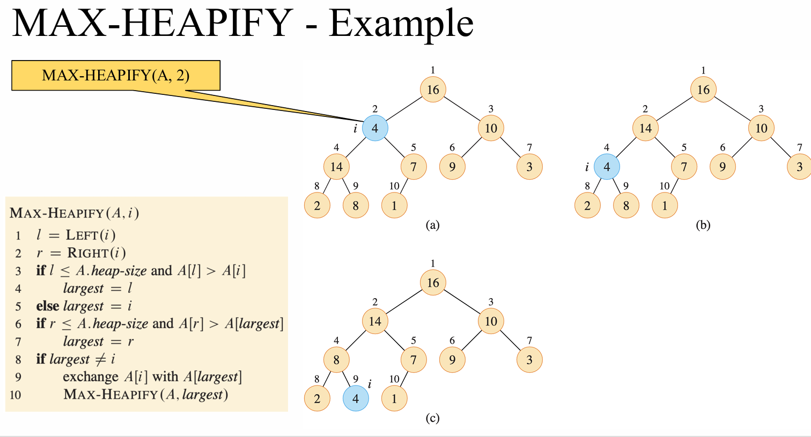
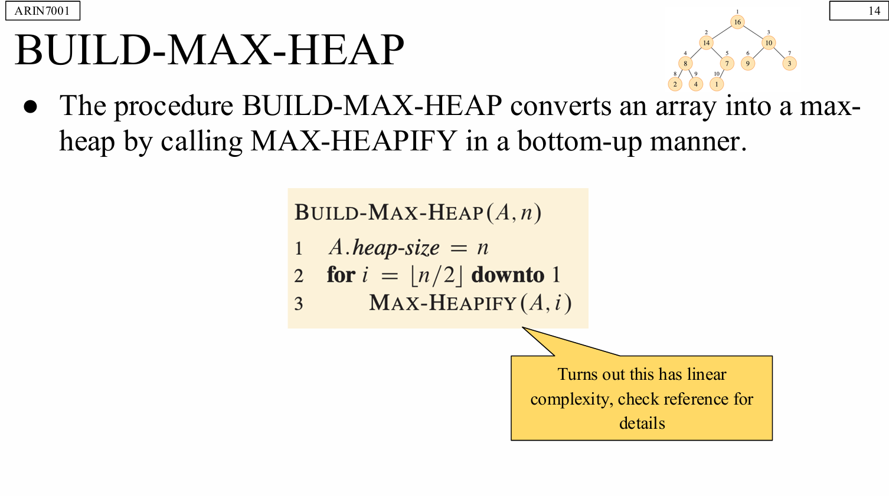
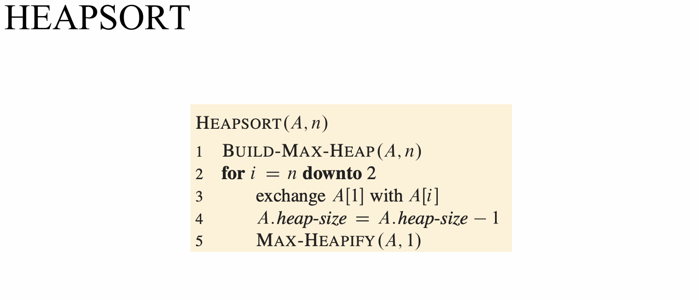
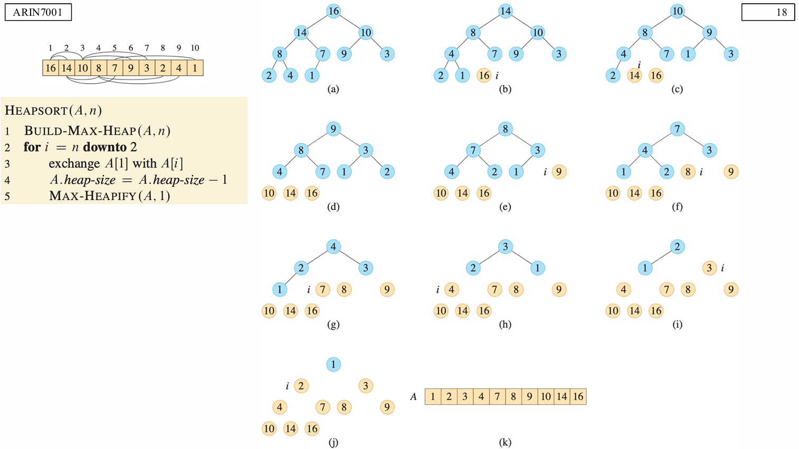

```
def max_heapify(arr, n, i):
    l = 2*i + 1
    r = 2*i + 2

    largest = i
    if l < n and arr[l] > arr[largest]:
        largest = l
    if r < n and arr[r] > arr[largest]:
        largest = r

    if largest != i:
        arr[i], arr[largest] = arr[largest], arr[i]
        max_heapify(arr, n, largest)

def build_max_heap(arr):
    n = len(arr)
    for i in range(n//2 - 1, -1, -1):
        max_heapify(arr, n, i)

def heapsort(arr):
    build_max_heap(arr)
    for end in range(len(arr)-1, 0, -1):
        arr[0], arr[end] = arr[end], arr[0]
        max_heapify(arr, end, 0)  # end 是新的 heap size
    return arr
```


---

## 二叉树
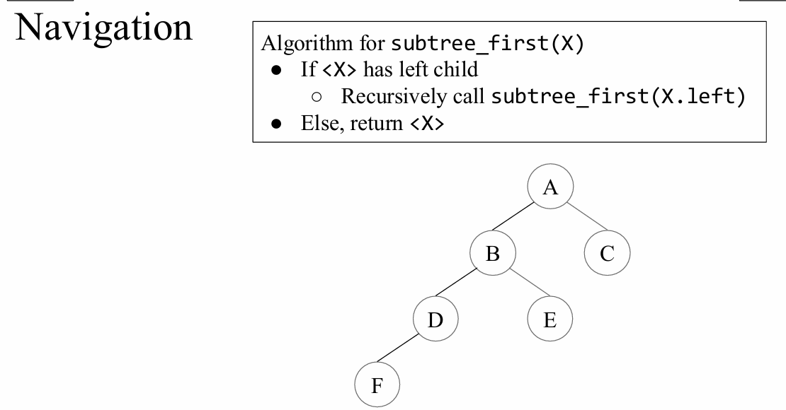
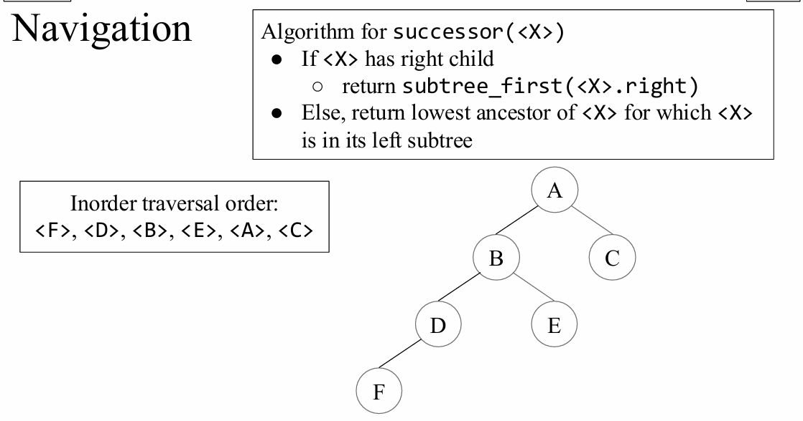
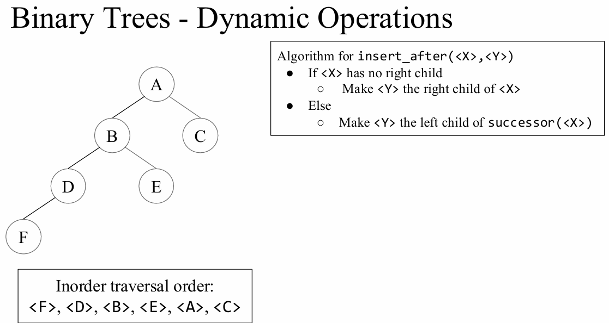
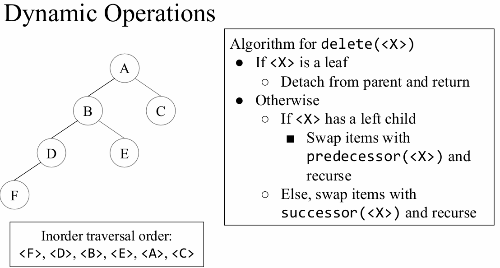
```
Algorithm for subtree_first(<X>)
● Input: a node <X> (root of a subtree)
● cur ← <X>
● While cur.left ≠ NIL
  ○ cur ← cur.left
● return cur


Algorithm for subtree_last(<X>)
● Input: a node <X> (root of a subtree)
● cur ← <X>
● While cur.right ≠ NIL
  ○ cur ← cur.right
● return cur


Algorithm for successor(<X>)
● If <X>.right ≠ NIL
  ○ return subtree_first(<X>.right)
● Else
  ○ cur ← <X>
  ○ p ← cur.parent
  ○ While p ≠ NIL AND cur = p.right
    ■ cur ← p
    ■ p ← p.parent
  ○ return p   (may be NIL)


Algorithm for predecessor(<X>)
● If <X>.left ≠ NIL
  ○ return subtree_last(<X>.left)
● Else
  ○ cur ← <X>
  ○ p ← cur.parent
  ○ While p ≠ NIL AND cur = p.left
    ■ cur ← p
    ■ p ← p.parent
  ○ return p   (may be NIL)


Algorithm for insert_before(<X>, <Y>)
● Goal: insert node <Y> immediately before <X> in inorder order
● If <X>.left = NIL
  ○ <X>.left ← <Y>
  ○ <Y>.parent ← <X>
● Else
  ○ u ← subtree_last(<X>.left)      (rightmost in left subtree)
  ○ u.right ← <Y>
  ○ <Y>.parent ← u


Algorithm for insert_after(<X>, <Y>)
● Goal: insert node <Y> immediately after <X> in inorder order
● If <X>.right = NIL
  ○ <X>.right ← <Y>
  ○ <Y>.parent ← <X>
● Else
  ○ u ← subtree_first(<X>.right)    (leftmost in right subtree)
  ○ u.left ← <Y>
  ○ <Y>.parent ← u


Algorithm for delete(<X>)
● Goal: remove <X> from the tree (inorder-pointer-based tree)
● If <X>.left = NIL
  ○ replace_node(<X>, <X>.right)
● Else If <X>.right = NIL
  ○ replace_node(<X>, <X>.left)
● Else
  ○ s ← subtree_first(<X>.right)    (successor of <X>)
  ○ If s.parent ≠ <X>
    ■ replace_node(s, s.right)      (s has no left child)
    ■ s.right ← <X>.right
    ■ <X>.right.parent ← s
  ○ replace_node(<X>, s)
  ○ s.left ← <X>.left
  ○ <X>.left.parent ← s


Algorithm for replace_node(<U>, <V>)
● Goal: replace subtree rooted at <U> with subtree rooted at <V>
● If <U>.parent = NIL
  ○ root ← <V>
● Else If <U> = <U>.parent.left
  ○ <U>.parent.left ← <V>
● Else
  ○ <U>.parent.right ← <V>
● If <V> ≠ NIL
  ○ <V>.parent ← <U>.parent
```
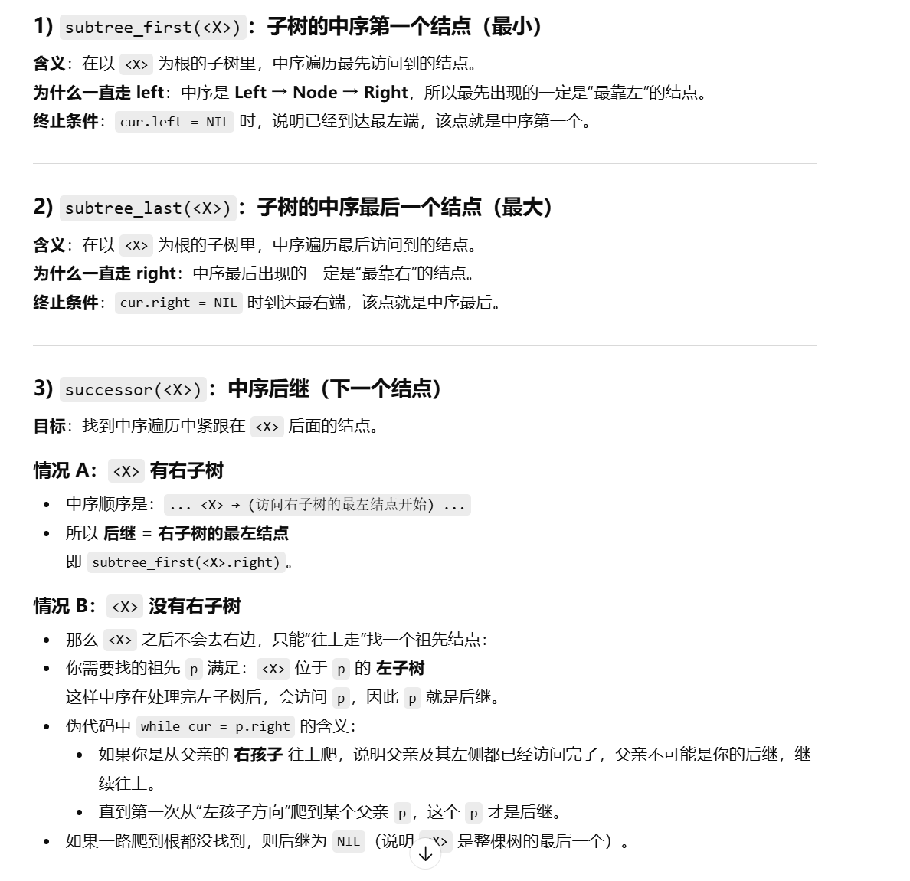
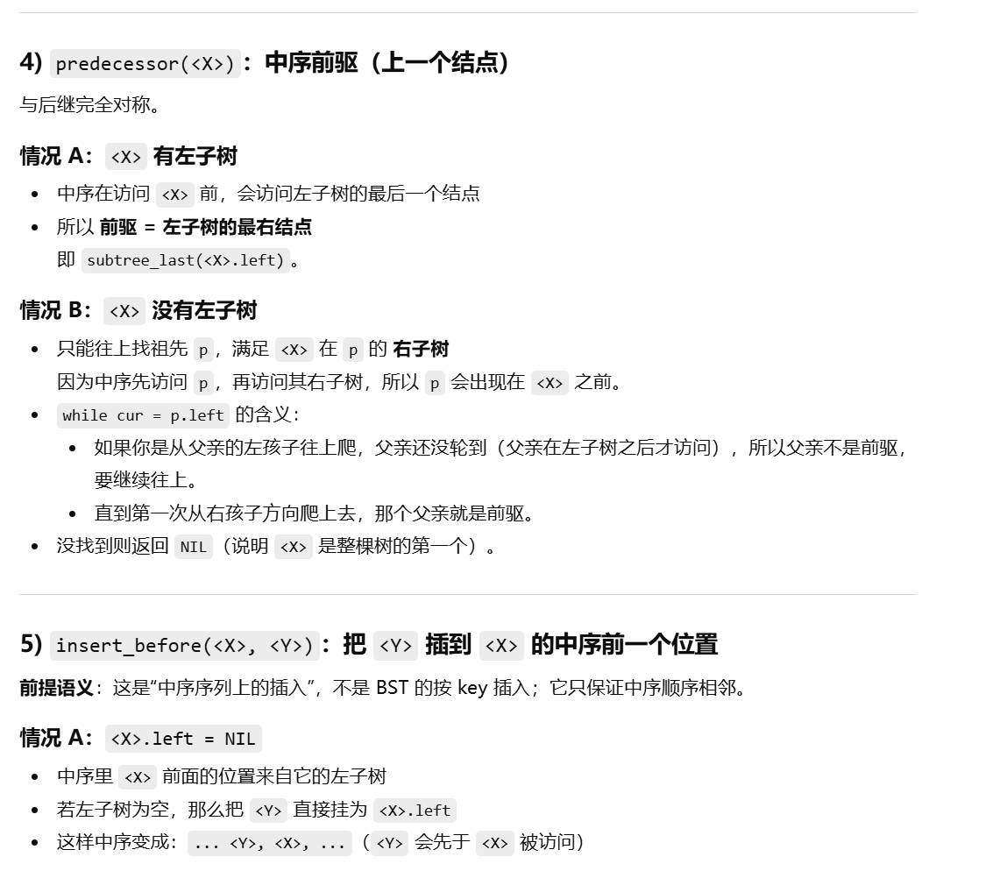
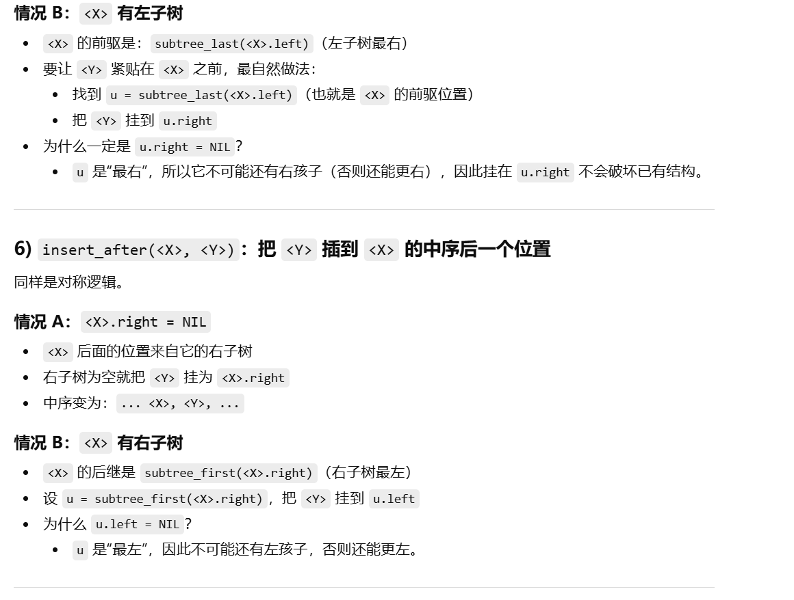
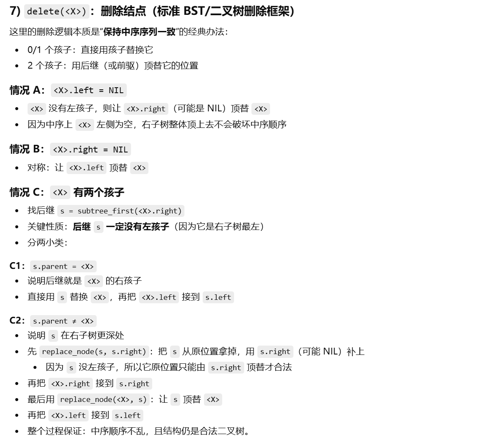